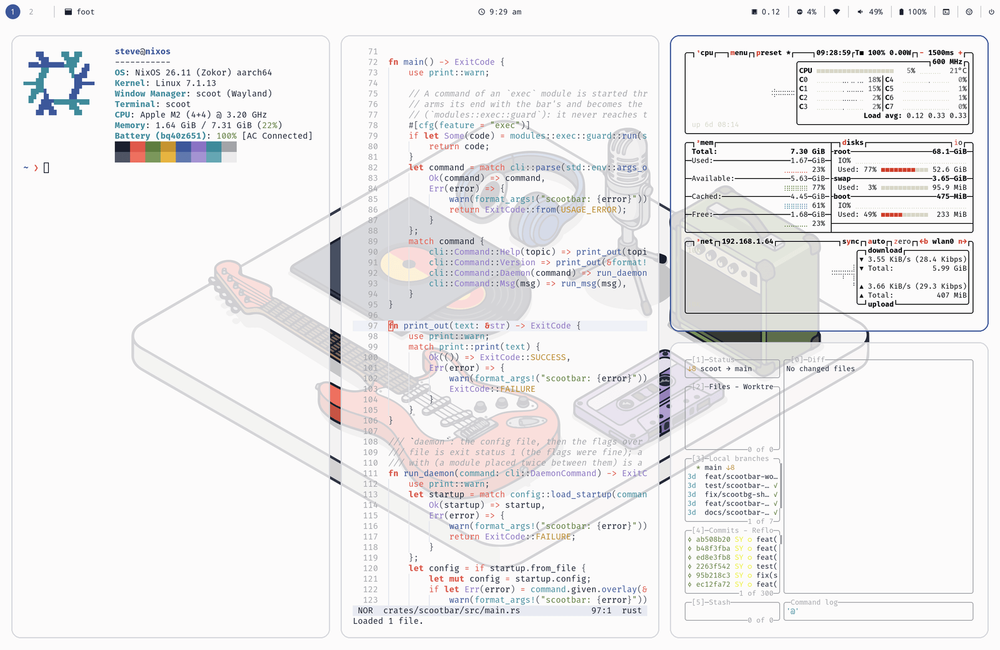
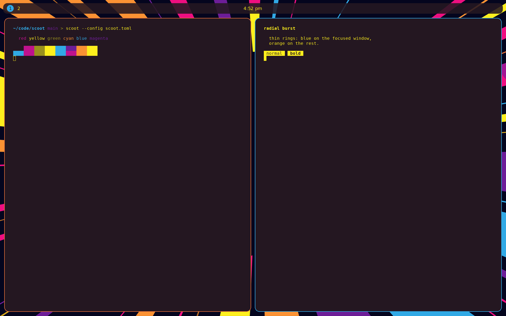
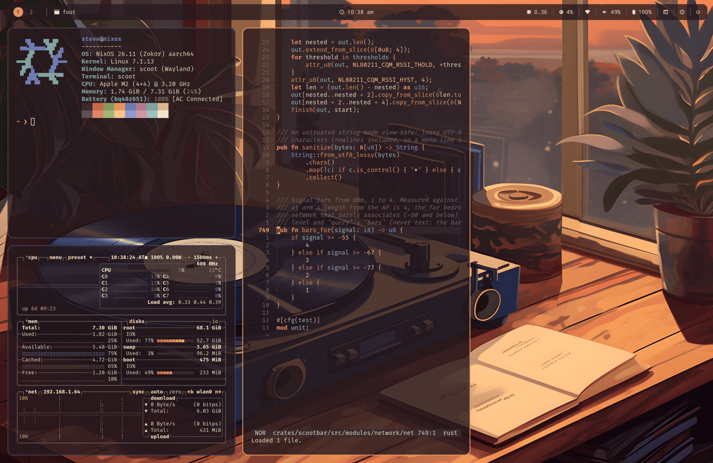

# scoot

[](https://github.com/scoot-sh/scoot/actions/workflows/ci.yml)

scoot is a Wayland compositor where windows sit side by side in columns on
a strip that scrolls sideways. Opening a window never squeezes the others;
the strip just gets longer. The layout comes from
[niri](https://github.com/niri-wm/niri).


## Why scoot

- **It doesn't need a GPU.** scoot draws on the CPU by default, so it runs
  anywhere: real hardware, a VM with no 3D acceleration, a container, or
  inside another desktop. Got a GPU? There's an optional tier that uses it.
- **Scripts and AI agents can drive it.** One socket gives you everything
  computer use needs: typing, clicking, screenshots, window positions, and
  "wait until the screen settles." scoot's own tests drive it this way.
- **It stays out of the way.** An idle scoot doesn't wake up at all, and
  it used less memory than niri in [our benchmarks](docs/benchmarks.md).

If you want the most mature scrolling compositor, use
[niri](https://github.com/niri-wm/niri). It's great, and it inspired this
project.

## Get started

### Install

scoot runs on Linux. With [Nix](https://nixos.org):

```sh
nix profile add github:scoot-sh/scoot#scoot github:scoot-sh/scoot#scootctl \
  github:scoot-sh/scoot#scootbar
```

(Older Nix calls it `nix profile install`.)

From source on Debian or Ubuntu (Rust 1.87 or newer):

```sh
sudo apt install pkg-config libwayland-dev libxkbcommon-dev libinput-dev \
  libdrm-dev libdisplay-info-dev libseat-dev libudev-dev libpixman-1-dev \
  libgbm-dev libegl-dev libdbus-1-dev
git clone https://github.com/scoot-sh/scoot && cd scoot
cargo build --release -p scoot -p scootctl -p scootbar    # binaries land in target/release/
```

The examples below open [foot](https://codeberg.org/dnkl/foot), scoot's
default terminal, so install that too (or name another one). NixOS and
home-manager modules are in [the desktop docs](https://www.scoot.sh/desktop/).

### Try it

The safest first run is in a window inside the Wayland desktop you already
use (GNOME, KDE Plasma, sway, …):

```sh
scoot --nested -- foot
```

That opens scoot with a terminal in it. Close the window to quit. If your
desktop keeps some `Super` shortcuts for itself, you can
[rebind scoot's](https://www.scoot.sh/scoot/keybindings.md#change-one-binding).

When you want it as your whole session, switch to a text console
(`Ctrl+Alt+F3`), log in, and run:

```sh
scoot --tty -- foot
```

`Super+Shift+e` quits, and `Ctrl+Alt+F1`..`F12` switches back to your
usual desktop at any time. Hardware setup, multiple monitors and the GPU
tier are in [backends](https://www.scoot.sh/scoot/backends.md).

### Drive it from a script

While scoot is running, from any terminal:

```sh
scootctl windows                          # list windows, as JSON
scootctl action focus-column left
scootctl type "hello"
scootctl screenshot --out shot.png
```

For agents and tests, `scoot --headless -- foot` runs with no screen at
all. Everything the socket can do is in [scootctl / IPC](https://www.scoot.sh/scootctl/).

### Keys

`Super` is the Windows/Command key. Directions are vim's `h` `j` `k` `l`.

| Keys | Does |
|---|---|
| `Super+Return` | Open a terminal (`foot`) |
| `Super+h` / `Super+l` | Focus the column left / right |
| `Super+j` / `Super+k` | Focus the window below / above |
| `Super+Shift` + direction | Move the column or window |
| `Super+1`..`9` | Go to workspace 1–9 |
| `Super+Shift+1`..`9` | Send the window to workspace 1–9 |
| `Super+,` / `Super+.` | Focus the output left / right, wrapping around every monitor |
| `Super+Shift+,` / `Super+Shift+.` | Send the window to the output left / right, wrapping |
| `Super+r` | Cycle the column's width |
| `Super+f` | Fullscreen |
| `Super+Shift+Space` | Float the window, or put it back |
| `Super+q` | Close the window |
| `Super+Shift+e` | Quit scoot |

All the default keys, and how to change them, are in
[keybindings](https://www.scoot.sh/scoot/keybindings.md).

### Configure

scoot reads `~/.config/scoot/config.toml`. Everything is optional. To start
from the defaults, with comments:

```sh
scoot --print-default-config --write
```

A small example:

```toml
[layout]
gap = 8

[appearance]
focus_ring_active_color = "#ffaa00"

[binds]
"super+t" = "spawn foot"

[autostart]
commands = ["spawn scootbar daemon"]

[wallpaper]
image = "~/Pictures/hills.jpg"
```

`scootctl reload` applies changes without restarting. A mistake never
stops scoot from starting: it logs the problem and uses the default. Every
option is in [configure](https://www.scoot.sh/scoot/configure.md).

## What works

scoot speaks the standard Wayland protocols, so the usual tools work.

| You want to… | |
| --- | --- |
| Run a bar, dock, launcher or notification daemon | [yes](https://www.scoot.sh/scoot/protocols.md#layer-shell-bars-wallpapers-launchers) |
| Switch workspaces or windows from a bar or taskbar | [yes](https://www.scoot.sh/scoot/protocols.md#workspaces-ext-workspace-v1) |
| Have dialogs and pop-ups float | [yes, automatically](https://www.scoot.sh/scoot/windows.md) |
| Watch video or play games fullscreen | [yes](https://www.scoot.sh/scoot/protocols.md#fullscreen) |
| Lock the screen, or lock and dim when idle | [yes](https://www.scoot.sh/scoot/protocols.md#screen-locking-ext-session-lock-v1) |
| Turn screens off when idle | [yes](https://www.scoot.sh/scoot/protocols.md#screen-power) |
| Take screenshots or share the screen | [yes](https://www.scoot.sh/scoot/protocols.md#screen-capture-ext-image-copy-capture-v1) |
| Reach the desktop over VNC | [yes, with wayvnc](https://www.scoot.sh/scoot/protocols.md#remote-desktop-vnc) |
| Run GPU apps, even with no GPU on the compositor | [yes](https://www.scoot.sh/scoot/protocols.md#gpu-rendering-clients-zwp_linux_dmabuf_v1) |
| Use a clipboard manager or middle-click paste | [yes](https://www.scoot.sh/scoot/protocols.md#clipboard-and-primary-selection) |
| Use a night light | [yes](https://www.scoot.sh/scoot/protocols.md#night-light-wlr-gamma-control-v1) |
| Use a HiDPI screen, fractional scaling included | [yes](https://www.scoot.sh/scoot/protocols.md#output-scaling) |
| Give each monitor its own scale and resolution | [yes, in the config file](https://www.scoot.sh/scoot/outputs.md) |
| Use an input method or on-screen keyboard | [yes](https://www.scoot.sh/scoot/protocols.md#input-methods-text-input-v3-input-method-v2) |
| Use a drawing tablet | [pens, not pads](https://www.scoot.sh/scoot/protocols.md#drawing-tablets-tablet-v2) |
| Change display modes from `wlr-randr` or Settings | [not yet: read-only](https://www.scoot.sh/scoot/protocols.md#display-information-wlr-output-management-v1) |
| Run X11 apps | [yes, with `--xwayland`](https://www.scoot.sh/scoot/protocols.md#xwayland-opt-in) in an XWayland build ([`nix build .#scoot-xwayland`](https://www.scoot.sh/scoot/xwayland.md)) |
| Drive it from a script or an agent | [yes](https://www.scoot.sh/scootctl/) |

Every protocol and version is listed in [protocols](https://www.scoot.sh/scoot/protocols.md).

## Not yet

- **Monitor placement.** Each monitor has its own scale and resolution,
  but they line up left to right, and there is no position setting yet.
- **Some X11 extras.** X input methods (XIM) and X window icons.
- **A macOS version.** On a Mac you can build `scootctl`, to drive scoot
  in a Linux VM.

## Looks

scoot does light, dark, warm and chill. Every color is
a setting — the bar tokens, scoot's ring and background colors, foot's
palette — so each look is just a config file. Prefer automatic? The Nix
modules theme scoot and scootbar from a wallpaper with Stylix
([Stylix](https://www.scoot.sh/scoot/theming.md#stylix)).

<table>
<tr>
<td align="center"><a href="docs/examples/music-desk/"></a><br><b>Light: the <a href="docs/examples/music-desk/">music desk</a> look</b></td>
<td align="center"><a href="docs/examples/radial-burst/"></a><br><b>Dark: the <a href="docs/examples/radial-burst/">radial burst</a> look</b></td>
<td align="center"><a href="docs/examples/vinyl-sunset/"></a><br><b>Warm: the <a href="docs/examples/vinyl-sunset/">vinyl sunset</a> look</b></td>
<td align="center"><a href="docs/examples/moonrise/"></a><br><b>Chill: the <a href="docs/examples/moonrise/">moonrise</a> look</b></td>
</tr>
</table>

<sub>Wallpapers: [musical instruments and audio equipment](https://unsplash.com/illustrations/musical-instruments-and-audio-equipment-on-a-white-surface-b6Us5E-BO8w) by [Alghozy](https://unsplash.com/@artgho), [colorful radial lines](https://unsplash.com/illustrations/colorful-radial-lines-exploding-on-a-dark-background-ETTtKnva9MM) by Sufyan pir, and [silhouetted trees under moon and stars](https://unsplash.com/illustrations/silhouetted-trees-under-moon-and-stars-jwBJOj6gakI) by saatvik 5554, all from Unsplash and each under the Unsplash License; and [lofi vintage vinyl study audio](https://pixabay.com/illustrations/lofi-vintage-vinyl-study-audio-8390965/) by AninditaErina from Pixabay (marked AI-generated), under the Pixabay Content License, downloaded separately and not shipped here. None is covered by this repository's MIT license.</sub>

## scootbar

scoot comes with `scootbar`, a status bar. It shows your workspaces, the
focused window's title, the clock, volume and microphone, WiFi, bluetooth,
battery, brightness, what's playing, and a system tray with menus. Clicks,
scrolls and hover do what you'd expect, the volume slider and the WiFi list
open as popups under the bar, and you can add your own buttons and modules
that show a command's output, without writing Rust.

It's light: idle, it uses around 4 to 5 MB of memory and wakes only when
something changes, plus three steady rhythms: the clock each minute, about
once a minute while a shown battery discharges, and every 10 seconds to
read the WiFi signal while WiFi is shown. It speaks D-Bus, PulseAudio and
netlink itself, so it needs no GTK and no libpulse, and the binary links
nothing beyond libc and libgcc_s. It also works on sway, niri, Hyprland and other compositors with
`wlr-layer-shell`, and scripts and agents can read every module's state
with `scootbar msg query`.

```sh
scootbar daemon &
```

It reads `~/.config/scoot/bar.toml`. Every module, option and popup is in
[scootbar](https://www.scoot.sh/scootbar/cli.md), and the NixOS and
home-manager modules (with Stylix colors) in
[the bar docs](https://www.scoot.sh/scootbar/).

## scootbg

scoot comes with `scootbg`, a small wallpaper daemon. It shows a color or
an image on each monitor, and uses no CPU once it's up. The `[wallpaper]`
section above runs it for you. It also works on sway, niri, Hyprland and
other compositors with `wlr-layer-shell`:

```sh
scootbg daemon &
scootbg set ~/Pictures/hills.jpg
```

It's early. More in [docs/scootbg/README.md](docs/scootbg/README.md).

## Documentation

| Doc | For |
| --- | --- |
| [the site](https://www.scoot.sh/) | every flag, config option and key ([scoot](https://www.scoot.sh/scoot/configure.md), [keybindings](https://www.scoot.sh/scoot/keybindings.md)) |
| [scootctl / IPC](https://www.scoot.sh/scootctl/) | driving scoot from a script or an agent |
| [protocols](https://www.scoot.sh/scoot/protocols.md) | writing a bar, launcher or other tool for scoot |
| [backends](https://www.scoot.sh/scoot/backends.md) | real hardware: devices, monitors, the GPU tier |
| [the scoot desktop](https://www.scoot.sh/desktop/) | the flake and the NixOS and home-manager modules |
| [benchmarks.md](docs/benchmarks.md) | measured CPU and memory, next to niri |
| [scootbg/](docs/scootbg/README.md) | the wallpaper daemon |
| [scootbar](https://www.scoot.sh/scootbar/) | the status bar: every module, option and popup |
| [development.md](docs/development.md) | building, testing and contributing |

What changed is in [CHANGELOG.md](CHANGELOG.md), and what's next in
[ROADMAP.md](ROADMAP.md).

## License

MIT. See `NOTICE` for third-party attribution (this compositor is built on
[Smithay](https://github.com/Smithay/smithay)).
