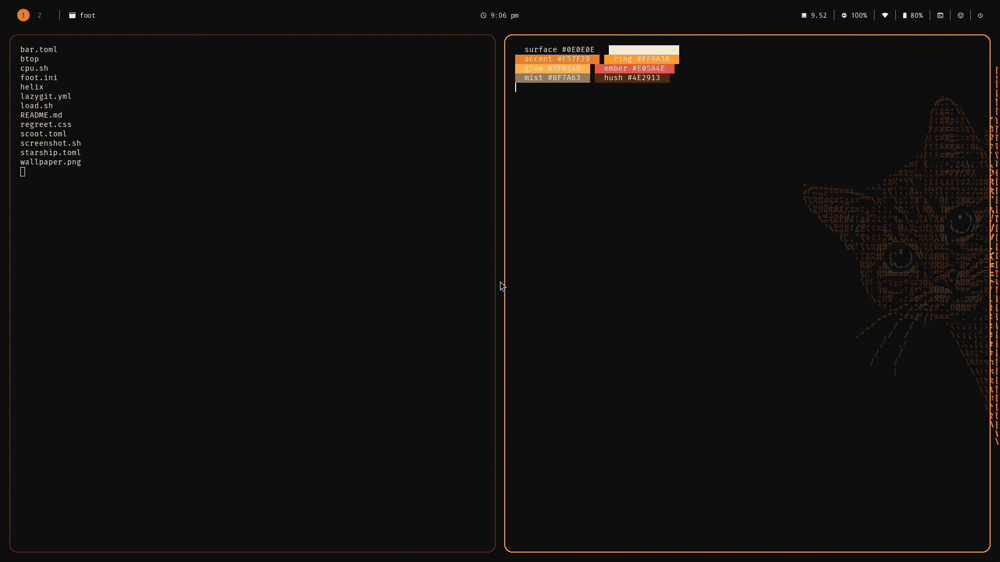

# The ginger-night look — calm black with one warm accent

A calm, dark look built around one image: a ginger tabby drawn in orange
text-glyph art, peeking in from the right edge onto a near-black field,
with two white eye-catchlights. It is the **desktop default**: a profile
with no `look` choice renders this look; set `look = null` explicitly to
theme nothing.



| File | For |
| --- | --- |
| [`scoot.toml`](scoot.toml) | the compositor: background, ring colors and widths, rounded corners, gaps, the wallpaper (`fit` on the look's black, so the cat is never cropped) |
| [`bar.toml`](bar.toml) | scootbar: a floating, rounded, translucent bar, workspaces as discs with the focused window's title, the clock, system modules, two command-fed modules, launcher buttons and the power menu |
| [`foot.ini`](foot.ini) | foot: the palette, 80% opacity, padding and font size (needs a foot with `[colors-dark]` sections, 1.26 or later) |
| [`starship.toml`](starship.toml) | starship: the prompt in the illustration's palette |
| [`helix/config.toml`](helix/config.toml) | Helix: relative line numbers, cursor line, the theme below |
| [`helix/themes/scoot-ginger-night.toml`](helix/themes/scoot-ginger-night.toml) | Helix: the transparent palette theme |
| [`btop/btop.conf`](btop/btop.conf) | btop: a dark transparent setup naming the theme below |
| [`btop/themes/ginger-night.theme`](btop/themes/ginger-night.theme) | btop: the ginger-night palette theme |
| [`lazygit.yml`](lazygit.yml) | lazygit: the palette, rounded borders |
| [`load.sh`](load.sh), [`cpu.sh`](cpu.sh) | the bar's `load` and `cpu` modules: load average and CPU percent on stdout |
| [`regreet.css`](regreet.css) | ReGreet: the login screen in near-black, cream and ginger (NixOS greeter) |
| [`wallpaper.png`](wallpaper.png) | the session wallpaper: a byte-identical copy of `docs/assets/CatPeeking.png` (the source PNG already beats a max-compression re-encode, so the copy is the optimization) |

It needs `scootbg` on your `PATH` for the wallpaper (scoot starts it itself; the Nix
modules install it when the settings have a `[wallpaper]` table, from source
`cargo install --path crates/scootbg`), a font file
for scootbar (see the comment in [`bar.toml`](bar.toml)), and `load.sh` and
`cpu.sh` somewhere on your `PATH` (see the comment in [`bar.toml`](bar.toml)).
Without `scootbg` scoot logs one
warning and carries on with the background color. The rest is optional:
starship, Helix, btop and lazygit each read their file only if you run them;
btop needs the theme copied beside its config (see below).

Try it from a checkout, each in its own terminal (scootbar and foot once scoot is up):

```sh
scoot --config docs/examples/ginger-night/scoot.toml
PATH="$PWD/docs/examples/ginger-night:$PATH" scootbar daemon --config docs/examples/ginger-night/bar.toml
foot --config docs/examples/ginger-night/foot.ini
```

To keep it, copy the files to your config directory (`~/.config/scoot/config.toml`,
`~/.config/scoot/bar.toml`, `~/.config/foot/foot.ini`,
`~/.config/starship.toml`, `~/.config/helix/`, `~/.config/btop/btop.conf`
with `btop/themes/ginger-night.theme` as `~/.config/btop/themes/ginger-night.theme`,
`~/.config/lazygit/config.yml`) and point `[wallpaper] image` at
a copy of the wallpaper. The prompt in the preview runs under
`STARSHIP_CONFIG` pointing at `starship.toml`, e.g.
`env STARSHIP_CONFIG=~/.config/starship.toml bash -i`.

## The login screen

On NixOS the greeter can wear this look too. Copy `regreet.css` and
`wallpaper.png` next to your system configuration:

```nix
programs.scoot = {
  enable = true;
  greeter = {
    enable = true;
    background = ./wallpaper.png;
  };
};
services.displayManager.regreet = {
  extraCss = ./regreet.css;
  font = {
    package = pkgs.dejavu_fonts.minimal;
    name = "DejaVu Sans";
    size = 12;
  };
  settings = {
    GTK.application_prefer_dark_theme = true;
    background.fit = "Cover";
    widget.clock.format = "%-I:%M %P";
  };
};
```

See [the greeter docs](../../nix.md#the-greeter-regreet-opt-in) for the
one-screen default and the other knobs.

## The palette

Role-named, so the look registry absorbs this look without rework.
Every hex below was sampled from `docs/assets/CatPeeking.png`
(1672x941) with a stdlib PNG decoder (zlib + unfilter, no image
library), not eyedroppered:

| Role | Color | Sampled from |
| --- | --- | --- |
| `surface` | near-black `#0E0E0E` | the field's center pixel (800,470); the 15 most common colors all sit in `#0C0C0C`–`#0F0E0E` |
| `ink` | warm cream `#F5EAD6` | the two eye-catchlights (`#FFFFFF` at ~(1605,361) and ~(1506,418)), softened warm so body text does not glare on black |
| `accent` | ginger `#E57F29` | the median of all 14,026 glyph pixels with R>150, 90≤G≤190, B<120 (mean `#DF8145`, median `#E57F29`) |
| `ring` | bright ginger `#FF9A30` | the most common glyph-stroke colors (`#FFA230`, `#FF972A`, …): the stroke peaks the ring is drawn in |
| `glow` | amber `#FFB14B` | a bright stroke variant from the same top-12 list: hover, prompt success, highlights |
| `hush` | dark umber `#4E2913` | the shadowed fur at (1500,470): the inactive ring, entry fields |
| `mist` | ginger taupe `#8F7A63` | dimmed ginger for separators, dimmed numbers, line numbers |
| `ember` | ember red `#E05A4E` | hand-placed away from ginger so urgent never reads as accent: errors, deletions |
| `sand` | dusty sand `#C9A87A` | git branch, graph text: the pale-glyph mid-tones warmed |
| `ridge` | slate taupe `#7E8AA0` | ANSI blue/cyan family (kept cool so code keeps a second temperature) |
| `moss` | muted sage `#8FA07A` | ANSI green family (kept desaturated to stay calm) |

Body text is cream on near-black at **16.2:1**, ginger at **6.8:1**,
amber at **10.7:1** and ember at **5.3:1** (WCAG AA needs 4.5:1).
`mist` (4.7:1) passes AA too and carries dimmed text; only the
inactive ring (1.7:1) never carries text — an unfocused ring, the same
role moonrise's mauve ring plays.

## What it costs

The defaults stay light on purpose; this look spends some of that, so each piece is
opt-in and you can drop any of them:

- **The wallpaper** makes scootbg hold the decoded image: about 8 MB RSS at 1920x1080
  (1672x941 RGBA, output-sized buffer, not file-sized;
  [scootbg](../../scootbg/README.md)). Drop `[wallpaper]` for a solid
  `background_color` and the cost is gone.
- **`corner_radius`** costs a little per frame when non-zero (measured at about +9% on a
  three-window session under pixman; see [appearance](https://www.scoot.sh/scoot/appearance.md)).
  `0` is free.
- **The translucent bar** (`opacity`) needs an ARGB buffer and no opaque region. On the
  Asahi M2 the shaped and translucent looks cost no more than a flush one that the
  method could resolve; see the [resource ratchet](../../scootbar/backlog/lightest.md#appearance-looks-flush-against-floating).
  Set `opacity = 1` (and `radius = 0`) for the plain bar.
- **The translucent terminals** (foot's `alpha=0.80`) make each terminal window non-opaque,
  so scoot blends it over the wallpaper whenever that region is redrawn. In the optional
  `gpu-scanout` `--tty` tier, a fullscreen translucent window also cannot be handed to the
  display directly ([backends](https://www.scoot.sh/scoot/backends.md)). That extra work was not measured here. Set
  `alpha=1.0` in [`foot.ini`](foot.ini) for opaque terminals.
- **The `load` and `cpu` modules** each hold one shell that sleeps (10 s and 5 s) and
  prints a line: no polling by the bar, one process each, woken by their own timers.

## Image credit and license

`wallpaper.png` is a byte-identical copy of `docs/assets/CatPeeking.png`
(926,588 bytes both; re-encoding the pixels at zlib level 9 with
sub/up/adaptive filtering all came out larger: 927,754 / 985,838 /
933,955 bytes, so the source is already optimal). The image is the
maintainer's own asset, already committed in this repository, so it
ships with the look under the repository's MIT license — unlike the
Unsplash/Pixabay illustrations behind the other looks, which stay
under their own licenses (see [NOTICE](../../../NOTICE)). To drop it,
remove the file and the `[wallpaper]` table: the session falls back to
the flat `background_color`.
