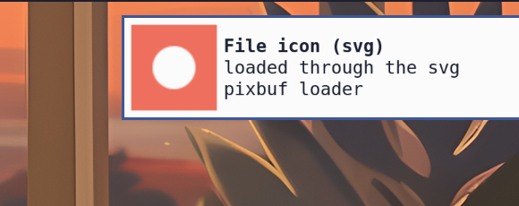
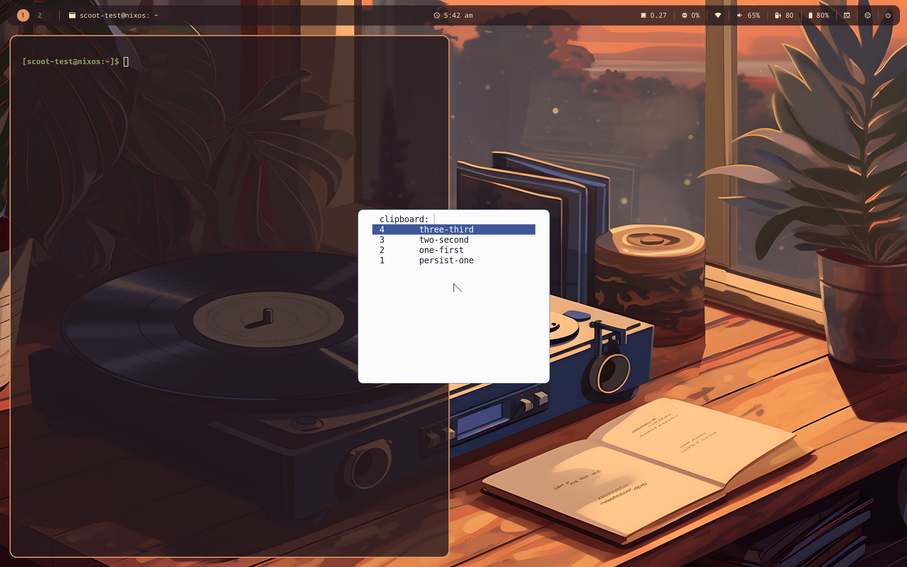

# Using scoot from Nix: flake consumption, home-manager, NixOS

- [Consuming the flake](#consuming-the-flake)
- [Prebuilt binaries: the Cachix cache](#prebuilt-binaries-the-cachix-cache)
- [Installing from FlakeHub](#installing-from-flakehub)
- [Platform notes](#platform-notes)
- [GPU tiers from the flake](#gpu-tiers-from-the-flake)
- [XWayland from the flake](#xwayland-from-the-flake)
- [Home-manager module](#home-manager-module)
- [Stylix](#stylix)
- [NixOS module](#nixos-module)
- [The wallpaper: scootbg](#the-wallpaper-scootbg)
- [The status bar: scootbar](#the-status-bar-scootbar)
- [The desktop profile](#the-desktop-profile)
- [Hardware keys and desktop actions](#hardware-keys-and-desktop-actions)
- [The overlay](#the-overlay)
- [Migrating from a hand-rolled packaging](#migrating-from-a-hand-rolled-packaging)
- [Settings failure modes](#settings-failure-modes)
- [Reference: live defaults](#reference-live-defaults)

## Consuming the flake

In your own flake:

```nix
{
  inputs = {
    nixpkgs.url = "github:NixOS/nixpkgs/<your-rev>";
    scoot.url = "github:scoot-sh/scoot";
  };
}
```

Then, in a module:

```nix
# The binary, anywhere a package list goes:
environment.systemPackages = [ inputs.scoot.packages.${pkgs.system}.scoot ];
# ... or build-and-run in one step, without installing:
# nix run github:scoot-sh/scoot -- --headless -- foot
```

`packages.<system>.scoot` is the compositor alone (`$out/bin` carries only
the `scoot` binary, with the `scoot msg` client alias kept on it),
`packages.<system>.scoot-gpu` the same binary with the `gpu-scanout` build
feature (see [GPU tiers](#gpu-tiers-from-the-flake) below),
`packages.<system>.scoot-xwayland` and `scoot-gpu-xwayland` those two with
the `xwayland` build feature and the X server on `PATH` (Linux only; see
[XWayland](#xwayland-from-the-flake) below),
`packages.<system>.scootctl` the standalone
remote-control client, `packages.<system>.scootbg` the wallpaper daemon
(Linux only; see [The wallpaper](#the-wallpaper-scootbg)),
`packages.<system>.scootbar` the status bar and `scootbar-demo` the bar
with a font (Linux only; see [The status bar](#the-status-bar-scootbar)),
and `packages.<system>.default` is whichever is
honest on that system (see [Platform notes](#platform-notes)). `apps`
mirrors six of them (`nix run . -- ...`, `nix run .#scootctl -- ...`,
`nix run .#scoot-gpu -- --tty -- ...`,
`nix run .#scoot-xwayland -- --headless --xwayland -- xterm`,
`nix run .#scootbar -- daemon --font F`, `nix run .#scootbar-demo`). The
same packages are also `pkgs.scoot`, `pkgs.scootctl`, `pkgs.scootbg` and
`pkgs.scootbar` through [the overlay](#the-overlay).

## Prebuilt binaries: the Cachix cache

Every merge to `main` builds and pushes the same set for `x86_64-linux`
and `aarch64-linux` (`.github/workflows/nix-build.yml`) and pushes them
to the public Cachix cache **`scoot-sh`**
(`https://scoot-sh.cachix.org`): `scoot` (the
GPU-free default), `scoot-gpu` and `scoot-xwayland` (the in-between
variants: the `gpu-scanout` and `xwayland` build features),
`scoot-gpu-xwayland` (the full build: both features plus Xwayland on
`PATH`), `scootctl`, `scootbg`, `scootbar` and `scootbar-demo`. Without
the cache, installing from the flake downloads the compiled-dependencies
artifacts (Smithay and the forks included, about one Smithay compile the
first time, then cached) and compiles scoot's own crates on top (the
compositor packages recompile 4 first-party crates, about a minute or two
on 4 cores, most of it the final link; the smaller packages recompile
their own crates plus a ~10-crate subgraph, in under a minute). Only
merges to `main` push: manual workflow runs build without publishing --
their Cachix step carries no auth token at all (only the push-to-`main`
step receives `CACHIX_AUTH_TOKEN`), so a manual run cannot publish even
if its build were tampered with -- and pull-request code never reaches a
cache users trust.

The builds are split crane-style (`flake.nix`): one
compiled-dependencies derivation per (Cargo feature set, link-flags) pair
(five in all: the base set, the compositor's own set, plus one per
compositor feature combination), which the cache keeps and every package
build reuses until `Cargo.lock` or a fork rev changes. So a code-only
merge recompiles no dependency for the four compositor packages (each
rebuilds 4 first-party crates: measured 81--96 s on 4 M2 cores against
110--132 s for the same packages' 129--136-crate full-graph rebuilds
before), and only a small scope-divergent subgraph for the client, the
wallpaper and the bar (9--12 crates, 13--39 s; Smithay itself is never
recompiled). The in-between variants cost one such small compile each --
which is why they are in the cached set (before crane, each would have
bought another full Smithay compile per push per architecture). Each
artifact is ~420 MiB in the store (~130 MB compressed over the wire), so
a lock or fork change pushes about 690 MB per architecture; code-only
merges push only the rebuilt packages.

Anything else builds locally from source but over the same cached
dependencies: a `scootbar.override` feature set builds over the same base
artifact, recompiling the bar's own crates (a no-modules build is
seconds; the workflow builds one as a check).

The flake declares the cache in its own `nixConfig` (`flake.nix`), but a
flake's `nixConfig` is not silently trusted: Nix asks whether to accept it
on first use (unless `accept-flake-config` is set), and its substituter
settings apply only to trusted users. To opt in explicitly — no prompt,
and works for every user — add the cache to your Nix configuration:

NixOS (`configuration.nix`):

```nix
nix.settings = {
  extra-substituters = [ "https://scoot-sh.cachix.org" ];
  extra-trusted-public-keys = [
    "scoot-sh.cachix.org-1:QMj7CMw8uqZxrvqqm6SggdxTHz6Q4prt30ydDcXJXCo="
  ];
};
```

(`extra-` appends to the default `cache.nixos.org` entries; assigning
`substituters` / `trusted-public-keys` outright would replace them.)

home-manager (`nix.settings` in your home configuration), or any other
machine directly in `nix.conf` (`/etc/nix/nix.conf` system-wide,
`~/.config/nix/nix.conf` per user): the same two lines,

```ini
extra-substituters = https://scoot-sh.cachix.org
extra-trusted-public-keys = scoot-sh.cachix.org-1:QMj7CMw8uqZxrvqqm6SggdxTHz6Q4prt30ydDcXJXCo=
```

What opting in trusts: binaries built by CI from reviewed merges to `main`,
signed with a Cachix-managed key (the project holds no private signing
key). A substituter is trusted with binaries — it can serve any store path
your Nix asks for — so this trusts CI's builds the way installing the
flake already trusts its source.

## Installing from FlakeHub

The flake is published to FlakeHub as **`scoot-sh/scoot`**
(`https://flakehub.com/flake/scoot-sh/scoot`), once per merge to `main`
after both architectures' binaries reach Cachix, so a published version
always has its binaries cached. With the `fh` CLI:

```sh
fh add scoot-sh/scoot
```

which adds the current release as a flake input, or in `flake.nix`
directly with plain `nix`:

```nix
{
  inputs = {
    nixpkgs.url = "github:NixOS/nixpkgs/<your-rev>";
    scoot.url = "https://flakehub.com/f/scoot-sh/scoot/0.1.*.tar.gz";
  };
}
```

One-off runs work the same way (quote the URL: the `*` is a FlakeHub
version constraint, not a glob):

```sh
nix run 'https://flakehub.com/f/scoot-sh/scoot/0.1.*.tar.gz#scoot' -- --headless -- foot
```

`0.1.*` follows the rolling release: every merge to `main` becomes
`0.1.<commit count>+rev-<sha>`, and the constraint resolves to the latest
one. **A rolling version promises nothing beyond "a merge to `main`"**:
it moves with every merge, until tagged releases arrive (per
[Independent versions per shipped
binary](backlog/packaging/independent-versioning.md)). To pin one,
replace `0.1.*` with the full version from the
[flake's page](https://flakehub.com/flake/scoot-sh/scoot) or `fh list
versions scoot-sh/scoot "0.1.*"`. No FlakeHub Cache: resolved store paths
are off (`include-output-paths: false`), so installs build nothing beyond
what Cachix serves and evaluate the flake locally like any other input.

## Platform notes

The flake covers **Apple Silicon and Linux** (`aarch64-linux`,
`x86_64-linux`, `aarch64-darwin`). On **macOS** the build gives the
`scootctl` remote-control client only — enough to drive a compositor
running in a VM; there is no macOS compositor (see README's "No macOS
adapter"). An Intel Mac is outside what the flake provides but nothing
Intel-specific blocks the client: `cargo build -p scootctl` from source
works there.

The modules below follow the same split: the home-manager module
manages the config file on any system (useful on macOS too, to keep the
config you deploy to a Linux box next to the machine that edits it),
while the NixOS module's session entry only means anything on NixOS.
scootbg, the wallpaper daemon, is Linux-only: there is no macOS
`scootbg` package, and on macOS a `[wallpaper]` section in the
home-manager settings renders as written and installs nothing. scootbar,
the status bar, is Linux-only the same way: no macOS package.

## GPU tiers from the flake

Two packages, matching the two GPU tiers in
[tty.md](tty.md#which-renderer-draws-the-frames):

- `packages.<system>.scoot` (the default on Linux) composites on the CPU
  with pixman and needs no GPU at all. `--renderer gles` is available from
  this package -- the offscreen tier, still read back to main memory -- but
  it needs EGL drivers from the **host OS**, not from the derivation: the
  package ships libglvnd (the dispatch library Smithay `dlopen`s) while
  Mesa's vendor ICDs come from the system (on NixOS, `hardware.graphics`
  enabled). That split is the standard nixpkgs pattern, and it is
  deliberate: bundling Mesa would risk shadowing the host's drivers --
  notably Asahi's -- with wrong ones. On a box with no working EGL,
  `--renderer gles` is a loud startup error naming the pixman default, not
  a panic and not a silent downgrade (previously it panicked in Smithay's
  `dlopen`; gh #177).
- `packages.<system>.scoot-gpu` adds the `gpu-scanout` Cargo feature (the
  one that links libgbm): under `--tty --renderer gles` the frame is
  composited straight into the buffer the CRTC scans out, with no
  read-back; under `--nested --renderer gles` it is handed to the host
  compositor as a GPU buffer instead of being read back, where the host
  composites on the same GPU (see
  [tty.md](tty.md#which-renderer-draws-the-frames)). Same binary name (`scoot`), the
  same EGL-driver requirement as above, plus a real DRM seat. Scanout
  drives the primary plane only -- no overlay or cursor planes -- but it is
  measured rather than merely reasoned now: on an Apple M2 under Asahi Linux
  it costs 4--5x less compositor CPU under damage than the default tier, for
  7--16 MB more RSS (see [Asahi.md](../Asahi.md)'s Test 4, which settled
  that on 2026-09-21).

## XWayland from the flake

X11 applications need two things the packages above do not carry: the
`xwayland` Cargo feature, and the `Xwayland` binary on the compositor's
`PATH` (the server is started as a bare `Xwayland`, a `PATH` lookup and
nothing else). Two Linux-only packages carry both:

- `packages.<system>.scoot-xwayland` -- `scoot` with the `xwayland`
  feature;
- `packages.<system>.scoot-gpu-xwayland` -- `scoot-gpu` with it.

Each wraps `bin/scoot` (a small compiled wrapper, so `scoot` is still an
ELF binary and `scoot msg` pays no shell start) to *append* nixpkgs'
Xwayland to `PATH`. Appended, so an `Xwayland` already on the session's
`PATH` -- NixOS's `programs.xwayland.enable` puts one there -- is the one
started. Every program the session starts inherits that `PATH`; the
appended directory holds `Xwayland` and nothing else. The package's
closure grows by Xwayland's own (it links Mesa for its GL acceleration;
344 MiB in all on x86_64-linux, all but 11.8 MiB of it Xwayland's closure),
which is why it is its own package and never the default: the default
`scoot` stays the GPU-free, X-free build.

One visible side effect of the wrapper: `bin/scoot` execs the real binary
as `bin/.scoot-wrapped`, so the running compositor's process name (`comm`,
what `pgrep -x`, `top` and `ps -o comm` show) is `.scoot-wrapped`,
not `scoot`. `pgrep -x scoot` finds nothing under these two packages; use
`pgrep -x .scoot-wrapped` there. (`pidof scoot` still finds it: procps
`pidof` also matches `argv[0]`'s basename, which the wrapper keeps as
`scoot`.) `scripts/niri-ab/sample.sh session`
accepts both names.

The package is only half of it: XWayland still starts only when asked, by
`--xwayland` or `[xwayland] enabled` (`programs.scoot.settings.xwayland.enabled
= true` in the home-manager module). The NixOS module needs nothing extra
-- point `package` at the XWayland build and its session entry's `Exec=`
starts the wrapper:

```nix
programs.scoot = {
  enable = true;
  package = inputs.scoot.packages.${pkgs.system}.scoot-xwayland;
  session.enable = true;
};
```

Either half alone is loud rather than silent: `[xwayland] enabled` with the
default `scoot` package logs that the build has no XWayland support, and an
XWayland build whose `PATH` somehow lacks the binary (a hand-built one, say)
logs `` `Xwayland` must be on PATH `` with the `PATH` it searched. Both then
run a Wayland-only session; neither stops the session from starting. Read
[the trust model](protocols.md#xwayland-opt-in) before turning it on: any X
client can keylog and read other X clients by design.

## Home-manager module

```nix
# In your home-manager flake inputs: scoot.url = "github:scoot-sh/scoot";
# In your home configuration:
imports = [ inputs.scoot.homeModules.scoot ];
# (Legacy spelling `inputs.scoot.homeManagerModules.scoot` still resolves
# to the same module.)

programs.scoot = {
  enable = true;
  # `package` defaults to the flake's own build for your system on Linux
  # (the same per-system default as `packages`); on macOS it defaults to
  # null (files only — the module manages the config, installs no
  # binary). Set it only to override:
  # package = inputs.scoot.packages.${pkgs.system}.scoot;
  # # macOS, to also install the remote-control client:
  # package = inputs.scoot.packages.${pkgs.system}.scootctl;
  settings = {
    layout.gap = 8;
    binds = {
      "super+t" = "spawn foot";
      "ctrl+alt+space" = "spawn wofi --show drun";
    };
    autostart.commands = [ "spawn waybar" ];
  };
};
```

| Option | Default | Meaning |
|---|---|---|
| `enable` | `false` | Manage scoot files (and install `package`). |
| `package` | flake's own build (Linux), `null` (macOS) | The binary installed to your profile. `null` installs no binary (files only). |
| `settings` | `{ }` | Free-form config, rendered verbatim to TOML (see below). Empty renders a valid minimal file: the compositor runs it as pure defaults. |
| `configFile` | `"scoot/config.toml"` | Where the rendered TOML lands, relative to `$XDG_CONFIG_HOME`. Keep the default unless you pass the same path via `--config` wherever you launch scoot. |
| `sessionScript` | `null` | Startup script text, written executable beside the rendered config at `<dirOf configFile>/session.sh` (`scoot/session.sh` with the default `configFile`). Launch it with `scoot -- ~/.config/scoot/session.sh` for the default (or `~/.config/<that path>` after a `configFile` override), or exec it from your greetd/startwm entry — on NixOS, that launch line goes in the NixOS module's `session.command` (see below), which is what makes the greeter entry run this script instead of the launcher (without the launcher's session wiring; wired startup programs belong in `[autostart]`). `null` writes no file. |
| `portals.enable` | `true` | Install `scoot-portals.conf` to the per-user xdg-desktop-portal lookup path (`~/.config/xdg-desktop-portal/`), so ScreenCast/Screenshot resolve to the `wlr` backend inside a scoot session. Inert outside one (nothing reads it until `XDG_CURRENT_DESKTOP=scoot`). Turn off if you manage portal backends some other way. |
| `wallpaper.enable` | `settings ? wallpaper` | Install `wallpaper.package` and set `settings.wallpaper.command` to its store path (a `command` you set yourself wins). On whenever `settings` has a `wallpaper` table; `false` leaves both alone, so `[wallpaper]` runs `scootbg` from `PATH`. See [The wallpaper](#the-wallpaper-scootbg). |
| `wallpaper.package` | flake's own `scootbg` (Linux), `null` (macOS) | The scootbg to install. `null` installs nothing and sets no `command`. |
| `stylix.enable` | `true` | Whether to take defaults from Stylix when it is in use (below). |
| `stylix.wallpaper.enable` | `true` | Whether to take the `[wallpaper]` `image`/`mode` defaults from Stylix (below). Set to `false` to choose your own wallpaper color. |

The example above renders byte-for-byte to:

```toml
[autostart]
commands = ["spawn waybar"]

[binds]
"ctrl+alt+space" = "spawn wofi --show drun"
"super+t" = "spawn foot"

[layout]
gap = 8
```

(That TOML is the module's own output for those settings, captured from
a real evaluation with the one invalid test bind removed — keys render
alphabetically, hence the table order.)

**Why free-form?** `settings` is a TOML value, not a typed schema per
field — deliberately. The config moves fast (three tables landed this
month); a typed schema goes stale and then lies about what the
compositor accepts, while free-form never drifts. `[binds]` is arbitrary
keys anyway, so a schema would need an escape hatch exactly where most
user content lives. Field names, types and defaults are documented in
[configuration.md](configuration.md); the full live-defaults reference
is at the bottom of this page, pasted from a real
`scoot --print-default-config` emission, not hand-written.

After `home-manager switch`, apply the new settings without re-logging in:
`scoot msg reload` (`scootctl reload` is the same client) re-reads the file
and re-applies what can move live; the two restart fields are refused with a
message naming that rather than silently kept (see
[configuration.md](configuration.md#reloading-the-config)).

## Stylix

When `config.lib.stylix` exists and `stylix.enable` is on,
`programs.scoot.settings` gets defaults from it — the compositor's half of
a themed desktop, next to the bar's ([The status bar](#the-status-bar-scootbar)).
The module never imports Stylix; nothing changes without it, and
`programs.scoot.stylix.enable = false` turns the defaults off with it
present. (The NixOS module renders no config file, so there is no NixOS-side
equivalent: this lives in the home-manager module only.)

| Setting | From | Notes |
|---|---|---|
| `appearance.focus_ring_active_color` | base16 `base0D` | The focused ring. Same slot Stylix's own sway, hyprland and river targets use for the focused border (checked against nix-community/stylix at `fb28acd`; there is no niri target there to check against). |
| `appearance.focus_ring_inactive_color` | base16 `base03` | Every other ring. Same slot those targets use for the unfocused border. |
| `appearance.background_color` | base16 `base00` | The frame clear color, shown until scootbg's first frame. Same slot those targets use for the background. |
| `appearance.cursor_theme` | `stylix.cursor.name` | Only when `stylix.cursor` is set. The package needs no installing here: Stylix's own cursor target (`home.pointerCursor`) already installs it and puts its `share/icons` on the lookup path, which is where scoot searches. |
| `appearance.cursor_size` | `stylix.cursor.size` | Only when `stylix.cursor` is set. |
| `wallpaper.image` | `stylix.image` | Only when `stylix.image` is set. The store path, as an absolute path, which scoot resolves like any other. Setting it is what turns `wallpaper.enable` on (it follows `settings ? wallpaper`), so scootbg is installed for it. |
| `wallpaper.mode` | `stylix.imageScalingMode` | Only when `stylix.image` is set (a mode without an image is meaningless, and an unconditional table would install scootbg for every Stylix user). The five values are exactly scootbg's five (`fill`, `fit`, `stretch`, `center`, `tile`), so it maps one to one. |

**Precedence**, highest first, per key: a value you set in `settings`, then
Stylix's (`lib.mkDefault`), then absent (the compositor's own built-in
default). So `settings.appearance.background_color = "#123456"` replaces
that one color and keeps the rest from Stylix. This is pinned by an
evaluation test (`nix/tests.nix`, with a stand-in for Stylix).

One combination Stylix can produce is invalid: a `wallpaper.color` you set
yourself plus Stylix's `image`. scoot takes `image` or `color`, never both,
so it refuses that section — fail-safe (the session carries on with
`background_color`, the error in the log naming it), but your wallpaper is
the background color until you resolve it: for a solid color under Stylix,
set `programs.scoot.stylix.wallpaper.enable = false` (the themed ring,
background and cursor stay), or set your own `image` (it wins over
Stylix's), or turn `programs.scoot.stylix.enable` off.
`cursor_color` has no Stylix convention (Stylix's cursor is name, size and
package only), so theming leaves it at the compositor's default.

## NixOS module

```nix
# In your NixOS flake inputs: scoot.url = "github:scoot-sh/scoot";
# In your system configuration:
imports = [ inputs.scoot.nixosModules.scoot ];

programs.scoot = {
  enable = true;
  # package defaults to the flake's own scoot build, like above.
  session.enable = true;   # opt-in login-screen entry (default false)
  # Run the home-manager session script from the greeter entry
  # (pairs with `sessionScript` above; default null is the `scoot-session` launcher):
  # session.command = "${config.programs.scoot.package}/bin/scoot --tty -- /home/alice/.config/scoot/session.sh";
};
```

| Option | Default | Meaning |
|---|---|---|
| `enable` | `false` | Install `package` system-wide. |
| `package` | flake's own `scoot` build | The binary to install and to launch from the session entry. Set it to `scoot-xwayland` for X11 apps (see [XWayland](#xwayland-from-the-flake)). |
| `wallpaper.enable` | `enable` and a package available | Install `wallpaper.package` system-wide, so a user's `[wallpaper]` section finds `scootbg` on `PATH` (any user, and a session the greeter starts). On with `enable` whenever there is a package (the flake's modules and overlay provide one), off otherwise; `false` opts out (another wallpaper daemon). |
| `wallpaper.package` | flake's own `scootbg` build | The scootbg to install. Setting `wallpaper.enable = true` with no package (direct module use without the overlay) is an eval error naming this option; leaving it at its default is not. |
| `session.enable` | `false` | Add a scoot entry to the display-manager/greetd session menu. |
| `session.command` | `null` | Full `Exec=` line for the session entry. `null` renders `<package>/bin/scoot-session`, the session launcher (below). Set it to run something else instead — usually `<package>/bin/scoot --tty -- <command>`, e.g. the home-manager `sessionScript` output (`/home/alice/.config/scoot/session.sh` for a user `alice` with defaults), or a wrapper script path that launches scoot itself (logging, environment setup). A set value replaces the whole line and bypasses the launcher, so it runs without the session wiring; startup programs that want the wiring belong in `[autostart]` instead. |
| `greeter.enable` | `false` | Log in through ReGreet (greetd + cage, nixpkgs' own `services.displayManager.regreet`), with scoot in its session list. Only ever on when set: this replaces the login screen. Refused at eval beside GDM or SDDM. |
| `greeter.background` | `null` | Background image for the ReGreet login screen. Null leaves it alone (required under Stylix with its regreet target, which sets the backdrop from `stylix.image` itself). |

The session entry **adds a session alongside existing ones, never
replacing the default**: the module writes a `scoot.desktop`
(`Exec=<package>/bin/scoot-session` by default,
`DesktopNames=scoot` — which is what sets
`XDG_CURRENT_DESKTOP=scoot` when launched from a display manager)
into `services.displayManager.sessionPackages`, the additive list
greetd/tuigreet, GDM and SDDM read. It never sets
`services.displayManager.defaultSession` (the pre-select) or
`services.greetd.settings.default_session` / `initial_session` (what
actually runs), so enabling it puts scoot in the menu next to your
existing sessions and switches nothing. `session.enable` still defaults
to **off**: a login-screen change is a change to your way back into your
own desktop, and that stays an explicit opt-in.

### What a greeter login starts

With the default entry, picking scoot at the greeter runs
`<package>/bin/scoot-session`, the session launcher
(`resources/scoot-session`, shipped beside the binary):

1. It refuses while another scoot login is still starting or a
   live session is already active for the user (a lock held by
   another launcher refuses at once, even before that launcher has
   started any unit; otherwise `scoot.service` or
   `graphical-session.target` active *and* the compositor answering
   IPC), so a second login cannot fight the first over the user
   manager. A second login must not judge an IPC-silent session stale
   on its own: the launcher holds
   `scoot-session.lock` under `$XDG_RUNTIME_DIR` from before that
   check until it exits, so a login arriving while the first is
   still importing its environment (no unit active yet), during its
   up-to-a-minute startup silence (or against a single slow answer
   from a busy session) finds the lock held and refuses instead of
   stopping a live session — lock held means starting or live,
   whatever the units or IPC say.
   Units left active with no lock holder by a launcher that died
   without cleanup (SIGKILL, power loss — the kernel releases the
   lock, which is the stale case) are stale, not live: when the lock
   is free and nothing answers IPC within a short probe, the launcher
   stops `scoot-session.target` and `scoot.service` (and resets the
   service's failed state) and continues
   the login instead of refusing every retry. It never stops the
   shared `graphical-session.target` itself — that target may belong
   to another desktop in the same user manager, and a stale-active
   target does not hurt the new login (the display variables are
   re-imported below). Without `flock(1)` on `PATH` there is no lock
   to consult, so there is no healing: an active session is refused
   as live, with a note on stderr. When the user manager itself cannot
   be asked at all -- every NixOS switch re-execs it, unreachable for a
   fraction of a second -- the launcher refuses the login rather than
   judging a session it cannot see; retry the login, which lands past
   the window. If a login ever still
   refuses while no scoot session is running, run `systemctl --user
   stop scoot.service scoot-session.target graphical-session.target`
   from any VT or over
   ssh, then log in again.
2. It imports the login environment into the systemd user manager and
   the D-Bus activation environment together
   (`dbus-update-activation-environment --systemd --all`), with
   `XDG_CURRENT_DESKTOP` defaulted to `scoot` when the greeter did not
   set one, and starts `scoot.service` (plain `start`: `--wait` hangs
   forever on some user managers even for active units, measured on
   systemd 261 — the readiness wait below is what actually gates on the
   compositor, and a stillborn service trips its liveness check on the
   first round).
3. It waits for readiness — the IPC socket answering `scoot msg
   version`, polled with a deadline (each attempt under a timeout, so a
   mid-startup connection the loop never answers cannot wedge the
   wait), never a blind sleep — then takes the session's own new
   Wayland socket under `$XDG_RUNTIME_DIR` (found by name-and-inode
   difference against a pre-start snapshot, since scoot reuses a stale
   name by replacing its file; zero or several new sockets stop the
   service instead of guessing) and imports `WAYLAND_DISPLAY` and
   `XDG_CURRENT_DESKTOP` into the user manager *and* the D-Bus
   activation environment together
   (`dbus-update-activation-environment --systemd` with exactly those
   two, overwriting whatever the first sweep carried for their names).
   Only the service definitely stopping ends the wait early: a poll
   the manager never answers (mid-re-exec) is retried inside the
   deadline, with a log line, never read as "scoot stopped".
4. Starting `scoot.service` pulls in nothing session-shaped (the
   unit is `PartOf=` `scoot-session.target`: stops propagate, starts
   never do). Past the import above, the launcher starts
   `scoot-session.target`, whose `BindsTo=` pulls in
   `graphical-session.target` -- so the target is reached only once
   the display is in the manager and on the bus. Units with
   `WantedBy=` it -- the status bar below -- start once the session
   exists, with the display already there: even
   `ConditionEnvironment=WAYLAND_DISPLAY` units (an idle daemon, say)
   start on the first try. The bar's two-second retry stays as
   insurance, not as the mechanism.
5. When scoot exits — a `quit` action, a crash — the launcher starts
   `scoot-shutdown.target`, which `Conflicts=` the session targets
   (`scoot-session.target` beside the graphical ones) away:
   everything bound to them (the compositor through `PartOf`
   `scoot-session.target`, the bar through `PartOf`
   `graphical-session.target`) stops, the two display variables in the user
   manager go back to their pre-session values (restored, or unset if
   they were unset — the D-Bus activation environment has no unset, so
   the bus keeps the last values the way it does for every session),
   and nothing leaks into the next login. The wait itself tells "the
   service stopped" from "the manager cannot be asked": unanswered
   polls are retried with a log line, so a re-exec landing mid-session
   never ends the login; only tens of seconds of silence -- the manager
   gone with the session (logout, shutdown) -- ends the wait, freeing
   the lock for the next login. Teardown retries stopping the session
   targets until the manager answers (bounded), so one unanswered call
   never orphans the compositor. The launcher exits with the
   compositor's own status when it has one, so a crash reads as a crash.

The units live in `resources/systemd/user/` (`scoot.service`,
`scoot-session.target`, `scoot-shutdown.target`) and are installed by
`session.enable` with the binary path filled in; outside NixOS, copy
them to `~/.config/systemd/user/` with `@SCOOT_BIN@` replaced by the `scoot`
binary's path (and `scoot-session` anywhere on `PATH`, with `SCOOT_BIN`
set if the binary is not beside it). Without a systemd user manager at
all (s6, the webtop target), the launcher runs `scoot --tty` directly
with a note: a session with no integration, not a failure.

With `session.command` set, `Exec=` is that string verbatim instead of
the launcher — the pairing with the home-manager module is
`session.command = "<package>/bin/scoot --tty --
/home/alice/.config/scoot/session.sh"` (for a user `alice`; substitute
your own username), so the greeter starts the compositor with
your session script instead of a bare one; a wrapper script path works
the same way (the wrapper launches scoot itself). That entry runs
without the five steps above — no `graphical-session.target`, no
activation import, no teardown — so prefer the launcher plus
`[autostart]` for startup programs (below), and reach for
`session.command` when the entry itself must be something else.
The value renders verbatim, so desktop-entry quoting (spaces, quotes,
pipes) is yours to get right — copy the example shape. `Exec=` lines get no shell
expansion (`~` and `$HOME` arrive literally — `~` is additionally
reserved by the Desktop Entry Spec), so always spell the script out as
an absolute path, quoted per the spec.

One auto-login caveat, verified against the pinned nixpkgs source: with
no explicit `defaultSession`, NixOS falls back to the head of the
session list for the autologin target — so on a box that auto-logs-in,
adding *any* session package can move that target. If you use
`autoLogin`, pin `services.displayManager.defaultSession` explicitly.

These greeters work with the entry with no scoot-side login-path
configuration: GDM, SDDM, and greetd with tuigreet or ReGreet (which
run in their own compositor and list scoot through the
`wayland-sessions` entry).

### The greeter: ReGreet, opt-in

```nix
programs.scoot = {
  enable = true;
  greeter.enable = true;   # default false: this replaces the login screen
  # greeter.background = /home/alice/Pictures/hills.jpg;   # optional backdrop
};
```

This is a thin convenience over nixpkgs' own
`services.displayManager.regreet`: it turns that on (greetd running
ReGreet under cage — ReGreet runs in cage, never inside scoot), forces
`session.enable` on so the greeter lists a scoot session, confines cage
to one output (below), and optionally names ReGreet's backdrop. Hosting
a pre-login greeter inside scoot itself would need a locked-down scoot
profile (no binds, no IPC socket) and is out of scope — a possible later
step, not this option.

What it changes, plainly: the machine boots to ReGreet instead of
whatever login screen it had. It never becomes the default unless set —
`greeter.enable` defaults to `false` — and rolling back is turning it
off again or booting the previous NixOS generation (nothing about the
previous login screen is uninstalled while it is on, only displaced).
It refuses at eval beside GDM or SDDM (two owners for one login
screen); anything else owning it (lemurs, ly, a hand-rolled greetd)
must be turned off by hand.

One screen, not the whole layout: cage spans every output by default
(nixpkgs' `cageArgs` default `[ "-s" "-d" ]`), so on a multi-output box
ReGreet's window covers the layout bounding box and the login card lands
near one screen's edge. This module sets `cageArgs` to `[ "-s" "-d" "-m"
"last"` instead — cage on a single output, the shape nixpkgs documents
as its own `cageArgs` example — at `mkDefault` priority, so a value you
set plainly wins and nixpkgs' spanning default loses (a second
`mkDefault` would be merged with this list, not replace it). "Last"
means the most recently connected output, re-chosen on every hotplug:
with the laptop alone the card is on its panel, and plugging a monitor
in moves the greeter there until it is unplugged. Back to spanning with
`services.displayManager.regreet.cageArgs = [ "-s" "-d" ];`.

Theming: `greeter.background` becomes ReGreet's `background.path` (the
file is copied to the store — point it at the same image as the
session wallpaper to match). There is no `fit` knob here; ReGreet's
default stands unless set through
`services.displayManager.regreet.settings` directly (which also wins
over this path for the backdrop itself: leave `background` null then).
Under Stylix with its regreet target enabled, leave `background` null:
Stylix sets the backdrop from `stylix.image` (plus its fit mapping,
fonts, and GTK CSS) itself, and setting both is refused at eval.

The rest of the styling is nixpkgs' own ReGreet options, and each
example look ships a stylesheet plus a NixOS snippet to match it:
[`music-desk`](examples/music-desk/regreet.css) (light),
[`vinyl-sunset`](examples/vinyl-sunset/regreet.css) (dark, with
`application_prefer_dark_theme`), and
[`radial-burst`](examples/radial-burst/regreet.css) (dark, mixed from
the palette without a live session in front of it). Point
`services.displayManager.regreet.extraCss` at one, set
`font.package`/`font.name`/`font.size` to match (the sheets assume
`DroidSansM Nerd Font Propo` 12 from `pkgs.nerd-fonts.droid-sans-mono`),
and tune `settings.background.fit` and
`settings.widget.clock.format` beside them — each look's README has the
whole snippet. Two GTK4 gotchas the sheets already handle: a bare
`label` rule also inks button labels, so colored buttons need
`button.suggested-action label` rules of their own; and the card rules
scope to `frame.background` rather than bare `frame`, which keeps
ReGreet's empty notification bar (no CSS class, unlike the login and
clock cards — read against ReGreet 0.5.0's `src/gui/templates.rs`) from
drawing a blank card when there is nothing to report.

A complete session, as one config — startup programs as config (the
wired route: they run inside the session the launcher wires up), the
NixOS side just adding the entry:

```nix
# Home configuration:
programs.scoot = {
  enable = true;
  settings = {
    output.scale = 2.0;
    binds."super+t" = "spawn foot";
    autostart.commands = [ "spawn waybar" "spawn foot" ];
  };
};

# System configuration:
programs.scoot = {
  enable = true;
  session.enable = true;
};
```

The script route still works, unwired — the home-manager side declares
the startup script, the NixOS side points the greeter entry at it
instead of the launcher:

```nix
# Home configuration (user `alice`):
programs.scoot = {
  enable = true;
  settings = {
    output.scale = 2.0;
    binds."super+t" = "spawn foot";
  };
  sessionScript = ''
    waybar &
    exec foot
  '';
};

# System configuration:
programs.scoot = {
  enable = true;
  session.enable = true;
  session.command = "${config.programs.scoot.package}/bin/scoot --tty -- /home/alice/.config/scoot/session.sh";
};
```

The greeter starts scoot with the session script instead of the
launcher: no `graphical-session.target`, no activation import, no
teardown (the bar's unit never starts — run the bar from the script or
from `[autostart]` on this route). The script path is absolute
(`Exec=` lines get no shell expansion), and it is the default `<dirOf
configFile>/session.sh` — a `configFile` override moves both halves, so
keep them paired.

The config file itself is per-user, so it stays in the home-manager
module above — the NixOS module owns the binaries and the login entry,
nothing else. (Direct-module users, importing `nix/modules/*.nix` rather
than the flake's modules: apply [the overlay](#the-overlay), and
`package` and `wallpaper.package` default to its `pkgs.scoot` and
`pkgs.scootbg`; without it, set `package` explicitly — the NixOS module
fails loudly at eval, naming the option, rather than writing a session
entry with no binary — and `wallpaper.package` too if you want scootbg:
without one, `wallpaper.enable` defaults to off, and only an explicit
`wallpaper.enable = true` with no package fails at eval.)

## The wallpaper: scootbg

A `[wallpaper]` section in scoot's config (see
[configuration.md](configuration.md#wallpaper)) runs `scootbg`, the
wallpaper daemon, which is its own package. With either module, turning
scoot on is enough: nothing else to install, no path to write.

- **NixOS** installs `scootbg` system-wide whenever `programs.scoot.enable`
  is on (`programs.scoot.wallpaper.enable` follows it whenever a package
  is available, which the flake's modules and overlay provide; set it to
  `false` to opt out). The default `[wallpaper] command = "scootbg"` finds it on
  `PATH`, for every user and for a session the greeter starts, with or
  without home-manager. Installing it changes nothing until a config asks
  for a wallpaper, which is why it is on by default while the login
  entry stays opt-in. Direct-module use without the overlay (no package):
  it defaults off, and only an explicit `wallpaper.enable = true` fails
  at eval — set `wallpaper.package`, or leave it off with
  `wallpaper.enable = false` where no wallpaper daemon is wanted at all.
- **home-manager** installs it whenever `settings` has a `wallpaper`
  table, and renders `command` as the package's store path, so the
  section works whatever is on `PATH`. The path changes with every
  upgrade, and that is harmless: scootbg leaves `command` out of the
  fingerprint that decides whether the section changed, so an upgrade
  never re-applies the section over a `scootbg set` pick.
- **One pinned pair.** Both modules default to the scoot and scootbg of
  the same flake revision, so the `apply-config` scoot speaks is the one
  the installed scootbg understands. Pin one without the other and a
  mismatch is reported in scoot's log (`apply-config` names both builds),
  never silently ignored.
- **Linux only.** On macOS `wallpaper.package` is `null`: the section is
  rendered as written (for the Linux box it deploys to) and nothing is
  installed.

The two together, next to the complete session above:

```nix
# Home configuration:
programs.scoot = {
  enable = true;
  settings.wallpaper = {
    image = "~/Pictures/hills.jpg";   # resolved against HOME by scoot
    mode = "fill";
    output."DP-2".color = "#101014";
  };
};

# System configuration (scootbg is installed by `enable` alone;
# the line below only says so):
programs.scoot = {
  enable = true;
  # wallpaper.enable = true;   # the default: follows `enable`
};
```

Either half alone works too: home-manager alone installs scootbg into the
user profile and points `command` at it; NixOS alone puts it on the
system `PATH` for a hand-written config.

**The wallpaper can be a link.** A look's `image` — and a `settings.wallpaper.image`
you write — takes `{ url = "..."; hash = "sha256-..."; }` (the hash as
SRI or hex) as well as a
path: the profile fetches it once with `pkgs.fetchurl` (the hash verified
by Nix, the file cached in the store), and scootbg sees an ordinary file.
A set without string `url` and `hash` fails evaluation. A per-output
`output.<name>.image` takes the same `{ url, hash }` set and is fetched
the same way. A plain string URL
works too, and then scootbg itself downloads and caches it at runtime:

```nix
# Fetched at build time (verified, in the store, no network at runtime):
programs.scoot.settings.wallpaper = {
  image = {
    url = "https://example.com/hills.jpg";
    hash = "sha256-AAAAAAAAAAAAAAAAAAAAAAAAAAAAAAAAAAAAAAAAAAA=";
  };
  mode = "fill";
};

# Or fetched by scootbg at runtime (cached under ~/.cache/scootbg/):
programs.scoot.settings.wallpaper = {
  image = "https://example.com/hills.jpg";
  sha256 = "9f86d081884c7d659a2feaa0c55ad015a3bf4f1b2b0b822cd15d6c15b0f00a08";
  mode = "fill";
};
```

Runtime downloads need `curl` on `PATH`: the flake's `scootbg` package
carries it (appended after your own `PATH`, so yours still wins); a
`scootbg` from anywhere else needs `curl` installed.
How the cache works, and what each failure says, is in
[scootbg's command reference](scootbg/cli.md#a-wallpaper-from-a-link).

No NixOS VM test boots a session to look at the wallpaper: CI proves the
same path end to end without one (`scripts/smoke-test.sh` and
`crates/scootbg/tests/scoot_config.rs` start a real scoot whose
`[wallpaper]` section runs scootbg, and check the pixels on each output),
and the module's own part, the package on `PATH` and the `command` it
renders, is pinned by the evaluation checks in `nix/tests.nix`. A
`nixosTest` would add a full NixOS system build and a VM boot to every
CI run for no path those do not already cover.

## The status bar: scootbar

`packages.<system>.scootbar` is [scootbar](scootbar/README.md), the status
bar, alone: one binary, linking nothing beyond glibc and libgcc_s, and
**no font in its closure**. Its installed closure is one of the bar's
measured rows ([the resource ratchet](scootbar/backlog/lightest.md)), and
the font is the user's to choose: even the one face the bar looks for first,
DejaVu Sans, is 742 KiB, nearly the size of the bar's own 826 KiB binary. It takes its font from `--font`, or from
the first of a short list of well-known files
([cli.md](scootbar/cli.md#fonts)), and with neither it refuses to start,
saying how to give one. On NixOS those files are usually absent, so name
one:

```sh
nix run github:scoot-sh/scoot#scootbar -- daemon \
  --font "$(nix build --no-link --print-out-paths nixpkgs#dejavu_fonts.minimal)/share/fonts/truetype/DejaVuSans.ttf"
```

or run **`scootbar-demo`**, the same binary behind a small script that
adds DejaVu Sans (`dejavu_fonts.minimal`, one 742 KiB file) as its
default `--font`:

```sh
nix run github:scoot-sh/scoot#scootbar-demo                          # scootbar daemon, a clock
nix run github:scoot-sh/scoot#scootbar-demo -- daemon --right clock  # any daemon flags
```

With no arguments it runs `daemon`; a `--font` you give wins; anything
other than `daemon` (`--help`, `--version`) passes through unchanged. It
is a demo, for trying the bar on a box with no fonts where it looks: the
overlay does not provide it, and a system should install `scootbar` and
give it a font its own font setup provides.

Modules are Cargo features (one per module: `clock`, `workspaces`, and the
three the config defines by name, `button`, `push` and `exec`, all default;
see `crates/scootbar/Cargo.toml`), reachable through `.override`:

```nix
# A bar with no modules: a plain bar, which needs no font.
scootbar.override { buildNoDefaultFeatures = true; }
# Exactly the modules listed.
scootbar.override { buildNoDefaultFeatures = true; buildFeatures = [ "clock" ]; }
# The default modules and the PNG decoder for `icon-image` (not a module and
# not a default: +115 KB, docs/scootbar/icons.md), built the same way.
scootbar.override { buildFeatures = [ "icon-image" ]; }
```

`programs.scootbar.features` (below) is the same list, so `features = [ "clock"
"workspaces" "button" "push" "exec" "icon-image" ]` builds the default bar with
PNG icons. A bar built without `exec`, `push` or `button` refuses that table
in the config (an unknown key), naming it.

### The modules: `programs.scootbar`

`homeModules.scootbar` (home-manager) and `nixosModules.scootbar` (NixOS)
are separate from the `programs.scoot` modules (`default` and `scoot`), so
importing one changes nothing about the other. Both take the same options;
the flake's own `scootbar` is the default `package`.

```nix
imports = [ inputs.scoot.homeModules.scootbar ];   # or nixosModules.scootbar
programs.scootbar = {
  enable = true;
  features = [ "clock" "workspaces" ];   # optional: build with exactly these modules
  settings = {                           # bar.toml, any key: see scootbar/cli.md#the-config-file
    left = [ "workspaces" ];
    center = [ "clock" ];
    bar.height = 32;
    colors.accent = "#89b4fa";
  };
};
```

| Option | Default | What it does |
| --- | --- | --- |
| `enable` | `false` | Installs the bar, writes its config and (unless `systemd.enable` is off) runs it. |
| `package` | the flake's `scootbar` (`pkgs.scootbar` with the overlay, else null) | The bar. Null with `enable` is refused, by name. |
| `features` | `null` | The modules as Cargo features, **exactly** the ones listed (`scootbar.override { buildNoDefaultFeatures = true; buildFeatures = features; }`); `[ ]` is a bar with no modules and no font. Null keeps `package` as it is. Needs a package with `.override`, as the flake's. |
| `settings` | `{ }` | Free-form: rendered as TOML to the bar's config, so a new option never needs a module change first. Unknown keys are the bar's own loud error, not the module's. |
| `stylix.enable` | `true` | Whether to take defaults from Stylix when it is in use (below). |
| `systemd.enable` | `true` | The user service, below. Off: start `scootbar daemon` from your compositor's autostart. |

**The file.** home-manager writes `~/.config/scoot/bar.toml`, the bar's
default path, so `scootbar daemon` from a shell reads what the service does
and `scootbar msg reload` re-reads it. NixOS writes `/etc/scootbar/bar.toml`
(the bar reads only `$XDG_CONFIG_HOME`, not `XDG_CONFIG_DIRS`), which the
system unit names with `--config`; a `scootbar daemon` started by hand reads
the user's own file instead.

**The service** is `scootbar.service` (a user unit): `WantedBy=` and
`PartOf=` `graphical-session.target`, `After=` it and `Before=tray.target`
(an ordering against a target the session does not define does nothing),
`Restart=on-failure` with `RestartSec=2`, `KillMode=process` (the apps a
[binding](scootbar/cli.md#pointer-input) launches are the bar's children,
and a restart for a new config would otherwise kill them with it) and
`StartLimitIntervalSec=0` (no burst limit: insurance, since systemd's default of 5 starts in 10 s is not
reached by a 2 s retry either, measured on systemd 261), so a crash, or a
start before the compositor's `WAYLAND_DISPLAY` is imported, retries, while
`scootbar msg kill` and a stop stay stopped (scoot does not supervise its
clients). `scripts/scootbar-unit-test.sh` runs this unit under a real
`systemd --user` against a live scoot and checks each of those, for the
NixOS-generated unit (`--nixos`, the default) and for the unit
home-manager's real generation and `activate` produce (`--home`).

**Restarting on a new config.** The unit carries `X-Restart-Triggers` on
the config file, so a changed config is a changed unit file and the switch
restarts the bar (it starts in milliseconds); an unchanged one leaves the
running bar alone. Measured under a real user manager with home-manager's
own switch tool, sd-switch 0.6.4: switching a generation that only adds
an unrelated option planned `No action scootbar.service (... RestartEq)`
and left the same `InvocationID` and process; switching to one with
`bar.height = 40` planned `Stop/Start scootbar.service` and the new bar
drew the new height (`scripts/scootbar-unit-test.sh --home`, S9; its
`--dry-run` plan matched what the real run did). NixOS: not run (a
`nixos-rebuild` is not something to run on a machine for this), read
instead from the pinned nixpkgs' `switch-to-configuration-ng`
(`pkgs/by-name/sw/switch-to-configuration-ng/src/main.rs`): for each active
user unit loaded from `/etc/systemd/user`, `collect_unit_changes` compares
the old and the new unit file (`compare_units`: a difference outside
`X-Reload-Triggers` needs a restart) and restarts the changed unit
(`do_user_switch`), so a `restartTriggers` change restarts the bar on a
`nixos-rebuild switch`, with the user manager running. That is the source
of this pin, not a run.

**Starting the bar: the unit, or your session script, not both.** The unit
starts when `graphical-session.target` is reached. In a greeter-started
session that target is reached for you past the display import:
`programs.scoot.session.enable` installs the `scoot-session` launcher
as the login entry, and the launcher starts `scoot.service`, imports
`WAYLAND_DISPLAY`/`XDG_CURRENT_DESKTOP` once the compositor answers,
and only then starts `scoot-session.target` (which pulls the graphical
target in) — see [NixOS module](#nixos-module). (NixOS's
`nixos-fake-graphical-session.target` exists for sessions that do not do
this, but its only users are the X11 session wrapper and `startx`,
never a Wayland session entry.) When scoot exits, the launcher stops
the targets again, so the bar goes down with the session instead of
retrying a compositor that is gone every two seconds until logout.

Outside a launcher-started session — a hand-rolled greeter entry, a
`scoot --tty` from a VT — reach the target the manual way: the session
script imports the environment and starts a target of its own. It cannot
start `graphical-session.target` directly: that target has
`RefuseManualStart=yes`, and `systemctl --user start
graphical-session.target` is refused ("may be requested by dependency
only", measured, systemd 261). A session target that `BindsTo=` it is
the way (the shape of NixOS's own fake target), and the script starts
that. (Launcher-started sessions already ship this target as
`scoot-session.target` in `resources/systemd/user/` — the recipe below
is only for the unwired route, where the launcher never runs. If a box
has both — the NixOS session entry beside this home-manager target —
the per-user file shadows the shipped one; both `BindsTo=` the
graphical target, so either starts the same session shape.)

```nix
# home-manager: the target the session script starts
systemd.user.targets.scoot-session.Unit = {
  Description = "scoot session";
  BindsTo = [ "graphical-session.target" ];
  Wants = [ "graphical-session-pre.target" ];
  After = [ "graphical-session-pre.target" ];
};
programs.scoot.sessionScript = ''
  systemctl --user import-environment WAYLAND_DISPLAY XDG_CURRENT_DESKTOP
  systemctl --user start scoot-session.target
  exec foot
'';
```

`import-environment` first, so the bar's first start finds the display (the
bar retries every two seconds until it can, so the order is not fragile, but
the first start is clean). Importing into D-Bus-activated apps' environment
too is `dbus-update-activation-environment --systemd WAYLAND_DISPLAY
XDG_CURRENT_DESKTOP`. With the target started, `WantedBy=` brings the bar up
after `graphical-session.target` and `PartOf=` stops it when the target
stops (`systemctl --user stop scoot-session.target`: measured, S8 of the
script, the bar came up 0.6 s after the target start and went down with the
stop). Stopping the target when scoot exits is on you on this route — the
launcher route above does it for you, and without it the bar retries a
compositor that is gone every two seconds until the user manager ends with
the logout (a stop of a lingering user's manager is not something this was
run against).

The other route: `programs.scootbar.systemd.enable = false`, and start the
bar from scoot itself, `autostart.commands = [ "spawn scootbar daemon" ]` in
`programs.scoot.settings` (or a line in the session script). One route per
program: both start two daemons, and the second one refuses at start-up
(one daemon per display holds the control socket), which the unit then
retries every two seconds.

**Stylix, without depending on it.** When `config.lib.stylix` exists and
`stylix.enable` is on, `settings` gets defaults from it: the six `colors`
tokens from the base16 palette (`background` base00, `foreground` base05,
`accent` base0D, `hover` base0D like the compositor's focused ring, `dim`
base03, `urgent` base08), `bar.font` from
`stylix.fonts.sansSerif` and `bar.font-size` from `stylix.fonts.sizes.desktop`
(points, converted to the bar's pixels at 4/3 and clamped to 1 to 256). The
font is a **file path**: scootbar has no fontconfig, so a build step finds
the regular face in the font package's `share/fonts`: a file named for the
family, `DejaVuSans.ttf` for "DejaVu Sans", or `Family-Regular.ttf` (Noto
Sans, a Nerd Font). **Variable fonts** (Inter's `InterVariable.ttf`),
**`.ttc` collections** and **other naming** (Ubuntu's `Ubuntu-R.ttf`,
Cantarell, Fira Sans) are not resolved. The bar then gets the plain default
font (DejaVu Sans) rather than a failed system build, and the font's build
prints a warning naming the family (in its build log, and in `warning` beside
the font in the store; not at evaluation, which would need the font package
built then). Set `settings.bar.font` to a path to choose the face. The
module never imports Stylix; nothing changes without it, and
`programs.scootbar.stylix.enable = false` turns the defaults off with it
present.

**Precedence**, highest first, per key:

1. **A value you set in `settings`** (an ordinary definition).
2. **Stylix's** (`lib.mkDefault`).
3. **The module's plain default**: `bar.font` as DejaVu Sans (also what an
   unresolved Stylix font becomes)
   (`dejavu_fonts.minimal`, so a bar with modules always starts), and only
   that, unless `features = [ ]`. Every other key absent is the bar's own
   default.

So `settings.colors.background = "#123456"` replaces that one token and
keeps the other five from Stylix, and a value you set is never overridden by
theming (the trouble Waybar's users report). **The accent changed**: it used
to be base0A yellow (the bar's own default accent, Catppuccin Mocha's
`f9e2af`), and is now base0D blue — the same blue as the compositor's Stylix
focused ring ([Stylix](#stylix)), so a themed desktop's bar highlights and
window rings match with neither set by hand. Only the Stylix default moved:
the bar's own unthemed default is still yellow. This is pinned by an
evaluation test (`nix/scootbar-tests.nix`, with a stand-in for Stylix), and
run against the real thing by `scripts/scootbar-stylix-test.sh`: real
Stylix (`fb28acd`) and home-manager (`efa3ccb`) themed from a real image, the
six tokens read back equal to base16 `base00/05/0D/0D/03/08` of the generated
palette, the file accepted by `scootbar daemon --check`, a user value winning
per key, and the bar's background pixel on a headless scoot equal to `base00`
(and to the user's color when the user sets one). It is not in CI: it builds
Stylix's palette generator and fetches two flakes. A native `stylix.targets.scootbar` is not
provided: that is an upstream Stylix change.

**Checks.** `checks.<system>.scootbar-modules` (Linux; run by CI's
`nix flake check`) evaluates both modules with and without a Stylix stand-in,
pins the precedence, the font pick, `features`, the unit and the refusals,
and runs the **real `scootbar` binary** over each rendered file with
[`scootbar daemon --check`](scootbar/cli.md#--check-validate-without-running)
(the config, the flags over it, the modules and the font, as a start does
them, with no compositor and nothing written to the runtime directory); a
file with an unknown key is refused by name.

## The desktop profile

One switch plus a look choice for essentially a full lightweight desktop,
instead of hand-wiring the pieces above from prose:

```nix
# Home configuration:
programs.scoot.desktop = {
  enable = true;
  look = "music-desk";   # "vinyl-sunset" | "radial-burst" | "moonrise" | null (no theming)
};

# System configuration:
programs.scoot.desktop = {
  enable = true;
  # Greeter passthrough (opt-in login screen, default off):
  # greeter.enable = true;
};
```

`enable` turns on the session wiring and the bar plus wallpaper defaults:
on the NixOS side the login-screen session entry (`session.enable`) and the
system-wide scootbg (`wallpaper.enable`, so a `[wallpaper]` section finds it
on `PATH`); on the home-manager side the portal config (`portals.enable`);
on either side the bar (`programs.scootbar.enable`, but only when that
module is imported — the profile never requires it). Either side alone
degrades to what it can do: NixOS without home-manager gets the entry and
the packages but no themed config file (the compositor config is per-user),
and home-manager without NixOS gets the themed files and the user units but
no login-screen entry.

`look` applies that example's palette to every piece the flake owns today:
the compositor `[appearance]` colors, the bar `colors`, and the session
wallpaper where one ships in the repository:

| Look | Compositor ring / background | Bar | Wallpaper |
|---|---|---|---|
| `music-desk` | blue ring `#3D579A`, paper `#FCFBFB` | paper, ink and blue | ships (`docs/assets/wallpapers/music-desk.png`, copied to the store) |
| `radial-burst` | blue ring `#31a9e5`, plum `#241721` | plum, yellow and blue | ships (`docs/assets/wallpapers/radial-burst.png`, copied to the store) |
| `moonrise` | amber ring `#FF9A49`, slate navy `#2B3648` | navy, cream and amber | ships (`docs/assets/wallpapers/moonrise.png`, copied to the store) |
| `vinyl-sunset` | orange ring `#E59560`, espresso `#271A1F` | espresso, cream and orange | **no image ships**: the illustration's license forbids passing it on standalone, so the session shows the flat espresso `background_color` unless you set `wallpaper` yourself (below) |

`null` (the default) themes nothing. What the look does not theme yet stays
yours: layout details (gaps, corner radius, column widths — copy them from
the example's `scoot.toml` if you want the whole look), the terminal palette
(the flake installs no terminal), and the login screen's stylesheet (each
example ships a `regreet.css`; the greeter child themes it later).

**Precedence**, highest first, per key: a value you set in `settings`, then
Stylix's (Stylix stays the override path where present), then the look's.
So `settings.appearance.background_color = "#123456"` beside
`look = "music-desk"` replaces that one color and keeps the rest of the
look, and under Stylix the look yields every leaf (this is pinned in
`nix/tests.nix`). One combination is invalid the same way the Stylix one
is: a `wallpaper.color` you set yourself beside a look's shipped `image`
(the two together are refused by scoot, fail-safe — the session carries on
with `background_color`). Set your own `image` instead (it wins per key),
or drop to `look = null`.

For `vinyl-sunset`, the illustration is yours to download (see
[its README](examples/vinyl-sunset/README.md) for the source and license);
point the wallpaper at your copy and the flat color steps aside:

```nix
programs.scoot.settings.wallpaper = {
  image = "~/Pictures/wallpapers/vinyl-sunset.png";
  mode = "fill";
};
```

The look does not fetch it for you, deliberately: the illustration's
license forbids passing it on standalone (naming wallpaper) and automated
downloading is at best unclear under Pixabay's terms, so no URL is wired
into the look — your machine downloads it from Pixabay, under Pixabay's
license, when you choose to. To drop the illustration entirely, remove the
`[wallpaper]` table: the flat espresso `background_color` is the look
without it.

**The greeter is passthrough, not profiled.**
`programs.scoot.desktop.greeter` is `programs.scoot.greeter` under the
profile's name (same options, same assertions, same forced session entry),
so everything in [The greeter](#the-greeter-regreet-opt-in) holds through
it. In particular `desktop.enable` never touches the login screen: no
default session, no autologin, nothing that could strand a login — the
greeter stays an explicit opt-in on top of the profile.

**XWayland** is a knob plus your existing package choice: the profile's
`desktop.xwayland.enable` defaults the compositor's `[xwayland] enabled`
on (home-manager side; the NixOS side accepts and reserves it), and you
point `programs.scoot.package` at the XWayland build as in
[XWayland](#xwayland-from-the-flake). With the default package the knob
warns and the session runs Wayland-only.

**Idle and lock** come on with the profile: a laptop that never dims,
locks, or sleeps its panels is not daily-drivable, so this is a default,
not a slot you wire yourself. After this many seconds without input:

| At | What | Why this step |
|---|---|---|
| 2 min | the panel dims to 10% (`brightnessctl -s set 10%`, restored on activity) | the backlight is most of idle draw (measured on the M2: 4.55 W screens on, 1.52 W both off) |
| 4 min | the session locks (`loginctl lock-session`, locker over `ext-session-lock-v1`) | after dim, **before** screens off, so the lock is already up when the panel goes dark and no unlocked frame is ever visible on wake |
| 5 min | every output powers off (`wlopm --off '*'`, back on at the first input, locked or not) | the measured 3 W saving |
| sleep | locks first, then sleeps (swayidle's `before-sleep`, waited on) | suspend must never land on an unlocked session |
| docked lid close | locks, does not suspend | a closed lid on a multi-output box means the user walked away, not that the session should die |

Audio holds the whole sequence off while anything plays
(`sway-audio-idle-inhibit`: any sink or source running), so music or a
call never dims the panel. Any input restarts every timer from zero
(resume commands fire on activity, locked or not), so there is nothing
to reset after unlock. There is one timeout set for AC and battery
alike -- dim and screens-off already capture the measured saving, and
dual sets would need a supervisor swayidle does not have; per-machine
tuning is an override away, and power profiles arrive with
`desktop.power`.

The pieces, and which side owns them: the home-manager side runs swayidle
as a user unit (`scoot-idle.service`, wanted by `graphical-session.target`
-- which the launcher reaches past the display import, so the display is
there when it starts) plus the inhibitor unit, writes the swayidle and
swaylock config files, and installs the tools for the user; the NixOS side
installs the tools system-wide, sets the docked-lid rule
(`HandleLidSwitchDocked = "lock"`: docked or multi-output only -- an
undocked laptop keeps suspending on lid close, whose policy is the
`desktop-power` child's), and names the locker's PAM service (without it
swaylock cannot validate a password). Either side alone degrades to what
it can do: without home-manager the tools sit ready for a hand-written
setup; without NixOS the units run but dim needs the backlight rights and
unlock needs a PAM service (below).

Every value is an option, applied on rebuild/switch (the units restart
into the new config; no re-login):

| Option | Type | Default | Meaning |
|---|---|---|---|
| `desktop.idle.enable` | bool | `true` with the profile | run the policy (dim, screens off, sleep lock, audio hold) |
| `desktop.idle.dimTimeout` | int (seconds) | `120` | inactivity before dimming; `0` disables the step |
| `desktop.idle.dimLevel` | int (percent, 1-100) | `10` | brightness the dim step sets |
| `desktop.idle.lockTimeout` | int (seconds) | `240` | inactivity before locking; `0` disables the step (sleep still locks) |
| `desktop.idle.offTimeout` | int (seconds) | `300` | inactivity before outputs power off; `0` disables the step |
| `desktop.idle.mediaInhibit.enable` | bool | `true` with the profile | hold idle while audio plays (needs PipeWire or PulseAudio running) |
| `desktop.idle.lock.enable` | bool | `true` with the profile | lock through the locker below |
| `desktop.idle.lock.command` | string | `<systemd>/bin/loginctl lock-session` (bare `loginctl lock-session` off Linux) | the stable lock action: what the timeout runs, and what the keymap's `Super+Escape` bind runs ([Hardware keys](#hardware-keys-and-desktop-actions)) -- lid-close and manual locks share this path through logind; empty, blank or quote-carrying values fail evaluation (the bind reads it too, so the check holds with the policy off) |
| `desktop.idle.lock.daemon` | enum (`"swaylock"`) | `"swaylock"` | the locker behind the action (smallest working closure, plain-text config, CPU-only; a future scootlock widens this without renaming anything) |
| `desktop.idle.lock.settings` | attrset of string | `{ }` | extra swaylock lines over the themed ones (a value here wins per key; `""` renders a bare flag, e.g. `{ show-failed-attempts = ""; }`) |
| `desktop.theme.targets.lock.enable` | bool | `true` | theme the locker from the look (screen and indicator from its palette); `false` keeps swaylock's own style while the rest follows the look |
| `desktop.idle.package` and friends | package or null | the tool named (Linux-only: null off Linux) | `package` (swayidle), `dimPackage` (brightnessctl), `offPackage` (wlopm), `mediaInhibit.package`, `lock.package`: point one at your own build; null with the switch on fails evaluation naming it |

```nix
programs.scoot.desktop = {
  enable = true;
  # Later to bed: lock at 10 min, screens off at 15.
  idle.lockTimeout = 600;
  idle.offTimeout = 900;
  # No audio hold on this box:
  # idle.mediaInhibit.enable = false;
  # No idle policy at all (each of the three switches back off: the
  # profile turns the set on, and the lock and inhibitor refuse to run
  # without it):
  # idle.enable = false;
  # idle.lock.enable = false;
  # idle.mediaInhibit.enable = false;
};
```

The locker follows the look: screen and indicator from its palette
(background, ring, accent, urgent -- the exact leaves are pinned in
`nix/tests.nix`), a value in `lock.settings` winning per key today, and
`theme.targets.lock.enable = false` dropping the themed block while the
rest follows the look. Stylix and `look = "auto"` slot into the usual
precedence (user > Stylix > look, per key) when the theme-look child
lands. Locked, it looks like this (the music-desk palette: paper
screen, no windows, the indicator hidden until you type -- captured
from a real session through scoot's own IPC screenshot path):


Troubleshooting, by symptom:

- *Screens never dim or power off.* Check the unit is running:
  `systemctl --user status scoot-idle` -- and that it started with the
  display: units wanted by `graphical-session.target` need the launcher
  (a hand-started session must reach that target with `WAYLAND_DISPLAY`
  imported, or the unit retries until the burst limit). The generated
  config is at `~/.config/swayidle/config`: read it, the timeouts are
  literal. Dim specifically needs the seat: logind grants the *active*
  login backlight access, so dim works in the seat session and logs
  EPERM anywhere else (over ssh, from a timer with no session) -- the
  step then does nothing. If dim fails inside your own seat session,
  the device node stays root-owned outside logind's reach; that is a
  machine quirk to note, not a config error.
- *The locker appears but no password works.* Unlock needs PAM: the
  NixOS side names `security.pam.services.swaylock` itself, but a
  home-manager-only setup needs it set wherever PAM is configured.
  Check Caps Lock second -- the indicator shows its state while you
  type (`swaylock` names it, the profile keeps that default).
- *The timeout passes and the session never locks.* The locker is
  probably exiting immediately: run `swaylock -f -C
  ~/.config/swaylock/config` by hand -- if it drops straight back to
  the prompt, its error names the cause (a broken PAM setup on a
  home-manager-only box, or a bad `lock.package`, are the usual ones).
  Until the locker stays up, every lock signal spawns a locker that
  dies and the screen stays up.
- *`loginctl lock-session` does nothing visible.* Something must
  listen for logind's Lock: that is the policy's `lock` event, so this
  means `scoot-idle` is not running (above) or `lock.enable` is off.
- *Music dims the panel.* The hold needs the inhibitor unit *and* an
  audio server: `systemctl --user status scoot-audio-inhibit` plus
  something actually playing through PipeWire (a paused player holds
  nothing). Without a server the unit backs off and stays stopped --
  that is the `desktop-audio-osd` child's half to wire, not an error.
- *Closing the docked lid suspends.* Something beat the profile's
  `HandleLidSwitchDocked = "lock"`: your own logind setting wins over
  it (plain priority beats the profile's default), and the
  `desktop-power` child will own suspend policy when it lands.

Without the flake, the same policy is a hand-written swayidle setup --
see [Idle: locking and screen
power](configuration.md#idle-locking-and-screen-power), which keeps the
manual recipe.

**Notifications** come on with the profile: a desktop with no
notification daemon drops password prompts, calendar pings and
low-battery warnings on the floor. The daemon is mako (lightest
well-maintained layer-shell daemon -- see why below), owning
`org.freedesktop.Notifications` on the session bus as a user unit
(`mako.service`, wanted by `graphical-session.target` -- which the
launcher reaches past the display import, so the display is there when
it starts), with its popups on the **`overlay`** layer:

```nix
programs.scoot.desktop = {
  enable = true;
  # A popup at the bottom-right, at most three visible:
  # notifications.settings = { anchor = "bottom-right"; max-visible = "3"; };
  # No daemon at all on this box (each switch below is its own):
  # notifications.enable = false;
};
```

The one setting that matters most is already set: `layer=overlay`.
mako's own default is `top`, which the compositor hides under a
fullscreen window ([Fullscreen](protocols.md#fullscreen)) -- so a
fullscreen game would swallow every popup. `overlay` stays above it
(the frame then composites instead of scanning out directly; nothing
changes on screen, at the cost of one compositing pass). A critical
popup over a fullscreen window looks like this (blue ring for normal,
urgent ring for critical -- captured from a real session through
scoot's own IPC screenshot path):


Overriding `layer` back to `top` re-hides popups under fullscreen.

Icons come from the pixbuf loaders the lean daemon wraps
explicitly (see why mako, below): a png and an svg from absolute
image paths draw as expected -- captured live from the profile's own
build through the same IPC screenshot path:



DND state and the unread count reach the bar through its `push`
module, and a click toggles DND -- the half the future `scootnotify`
keeps unchanged (the daemon name is the only visible change when it
replaces mako). The module is defined, not placed: show it with one
line in your bar config:

```toml
right = ["notifications", "clock"]
```

What it shows: the count while any are up (`urgent` when one is
critical), `DND` (muted) while held, an envelope alone otherwise (so a
quiet desktop keeps a clickable bell, not a hole -- the glyph is in
DejaVu Sans, the bar's own default font; set
`settings.push.notifications.icon` to your own). The feed is a
small watcher, not a poll: it syncs once at start, then re-syncs on
mako's bus signals (arrivals, dismissals, timeouts and mode changes
emit `PropertiesChanged`; a daemon restart emits none, so the feed
also watches the bus name itself -- a restart re-syncs, and a daemon
going away clears the bar instead of leaving the stale state up), so
overriding any mako key in `settings` never breaks it. A push the bar
refuses is one line naming why: a module that is not placed yet (the
one-liner above) says the module is missing, instead of blaming a bar
that is running. Do-not-disturb itself is mako's mode (`[mode=do-not-disturb]
invisible=1`, toggled by `makoctl mode -t do-not-disturb` -- the same
command the bar's click runs, by absolute path). Held popups wait in
the daemon; the bar reads `DND 2` (muted) while two are held:


Over the session lock, nothing of a notification's content ever shows:
while locked the compositor draws nothing but the lock client's own
surfaces -- windows and layer surfaces on every layer, `overlay`
included, are not gathered into the frame at all
([Screen locking](protocols.md#screen-locking-ext-session-lock-v1)).
mako itself knows nothing of the lock: popups that arrive while locked
wait in its visible list (no timeout by default) and appear on unlock;
dismissed ones sit in its history buffer (`max-history`, default 5).
A notification arriving mid-lock draws nothing -- the frame stays the
lock screen alone (same IPC screenshot path, password prompt never
disturbed). The shot below is intentionally blank: it is byte-identical
to the frame just before the notification arrived, which is the whole
proof -- no popup content reaches the locked frame, and mako holds the
popup queued until unlock:


Sandboxed apps fall out for free: the portal's Notification interface
forwards to whoever owns `org.freedesktop.Notifications`, which is
this daemon (once a portal backend runs -- that wiring is the
`desktop-capture` child's).

Every value is an option, applied on rebuild/switch (the units restart
into the new config; no re-login):

| Option | Type | Default | Meaning |
|---|---|---|---|
| `desktop.notifications.enable` | bool | `true` with the profile | run mako plus the bar feed |
| `desktop.notifications.daemon` | enum (`"mako"`) | `"mako"` | the daemon behind `enable` (a future scootnotify widens this without renaming anything) |
| `desktop.notifications.settings` | attrset of string | `{ }` | extra mako lines over the generated ones (a value here wins per key, rendered verbatim, e.g. `{ anchor = "bottom-right"; }`) |
| `desktop.theme.targets.notifications.enable` | bool | `true` | theme mako from the look (popup background and text, ring, urgent critical ring); `false` keeps mako's own style while the rest follows the look |
| `desktop.notifications.package` | package or null | lean mako without the GTK stack (Linux-only: null off Linux) | point at your own mako build; null with the switch on fails evaluation naming it |

Why mako, measured at the pinned rev (`8ce4ef6`, `aarch64-linux`,
`nix path-info --closure-size`, marginals against swaylock's closure
-- the idle/lock child the profile already ships): stock mako
357.4 MiB (210.4 MiB marginal), dunst 174.7 MiB (43.8 MiB; 172.9/41.9
MiB built Wayland-only), SwayNotificationCenter 1.3 GiB. Stock mako's
weight is almost all one hook: `wrapGAppsHook3` in its
`nativeBuildInputs` references gtk+3 directly (324.8 MiB cumulative
with its tinysparql/cups/at-spi2/avahi train) -- not
`systemdMinimal`, which is already in every NixOS closure, and not
pango/cairo, which the lock child already pays for. The profile does
not ship stock mako: `nix/modules/notifications-mako.nix` drops the
hook and wraps only what the daemon uses (the pixbuf icon loaders
through an explicit loaders cache, an icon theme dir, `PATH` for its
helpers -- the same wrapping dunst's own package does), for a
183.4 MiB closure, 53.3 MiB marginal, and zero references to the GTK
stack (pinned in `nix/tests.nix`: the closure check fails if any of
those names reappears). The true backend distinction is not the
closure (X client libraries ride along in both daemons through
cairo/pango) but that mako has no X11 backend at all and cannot run
on X11, where dunst compiles both (`withX11`/`withWayland` in its
package). dunst draws on pure Wayland too -- re-tested with no
config and with a minimal `layer = overlay` config, it owned the bus
name and drew on the second output while reporting the notification
displayed (the earlier "drew nothing" was captured on the wrong
output). The pick stays mako for the feed contract: mode-based DND
is exactly the bar-toggle contract above, and `makoctl list -j`
gives the feed per-notification urgency for the `urgent` class --
dunst's counts (`dunstctl count`) carry no urgency without parsing
its history JSON. SwayNotificationCenter is a GTK control center
indifferent to the slot. Upstream is active (1.11.0, MIT, same
license as scoot).

Troubleshooting, by symptom:

- *No popups at all.* Check the unit is running:
  `systemctl --user status mako` -- and that D-Bus knows it:
  `busctl --user list | grep -F Notifications` should name mako's
  owner. A `Notify` with the daemon down activates the unit through
  mako's own activation file; if activation skip-logs, the display was
  not imported yet (the unit's start condition) and the next `Notify`
  retries.
- *Popups vanish under fullscreen.* Something set `layer` back to
  `top`: read `~/.config/mako/config` (the generated file), the first
  content line is the layer. A `layer` in `settings` wins over the
  default -- remove it.
- *The bar shows nothing.* The module needs placing (the one line
  above), the bar needs rebuilding with the `push` feature (the
  default build has it; a `features` list without it fails evaluation
  naming it), and the feed needs running:
  `systemctl --user status scoot-notify-sync`.
- *DND is stuck on.* `makoctl mode` lists the modes; an empty line
  besides `default` means off. Toggle it back:
  `makoctl mode -r do-not-disturb`.
- *A popup stayed up for hours.* That is mako's default (no timeout):
  dismiss it (`makoctl dismiss -a` clears them all into history) or
  set one: `notifications.settings.default-timeout = "10000";`
  (milliseconds).
- *Two daemons fight over popups.* Another notifier (dunst, swaync,
  a desktop's own) owns the bus name instead: only one can. Turn this
  one off (`notifications.enable = false`) or uninstall the other.

## Clipboard

Copy in one window, close it, and the paste still works: every copy
lands in a history kept by cliphist, restorable with one keypress.
Without this slot, a copy dies with the app that offered it -- from
your side of the screen that reads as data loss, and agents move text
through the clipboard constantly, so the profile turns it on.

```nix
programs.scoot.desktop = {
  enable = true;
  # A longer tail in a moved db:
  # clipboard.maxItems = 250;
  # clipboard.dbPath = "/home/you/.cache/cliphist-test/db";
  # No history at all on this box (each switch below is its own):
  # clipboard.enable = false;
};
```

What runs: two watcher units (`scoot-clipboard-store` for the regular
clipboard, `scoot-clipboard-primary-store` for the primary selection,
both wanted by `graphical-session.target` -- which the launcher reaches
past the display import -- retried rather than conditioned, gated on
the display like the mako unit), each a `wl-paste --watch` feeding one
shared history, plus `wl-copy`/`wl-paste` on PATH for scripts and
terminals. The history keeps 100 entries by default (oldest dropped
first, each entry at most 5 MB -- cliphist's own cap), byte-for-byte:
trailing newlines survive, and so do images. Press `Super+v` and the
picker shows the newest first; Enter restores the picked entry to the
clipboard, then paste as usual:



Know exactly what "the paste still works" promises, because Wayland
selections are owner-held: the *history* survives the source app
closing (and a reboot -- it lives in a db on disk, below), while the
*live* selection still dies with its owner (no manager can change
that without re-owning every copy, which would fight the lock policy
below). So `Ctrl+v` right after closing the source finds nothing --
open the picker, Enter, paste. One keypress, always the same path.

Why cliphist, measured at the pinned rev (`8ce4ef6`, `aarch64-linux`,
`nix path-info`, marginals over the profile's own tools -- the eight
the idle, notification and keymap children already ship):

| Tool | Version | Closure marginal | Why / why not |
|---|---|---|---|
| cliphist (stock nixpkgs) | 0.7.0 | 207.8 MiB | the manager -- but its contrib picker scripts embed wofi (gtk+3 with the tinysparql/cups/at-spi2 train), fuzzel, fzf, chafa and perl, none of which the profile runs |
| cliphist (lean, what ships) | 0.7.0 | 2.5 MiB | stock minus those scripts (`nix/modules/clipboard-cliphist.nix`, the mako treatment): the binary plus its Go runtime only |
| clipman | 1.7.0 | 85.5 MiB | an active fork of an archived project, JSON history, and its picker is built in (`pick -t wofi`) -- a second picker UI, which is exactly what this slot refuses to add |
| wl-clipboard | 2.3.0 | 80.0 MiB | ships regardless: the watcher behind the units and `wl-copy`/`wl-paste` on PATH (a C tools package, already lean) |
| fuzzel (dmenu mode) | 1.14.1 | 41.7 MiB | the picker's menu: 4 new paths over the profile (cairo/pango ride along already), layer-shell `overlay` native, no toolkit -- and the reserved launcher choice, which the launcher child reuses |
| tofi | 0.9.1 | 0.2 MiB | lighter, measured -- passed over for the reuse: a second menu tool would theme, document and maintain twice for 40 MiB |
| bemenu | 0.6.23 | 0.6 MiB | same call as tofi |
| wofi | 1.5.3 | 67.4 MiB | heavier than fuzzel and GTK-based |

cliphist over clipman, then, for fit at an acceptable weight: bounded
SQLite history with dedupe and previews (clipman's is an unbounded
JSON file the project itself tells you not to persist), no picker of
its own (lines on stdin, selection on stdout -- the dmenu contract the
launcher slot reuses), and an upstream that is maintained (the fork
exists because clipman's is not). Both managers are GPL-3.0-only, which
matters nowhere here (packaging, not copying).

The manager speaks whichever data-control generation it was written
for through `wl-paste`: `ext-data-control-v1` first,
`zwlr-data-control-v1` v2 as fallback (verified in the built binary),
so exposing both generations side by side is what lets the stock tools
work -- an older client speaking only `wlr` still lands in the same
history.

Password-manager copies never land in history, by construction: such
an offer carries the `x-kde-passwordManagerHint` MIME type, and
`wl-paste --watch` sets `CLIPBOARD_STATE=sensitive` for exactly those
offers (checked in `wl-clipboard`'s source at the pinned rev: presence
of that one MIME, value unchecked), for which cliphist's `store`
stores nothing. Managers that do not set the hint are *not* excluded
-- nothing else is checked at this rev -- so treat the history as
sensitive-adjacent anyway (below). Try it: `wl-copy --sensitive` (the
hint with value `secret`, what a password manager offers) copies, and
the history stays empty.

Over the session lock, two halves: the history is wiped as the session
locks (clear-on-lock: the wipe runs before the locker on the idle
policy's `lock` and `before-sleep` lines, so pre-lock copies never
sit on disk behind the lock screen), and nothing copied during the
lock is recorded (refuse-while-locked: the store entry asks the
compositor first and drops the copy when locked, failing open without
IPC so a broken probe costs the lock guarantee, never the history).
The picker needs no such machinery: while locked no `[binds]` action
fires at all, so `Super+v` never runs (and a manual run is refused
naming the lock). Without the idle policy there is no lock event to
ride, so a standalone clipboard wipes manually (`cliphist wipe`).

The primary selection is captured, not replaced: middle-click keeps
pasting what it always did (the live primary stays
compositor-native), while every primary copy joins the same history --
the picker restores either selection to the regular clipboard, the one
predictable target. A manager that re-owned the primary itself would
fight the compositor's focus gate (only the focus holder may set it),
so it does not.

The history db lives at cliphist's default (`~/.cache/cliphist/db`,
honoring `XDG_CACHE_HOME`) unless `dbPath` moves it: on disk, so
history survives reboots. That is the privacy trade-off, stated whole:
convenience (yesterday's copies one keypress away) against exposure
(any same-uid process reads the db file -- the same boundary the
protocol docs draw for the live selection). Secrets never land there
by the mechanism above, the lock wipes it every lock, and `wipe`
empties it any time; there is deliberately no encrypt-at-rest (a key
on the same login protects nothing).

Every value is an option, applied on rebuild/switch (the units restart
into the new config; no re-login):

| Option | Type | Default | Meaning |
|---|---|---|---|
| `desktop.clipboard.enable` | bool | `true` with the profile | keep history (two watcher units), `wl-copy`/`wl-paste` on PATH, the picker bind |
| `desktop.clipboard.maxItems` | int (at least 1) | `100` | history entries kept, oldest dropped first |
| `desktop.clipboard.dbPath` | string or null | `null` (cliphist's default) | history db path: absolute, letters, digits and `._/+@-` only (no `~`, spaces, quotes or other shell characters); anything else fails evaluation |
| `desktop.theme.targets.clipboard.enable` | bool | `true` | theme the picker from the look (menu background and text, selection and border); `false` keeps fuzzel's own style |
| `desktop.clipboard.managerPackage`, `.wlClipboardPackage`, `.menuPackage` | package or null | lean cliphist, wl-clipboard, fuzzel (Linux-only: null off Linux) | point one at your own build; null with the switch on fails evaluation naming it |

The picker follows the look: menu background and text, selection and
border from its palette (the exact flags are pinned in
`nix/tests.nix`), a value you set in fuzzel's own config winning per
key as usual, `theme.targets.clipboard.enable = false` dropping the
themed flags while the rest follows the look. Stylix and `look =
"auto"` slot into the usual precedence when the theme-look child
lands.

Troubleshooting, by symptom:

- *Close the app and the paste is empty.* That is the live selection,
  not the history: it dies with its owner, always. Open the picker
  (`Super+v`), Enter on the entry, paste. If the *picker* is empty
  too, the watcher never stored it: `systemctl --user status
  scoot-clipboard-store` (and `-primary-store`), then `cliphist
  list` -- an empty list with a running watcher means the copy never
  reached the compositor (no keyboard focus at copy time, or an X app
  copying while unfocused, which the compositor refuses).
- *`Super+v` opens nothing.* The slot renders that bind only with
  `clipboard.enable` beside the keymap (both on with the profile);
  either off leaves the combo unbound. Then check the menu:
  `fuzzel --dmenu` from a terminal -- with an empty history it exits
  at once (`--no-run-if-empty`), which is the picker staying quiet,
  not an error.
- *Escape clears my clipboard.* It does not: a cancelled pick exits
  before `wl-copy` runs, precisely because an empty `wl-copy` would
  clear the selection. If the selection changed anyway, something else
  claimed it (another manager running beside this one -- only one
  watcher per selection should run).
- *A password is in the history.* The offering app did not set
  `x-kde-passwordManagerHint` (only that MIME is checked): delete it
  (`cliphist list | fuzzel --dmenu | cliphist delete`, or `delete-query
  "part of it"`, or `wipe` for all of it) and tell the app to set the
  hint. Verify the mechanism any time: `wl-copy --sensitive` must
  leave `cliphist list` empty.
- *Copies made while locked are in the history.* The store entry's
  probe failed open (no IPC when it ran): `systemctl --user status
  scoot-clipboard-store` and the compositor's socket (the probe needs
  the session's `scoot`, not a files-only setup). The wipe still ran
  at lock, so pre-lock entries are gone regardless.
- *Two pickers / two histories.* Another manager (clipman, a desktop's
  own) runs beside this one: only one should. Turn this one off
  (`clipboard.enable = false`) or uninstall the other.

## Hardware keys and desktop actions

A laptop whose brightness and volume keys do nothing is not
daily-drivable, so the profile ships one keymap for them and for the
desktop actions the other children add -- and it is on with the
profile. The compositor's own built-in defaults stay window management
only (see [Default keybindings](configuration.md#default-keybindings)):
hardware binds spawn tools scoot does not ship, so they belong to the
profile that installs those tools, not to every scoot session.

| Press | Does | Needs (beside the profile) |
|---|---|---|
| `XF86MonBrightnessUp` / `Down` | panel `+5%` / `-5%` (`-e`, so low steps stay usable) | brightnessctl (installed) |
| `XF86AudioRaiseVolume` / `LowerVolume` | default sink `+5%` / `-5%` | PipeWire running |
| `XF86AudioMute` | default sink mute toggle | PipeWire running |
| `XF86AudioMicMute` | default source mute toggle | PipeWire running |
| `XF86AudioPlay` / `Pause` / `Stop` / `Next` / `Prev` | `playerctl play-pause` / `pause` / `stop` / `next` / `previous` | a player speaking MPRIS |
| `Super+Escape` | lock (`idle.lock.command`, through logind) | the locker |
| `Super+d` | launcher | `launcher.enable` (fuzzel) |
| `Super+v` | clipboard picker | `clipboard.enable` (cliphist through fuzzel) |
| `Super+n` | dismiss visible notifications | `notifications.enable` (mako) |
| `Super+Shift+n` | do-not-disturb toggle | `notifications.enable` (mako) |
| `Super+Ctrl+n` | show hidden notifications | `notifications.enable` (mako) |
| `Print` | screenshot every output into `~/Pictures` | `capture.enable` (grim) |
| `Shift+Print` | screenshot a picked region into `~/Pictures` | `capture.enable` (grim plus slurp) |

The do-not-disturb bind and the bar's notification toggle agree by
construction: both run mako's `mode -t do-not-disturb` from
`notifications.package` by absolute path (pinned in `nix/tests.nix`),
so the key and a bar click never diverge -- overriding the package
moves both. The other two notification binds run mako's `dismiss`
and `restore` the same way, and only while `notifications.enable`
is on beside the keymap.

On an Apple keyboard these are the Fn row: `F1`/`F2` brightness,
`F7`/`F8`/`F9` previous/play/next, `F10` mute, `F11`/`F12` volume
down/up. There is deliberately no on-screen display yet: volume and
brightness step silently until the `desktop-audio-osd` child wires
one (the bar's volume, brightness, media and microphone modules are
the display half).

Holding a brightness, volume or media key keeps stepping: those binds
opt into the compositor's per-bind repeat (200 ms delay, then 25 steps
a second — the seat keyboard's own rate), and they keep working on the
lock screen while every other bind stays refused
(`docs/configuration.md#binds`, `docs/protocols.md#screen-locking-ext-session-lock-v1`).
The launcher, clipboard, lock and capture binds deliberately opt into
neither: a terminal or picker from behind the lock screen would be a
bypass, and `Super+Escape` on an already-locked session has nothing to
do.

Reserved but unbound (their child binds them; nothing else may take
the combo): `XF86KbdBrightnessUp`/`Down` (no stable device name --
the reference machine exposes no keyboard-backlight device, and
`brightnessctl` without `-d` would drive the panel instead),
`Super+Shift+s` (window capture, for the capture child),
`Super+Shift+p` (power menu, for the power child).

Why these combos and not the alternatives: `Super+d` is the launcher
in niri and fuzzel's own documentation, and `Super+Space` -- the
other candidate -- already moves focus between floating windows and
the strip, so taking it would rename a shipped default out from
under existing users. `Super+v` is the clipboard convention
everywhere else. `Super+Escape` is free (the compositor binds no
`Escape` combo), sits beside the quit combo without sharing a
modifier-slip path with it, and matches the `idle.lock.command`
action the idle child already declared for exactly this bind. Every
hardware keysym and every `Super` combo above was checked against
[Default keybindings](configuration.md#default-keybindings): no
overlap with any built-in, including `Super+Shift+e` (quit),
`Super+Shift+Space` (float) and the `Super+Shift+1..9` workspace
moves.

Every value is an option, applied on rebuild/switch plus a session
reload (`scootctl reload`) or re-login:

| Option | Type | Default | Meaning |
|---|---|---|---|
| `desktop.keys.enable` | bool | `true` with the profile | render the keymap into `[binds]` |
| `desktop.keys.binds.<name>.enable` | bool | `true` | bind that key (`brightnessUp`, `brightnessDown`, `volumeUp`, `volumeDown`, `volumeMute`, `micMute`, `mediaPlay`, `mediaPause`, `mediaStop`, `mediaNext`, `mediaPrev`, `lock`, `launcher`, `clipboard`, `notifDismiss`, `notifDnd`, `notifHistory`, `captureOutput`, `captureRegion`); `false` leaves its combo unbound |
| `desktop.keys.brightnessPackage` | package or null | brightnessctl (Linux-only: null off Linux) | the backlight tool the brightness binds run |
| `desktop.keys.volumePackage` | package or null | wireplumber (Linux-only: null off Linux) | the audio tool the volume and mute binds run (`wpctl`) |
| `desktop.keys.mediaPackage` | package or null | playerctl (Linux-only: null off Linux) | the MPRIS tool the media binds run |

Each bind renders as a `mkDefault` a value you set in
`settings.binds` wins over -- so one bind is overridden and one
removed like this (both shapes are evaluated in `nix/tests.nix`,
which pins every default bind beside them):

```nix
programs.scoot.desktop.keys.binds.volumeUp.enable = false;
programs.scoot.settings.binds."XF86AudioRaiseVolume" = "spawn wpctl set-volume @DEFAULT_AUDIO_SINK@ 3%+";
```

Overriding with a plain string like that drops the bind's repeat and
lock-screen behavior (a string carries no flags — see
`docs/configuration.md#binds`): hold-to-step and locked volume stop
with it. To keep both, override with the table form:

```nix
programs.scoot.settings.binds."XF86AudioRaiseVolume" = {
  action = "spawn wpctl set-volume @DEFAULT_AUDIO_SINK@ 3%+";
  repeat = true;
  allow_when_locked = true;
};
```

Off Linux the tools default to null and the binds render with bare
tool names for the Linux box the config deploys to, installing
nothing. A bind whose tool is missing fails quietly -- scoot logs a
warning and carries on, input never wedges -- so a partial setup
(stub slots, no PipeWire, no player) degrades to dead keys, never to
a broken session.

Troubleshooting, by symptom:

- *A Fn key does nothing.* First check the tool, not the bind:
  `brightnessctl get`, `wpctl get-volume @DEFAULT_AUDIO_SINK@`,
  `playerctl status` -- a missing tool (or no PipeWire, no player)
  is the usual cause, and the bind is correctly quiet about it.
  Then check the bind reached the file: the rendered binds are
  `[binds]` in `~/.config/scoot/config.toml` (re-login or
  `scootctl reload` after a rebuild). Then check scoot saw the key:
  `scoot msg key XF86AudioRaiseVolume` should do what the key
  does -- if it does, the compositor never received the keystroke
  (wrong keyboard map on the seat, or a host compositor eating the
  key under `--nested`).
- *Volume or brightness keys die at the lock screen.* They should not:
  those binds fire while locked by default. If yours do not, the bind
  lost its flags -- overriding one with a plain string drops
  `allow_when_locked` (see above), and removing it through
  `binds.<name>.enable = false` leaves the combo unbound entirely.
  Check the rendered `[binds]` in `~/.config/scoot/config.toml`: a
  working volume bind is a table with `allow_when_locked = true`.
- *Holding volume up steps once.* It should keep stepping at 25 Hz
  after a 200 ms delay (Smithay absorbs a repeat press of an
  already-held key before the bind filter, deliberately, against
  double-firing shortcuts -- so the compositor repeats the bind on
  its own timer instead). A bind that fires once per press lost its
  `repeat` flag the same way: a plain-string override, which the
  rendered `[binds]` shows as a bare string instead of a table with
  `repeat = true`.
- *`Super+d` opens nothing.* The launcher slot is still a stub:
  that bind renders only with `launcher.enable`, and nothing
  installs a launcher until that child lands. Same for `Print`
  (capture) -- while `Super+v` works today: it runs the clipboard
  picker (see above) whenever `clipboard.enable` is on beside the
  keymap, as does the `Super+n` family (mako's own commands)
  whenever `notifications.enable` is.

**Every later piece has its slot already**, off and inert: one boolean
(plus a package override where a package is involved) per paved-path child,
so those children fill bodies without renaming options. Enabling one today
is accepted and does nothing yet -- except where the keymap above says
otherwise (a slot the keymap gates a bind on: enabling it beside the
keymap binds that key). Changes apply on rebuild/switch, like
every other option here:

| Slot | Type | Default | Child | Default tool |
|---|---|---|---|---|
| `desktop.idle.enable` / `desktop.idle.lock.enable` (+ timeouts, `lock.command`, `lock.settings`) | bool (+ timeout ints, action string, package per tool) | `true` ([Idle and lock](#idle-and-lock): dim 2 min / 10%, lock 4 min, off 5 min) | idle policy + locker | swayidle + swaylock |
| `desktop.keys.enable` (+ per-bind `binds.<name>.enable`, tool packages) | bool (+ 19 bools, 3 packages) | `true` ([Hardware keys](#hardware-keys-and-desktop-actions): brightness, volume, media, lock; slot binds with their slots) | the shared keymap every other child registers into | brightnessctl + wireplumber + playerctl |
| `desktop.notifications.enable` (+ `daemon`, `settings`) | bool (+ enum, lines, package) | `true` ([Notifications](#notifications): mako unit, overlay layer, bar feed) | notifications (mako now, scootnotify later) | mako |
| `desktop.launcher.enable` | bool + package | `false` | launcher | fuzzel (the default binds still name wofi until that child reconciles them) |
| `desktop.capture.enable` | bool + package | `false` | screenshots bound to keys | grim + slurp |
| `desktop.auth.enable` / `desktop.secrets.enable` | bool + package | `false` | polkit agent + keyring | — |
| `desktop.audio.enable` | bool + package | `false` | audio baseline and OSD (the keymap above is its keys half) | pipewire + wireplumber |
| `desktop.clipboard.enable` (+ `maxItems`, `dbPath`, three packages) | bool (+ int, path, packages) | `true` ([Clipboard](#clipboard): history kept, picker bound, wiped at lock) | clipboard persistence + history | lean cliphist + wl-clipboard + fuzzel |
| `desktop.nightlight.enable` | bool + package | `false` | night light | wlsunset or gammastep |
| `desktop.power.enable` | bool + package | `false` | power profiles, suspend, charge limit | power-profiles-daemon |
| `desktop.theme.enable` | bool + package | `false` | GTK/Qt theme, dark mode (non-Stylix fallback) | — |
| `desktop.apps.terminal.enable` / `desktop.apps.fileManager.enable` | bool + package | `false` | terminal + (optional) file manager | foot; — |
| `desktop.displays.enable` | bool | `false` | output policy | — |
| `desktop.inputMethod.enable` | bool | `false` | input-method wiring | — |
| `desktop.automount.enable` | bool + package | `false` | removable-media automount (no child filed yet) | udiskie |

Every slot that installs something also takes `<slot>.package` (a package
or null, default null): null installs nothing.

Portal backend packages (`xdg-desktop-portal`, `-wlr`, `-gtk`) have no slot
yet: the profile owns the portal *config* half today, and the capture child
brings `grim`; the rest arrives with its child. Network/Bluetooth pickers
likewise (the bar's `network`/`bluetooth` modules are display-only today).

Two loud refusals instead of silent no-ops: `desktop.enable` without
`programs.scoot.enable`, and a `look` without `desktop.enable`, each fail
evaluation naming the missing switch; an unknown `look` fails naming the
four valid ones. All four are pinned in `nix/tests.nix`, with the
rendered compositor and bar files checked content-equal to the examples'
palettes.

## The overlay

`overlays.default` adds `pkgs.scoot`, `pkgs.scootctl` and, on Linux,
`pkgs.scootbg` and `pkgs.scootbar`:

```nix
nixpkgs.overlays = [ inputs.scoot.overlays.default ];
```

They are the flake's own builds, the same derivations as
`packages.<system>.*`, not rebuilt against your nixpkgs: scoot and scootbg
stay one pinned pair, and nothing is built twice. With the overlay applied,
the modules' `package` and `wallpaper.package` default to these, which is
what makes the pure modules (`nix/modules/home.nix`, `nix/modules/nixos.nix`)
usable without the flake's wrappers. On macOS the overlay adds `scoot`
and `scootctl` (the client) and no `scootbg` or `scootbar`. It does not
add `scootbar-demo` (see [The status bar](#the-status-bar-scootbar)).

## Migrating from a hand-rolled packaging

Converting an existing `flexwm` setup to the flake is three renames, all
silent at build time:

- **`${pkg}/bin/flexwm` → `${pkg}/bin/scoot`** in any
  `writeShellScriptBin` wrapper or `Exec=` line. Nix interpolates the store
  path without checking the binary exists, so a stale path builds fine and
  fails at the login screen.
- **`xdg.configFile."flexwm/config.toml"` → `programs.scoot.settings`**
  (or `"scoot/config.toml"`). This is the dangerous one: scoot only reads
  the `scoot` path, and a missing file at the default path is silent by
  design (see
  [configuration.md](configuration.md#failure-semantics)) — so a stale path
  boots happily on built-in defaults, silently dropping scale and binds.
  Move the content into `settings` and delete the old entry, otherwise your
  real config sits orphaned at a path nothing reads while the module renders
  defaults where scoot looks.
- **The module split**: `homeModules.scoot` (the legacy spelling
  `homeManagerModules.scoot` still resolves) owns the config file;
  `nixosModules.scoot` owns the binaries (scoot, and scootbg for
  `[wallpaper]`) and the login-screen entry. A
  hand-rolled `xdg.configFile` next to the module manages a file scoot
  never reads — keep the module's and delete the hand-rolled one.

## Settings failure modes

Two cases, behaving differently by design:

- **A value with no TOML representation** (e.g. a Nix function in
  `settings`) fails the option type-check at evaluation time ("not of type
  'TOML value'"), so the error aborts before anything builds, let alone
  starts a session. Loud and early.
- **A value that renders but has the wrong scoot type** (a string for
  `layout.gap`) builds fine and is refused at session start — where the
  loader fails safe: the whole file is discarded for built-in defaults,
  the error is logged, and the session still boots. A typo costs the
  config, never the session. (This is why `settings` needs no
  build-time type schema to be safe: see
  [configuration.md](configuration.md#failure-semantics) for the full
  refusal rules.)

## Reference: live defaults

Every key below is present in `settings` exactly as shown (values are the
live defaults; the two commented-unset keys stay commented — uncommenting
either changes the session, as noted below). Pasted from a real
`scoot --print-default-config` emission on 2026-09-22 (dev-VM Linux
build from the tree at `e04d2b0`), not hand-written — regenerate rather
than edit by hand if it ever looks stale:

Two keys describe less than the packaged binary decides: setting
`backend = "gles"` needs EGL drivers from the host OS (on NixOS,
`hardware.graphics` enabled) and is a loud startup error without them,
and the `--tty` scanout tier needs `packages.scoot-gpu` instead of
`packages.scoot` — see [GPU tiers from the
flake](#gpu-tiers-from-the-flake). `[tty] gpu` is unaffected by packaging
either way: it names a host DRM device path, not a build feature.
Likewise `[xwayland] enabled = true` needs `packages.scoot-xwayland` (or
`scoot-gpu-xwayland`) -- see [XWayland from the
flake](#xwayland-from-the-flake); with the default package it logs a
warning and the session runs Wayland-only.

```toml
[layout]
# Gap between columns, between windows stacked in a column, and at output edges.
gap = 12
# Column widths as fractions of the output width, in cycle order.
column_widths = [0.3333333333333333, 0.5, 0.6666666666666666]
# Index into column_widths for newly created columns.
default_column_width = 1

[appearance]
# Ring thickness; clamped to at most half of gap.
focus_ring_width = 3
# Ring thickness around every window that is not focused; unset means the same
# as focus_ring_width (shown here with that default; uncommenting it pins the value,
# so it stops following focus_ring_width). Same clamp; 0 is no ring.
focus_ring_inactive_width = 3
focus_ring_active_color = "#6ba6fa"
focus_ring_inactive_color = "#595961"
background_color = "#14141a"
corner_radius = 0
cursor_size = 16
cursor_color = "#ffffff"
# Unset follows $XCURSOR_THEME, then "default"; name one here only to override that.
# cursor_theme = "Adwaita"
prefer_no_csd = true

[output]
# Output scale advertised to clients and rendered at.
scale = 1.0

[renderer]
# Which renderer composites each frame. --renderer wins over this when both name one.
backend = "pixman"

[tty]
# Unset means the automatic search picks; --gpu PATH wins over this when both name one.
# Name the display controller (prefer a stable /dev/dri/by-path/... alias):
# gpu = "/dev/dri/card0"

[xwayland]
# Run an XWayland server inside the session (opt-in X11 support, off by default). --xwayland wins when either names it: the two are OR-ed. Needs an `xwayland` Cargo-feature build; without one the knob warns and the session runs Wayland-only. Takes effect on restart.
enabled = false

[autostart]
# Action strings to run once each, in file order, at session startup. A reload runs entries the session has not seen yet (new spawns only).
commands = []

[binds]
"super+h" = "focus-column left"
"super+l" = "focus-column right"
"super+j" = "focus-window down"
"super+k" = "focus-window up"
"super+shift+h" = "move-column left"
"super+shift+l" = "move-column right"
"super+shift+j" = "move-window down"
"super+shift+k" = "move-window up"
"super+alt+h" = "consume-or-expel left"
"super+alt+l" = "consume-or-expel right"
"super+ctrl+j" = "focus-workspace down"
"super+ctrl+k" = "focus-workspace up"
"super+shift+ctrl+j" = "move-window-to-workspace down"
"super+shift+ctrl+k" = "move-window-to-workspace up"
"super+r" = "cycle-column-width"
"super+f" = "toggle-fullscreen"
"super+q" = "close"
"super+Return" = "spawn foot"
"super+shift+e" = "quit"
"super+comma" = "focus-output 1"
"super+period" = "focus-output 2"
"super+shift+comma" = "move-window-to-output 1"
"super+shift+period" = "move-window-to-output 2"
"super+1" = "focus-workspace-index 0"
"super+shift+1" = "move-window-to-workspace-index 0"
"super+2" = "focus-workspace-index 1"
"super+shift+2" = "move-window-to-workspace-index 1"
"super+3" = "focus-workspace-index 2"
"super+shift+3" = "move-window-to-workspace-index 2"
"super+4" = "focus-workspace-index 3"
"super+shift+4" = "move-window-to-workspace-index 3"
"super+5" = "focus-workspace-index 4"
"super+shift+5" = "move-window-to-workspace-index 4"
"super+6" = "focus-workspace-index 5"
"super+shift+6" = "move-window-to-workspace-index 5"
"super+7" = "focus-workspace-index 6"
"super+shift+7" = "move-window-to-workspace-index 6"
"super+8" = "focus-workspace-index 7"
"super+shift+8" = "move-window-to-workspace-index 7"
"super+9" = "focus-workspace-index 8"
"super+shift+9" = "move-window-to-workspace-index 8"
```

(Differences from the raw emission are mechanical and stated: the emission's
14-line file-header prose is dropped, comment lines unwrapped where the
emission's prose wraps, `#`-commented keys
uncommented with their default values filled in — except `cursor_theme`
and `tty.gpu`, which stay commented exactly as emitted because they are
unset by default (placeholders, not values: setting either changes the
session) — the 3-line `corner_radius` comment is dropped, and the trailing note
about `--tty` VT binds folded into
[configuration.md](configuration.md#binds). The values are untouched.)
