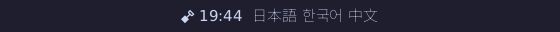

# Icons and fonts: how they work, and what they cost

The reference for the config keys is [cli.md](cli.md#icons); this is the
mechanism and the measurements behind it, for the button, volume, network and
battery modules that will reuse it, and for whoever asks "why not X".

An icon is one of three things, chosen by which config key a module's section
sets (at most one):

| Key | What | Cost | Built |
| --- | --- | --- | --- |
| `icon = "\U000f0e65"` | One glyph from the font chain (a symbol font as a fallback) | one more font file | always |
| `icon-path = "M12 2 ..."` | SVG path data, filled by the bar's own rasterizer, tinted from the theme | +24.6 KB of binary | always |
| `icon-image = "/abs/icon.png"` | A PNG, decoded once, scaled at the output's real scale | +127 KB of binary | `--features icon-image` |

The clock is the only module with an icon so far. A module names an icon, never
pixels: it holds an `Icon` (`src/icon/mod.rs`) from its settings and shows it
with `View::show_icon`; `config/icon.rs` turns the three keys into one, and the
render path measures, lays out and draws it. **The per-module `icon` keys arrive
with the modules that need them** (button, volume, network, battery, in their
own tickets): each takes the same three keys through `config::icon`, and none
is invented ahead of its module.

## Path icons

`src/icon/path.rs` parses the `d` attribute of an SVG `<path>` by hand:
`M m L l H h V v C c S s Q q T t A a Z z`, implicit repeats (`M 1 2 3 4` is a
move and a line), shorthand numbers (`.5.5`, `1e2`, `-1-2`), arc flags without
separators (`a1 1 0 00.5.5`). Relative commands become absolute, quadratics
become cubics and each arc becomes at most four cubics (the endpoint-to-center
conversion of the SVG implementation notes, F.6), so the rasterizer sees only
lines and cubics. Nothing is guessed: a stray character, a missing argument, a
bad flag, a number that is not finite or past 1,000,000, a path that does not
start with `M`, or one that draws nothing is an error naming the byte it
stopped at, and the config error names the key (`clock.icon-path: not usable
SVG path data: at byte 7: expected a number`). The bounds are 16 KiB of text,
1024 commands (an implicit repeat counts each time) and 4096 segments; a
fuzzed-string test (20,000 random and 20,000 mutated strings, plus every
truncation of a corpus of real icon paths) runs on every `cargo test`, and
another feeds hostile numbers (1e6 coordinates, radii of 1e-6, a 0.001-unit
viewbox) through the rasterizer.

The path has no size of its own, so `icon-viewbox = "min-x min-y width height"`
says which part of its plane is the icon. The default is `0 0 24 24`
(Material's); Font Awesome's are `0 0 512 512` and so on. The viewbox is fitted
into the icon's square with SVG's `xMidYMid meet`: scaled uniformly, centered.

`src/icon/raster.rs` fills it **analytically, with no supersampling**: the
signed-area accumulation `font-rs` and `ab_glyph` use for glyphs. Each edge adds
the area it uncovers into a buffer of one float a pixel; a running sum along
each row is the coverage. Curves are flattened first into at most 48 lines
within 0.025 px of the curve (a circle of radius 10 then covers 0.3% less area
than the true one; at a tenth of a pixel it was 1.1%, visibly small). The
fill rule is the accumulated winding clamped to 0 to 1: SVG's default `nonzero`
for icons as drawn (a hole wound the other way cancels, overlapping
same-direction shapes saturate). Edges outside the square are clamped to it, so
a path past its viewbox costs nothing and cannot write outside the buffer.

The size is the **em in device pixels**, rounded, so the icon is as tall as the
text's em at whatever scale the output is at: the bitmap is made at that size,
never a smaller one stretched. It is drawn tinted with the theme token of the
view's class (`normal` `fg`, `warn` `accent`, `urgent` `urgent`, `muted` `dim`),
so it follows Stylix like the text beside it. A gap of one space of the primary
font follows it when text does.

The bitmap is cached per (icon, size) in one arena of at most 4 MiB and 16
entries; past either the cache is dropped and refilled from what is drawn next
(the glyph cache's rule), and a size past 512 pixels draws nothing. A new
output scale is a new size, so it is one miss. A warm repaint allocates nothing
(`render/tests/icons.rs`, counted through `scootbg_mem`'s allocator).

### Measured

Release build (`lto = "fat"`, `codegen-units = 1`, `strip`), one core of a
4-vCPU container, `cargo test --release` ignored benchmarks (thrown away, not
committed) at the commit before this record:

| | |
| --- | --- |
| parse a 149-byte cloud path | 1.0 us |
| rasterize the cloud at 14 / 16 / 21 / 24 / 32 / 64 px | 2.3 / 2.4 / 3.0 / 3.5 / 6.2 / 13.8 us |
| the same at 128 / 512 px | 32 / 374 us |
| a ring (two arcs, four 90-degree cubics each) at 24 / 512 px | 5.7 / 498 us |
| a warm repaint of the whole bar, 1920x28, three text modules, before / after this change | 5.78 and 6.64 us / 5.07 and 6.66 us (two runs each: noise) |
| an unchanged repaint (nothing to do) before / after | 0.043 and 0.039 us / 0.031 and 0.040 us |

So a path icon costs microseconds once per (icon, size) and nothing per frame:
the draw path for a view with no icon gained one `Option` check. Binary size
(release, the bar built alone, sizes in bytes):

| Build | main | this change |
| --- | --- | --- |
| `--no-default-features` (no module) | 1,164,032 | 1,168,128 (+4,096) |
| default (`clock`, `workspaces`) | 1,442,576 | 1,467,160 (+24,584, +1.7%) |
| default + `icon-image` | | 1,594,136 (+126,976 for the decoder) |

Idle RSS of the default release bar on headless scoot with a clock and a path
icon is 4,792 kB against 4,744 kB without the icon (`VmRSS` after 2.5 s; the
cache holds one 15 x 15 bitmap).

## Image icons

`icon-image = "/abs/path.png"` (an absolute path; a relative one is refused) in
a build with the **`icon-image`** feature. `src/icon/image.rs` decodes it once,
when the config is read (so a bad file is a refused reload naming
`clock.icon-image`, with the running bar untouched), holds it as a
premultiplied `b, g, r, a` bitmap, and drops it with the module at the next
reload. It uses the `png` crate the workspace already carries (scootbg, scoot),
`0.18`, MIT OR Apache-2.0, default features, no new package in the tree.

**The feature is off by default**, measured: the decoder is +126,976 bytes on a
1,467,160-byte bar (+8.7%), and the [resource ratchet](backlog/lightest.md) does
not let a row regress for a feature most bars will not use, where a path icon
does the same job for 24 KB and follows the theme. `--no-default-features` is
the smallest build either way. Build it in with `--features icon-image`, or on
Nix through the module's `features` list
(`programs.scootbar.features = [ "clock" "workspaces" "icon-image" ]`, see
[nix.md](../nix.md#the-status-bar-scootbar)). Without it the key is unknown, and
the config error says so, as for a module that is not built. The CI matrix
treats it as one more feature: clippy and unit tests alone and combined, and
the headless-scoot test with it on.

Bounded like the font loader: opened `O_NONBLOCK` and required to be a regular
file (a FIFO or device is refused without a read; a symlink loop is the kernel's
`ELOOP`), at most 8 MiB, read whole (a file that grew past that since `fstat`
is cut and refused); the decoder has a 16 MiB allocation budget and the header's
size is checked before any pixel buffer exists (at most 1024 x 1024, so a
100000 x 100000 header is refused once the header chunk is read). Tests refuse a truncated file
at every length, a bad checksum in the header and in the data, a zero size,
oversize headers, and compressed data 4096x larger than its header declares.
Palettes, 1 to 16 bits, gray, gray and alpha, RGB and RGBA are all read (the
decoder expands them to 8-bit RGBA); an animated PNG shows its default image.

**The filter**: a separable triangle (bilinear) filter over *premultiplied*
color, its support widened to the scale ratio when shrinking (so it is an area
average: a 256-pixel icon at 20 pixels is smooth, and no source pixel is
skipped), plain bilinear when enlarging. Premultiplied, so a transparent
pixel's color never bleeds into its neighbor as a fringe. The image is fitted
into the em-sized square keeping its aspect ratio, centered, with transparent
margins, and drawn source-over with its own colors (not tinted). A full-color
SVG is converted to PNG ahead of time (the Nix module can do it in a
derivation): **no SVG files and no `resvg` in the bar**.

Measured, release: decode 256 x 256 RGBA 0.56 ms, 1024 x 1024 10.7 ms; scale
256 to 24 px 0.12 ms, 1024 to 24 px 1.8 ms, 1024 to 512 px 6.0 ms. All once, at
load or at the first draw of a size, never per frame. The cache holds one
`side x side x 4` bitmap per size (a 21-pixel icon is 1.7 KB).

## Fonts: what the real ones do

The fallback chain is documented in [cli.md](cli.md#fallback-fonts-and-icons)
and was tested against the test font in code. To check it against real ones,
the run on headless scoot (scale 1, a 32-pixel bar, 15 px) was:

- primary `DejaVuSans.ttf` (nixpkgs `dejavu_fonts.minimal`,
  `/nix/store/zqhby0xidpi0xsafsbl4l7dc72imqqq6-dejavu-fonts-minimal-2.37`),
- fallbacks `SymbolsNerdFont-Regular.ttf` (`nerd-fonts.symbols-only` 3.5.0,
  `/nix/store/hqsjk54dhxf2s380j6rrnn4jx6a5xwrm-nerd-fonts-symbols-only-3.5.0`)
  and `NotoSansCJK-VF.otf.ttc` (`noto-fonts-cjk-sans` 2.004,
  `/nix/store/dllg6pqphyxipzwihzb6phmjlq4r0w4b-noto-fonts-cjk-sans-2.004`),
- `[clock] format = "%H:%M  日本語 한국어 中文"`, `icon = "\U000f0e65"`.

The symbol icon, the Latin digits and the three CJK scripts all draw, from three
files, with no `.notdef` box. What the run showed beyond the picture:

- **A `.ttc` collection loads** (index 0), and **so does a variable CFF2 font**
  (`NotoSansCJK-VF`): `ab_glyph` reads its default instance.
- **A 32 MB CJK font costs its size in memory unless it is mapped**: it was
  read into the heap here (`RssAnon` 35,432 kB, `VmRSS` 39,140 kB with all
  three fonts), because this container's `/nix/store` is a writable mount and
  the bar maps a font only from a read-only one
  ([cli.md](cli.md#fonts)); on NixOS it is mapped, and only the pages of the
  glyphs drawn are resident. A bar that needs CJK on another distribution pays
  the file's size (this one is 32.7 MB).
- **Shaping is not done**: the run is per codepoint, in order (see the out of
  scope list in cli.md).

## Hinting: `swash` against `ab_glyph`, decided

The ticket asked whether 1x text needs hinting. A throwaway copy of the bar
(not in the tree) replaced only `ab_glyph`'s rasterization with `swash` 0.2.10
hinted (`Render` with `hint(true)`, TrueType instructions), everything else the
same, and rendered the same text at 12, 14, 15 and 16 px at scale 1 in
DejaVu Sans on headless scoot. In the image each pair is `ab_glyph` (top) then
`swash` hinted (bottom), 3x nearest-neighbor, sizes 12, 14, 15, 16 from the top:

| | `ab_glyph` (shipped) | `swash` hinted | Cost |
| --- | --- | --- | --- |
| Release binary, default features | 1,467,160 B | 2,310,928 B | **+843,768 B (+57%)** |
| Idle `VmRSS`, three runs at 15 px | 4,780 / 4,760 / 4,796 kB | 5,580 / 5,532 / 5,592 kB | **+0.79 MB (+16.7%)**, PSS +0.79 MB |

(`RssAnon` +50 kB and `RssFile` +0.75 MB: the cost is the code's pages, not the
glyph cache.) Ink pixels in the crop, by how much of them are partial coverage
(20 to 80%) and how many are fully inked (90% or more):

| px | partial, `ab_glyph` / `swash` | full, `ab_glyph` / `swash` |
| --- | --- | --- |
| 12 | 55.4% / 51.2% | 13.1% / 20.5% |
| 14 | 57.1% / 54.3% | 18.0% / 22.3% |
| 15 | 46.3% / 48.5% | 23.4% / 28.3% |
| 16 | 49.0% / 45.9% | 25.0% / 29.5% |

**Decision: do not ship `swash`.** Hinting does snap horizontal stems (more
fully inked pixels, five to seven points, and 5 to 13% fewer ink pixels), and a
side-by-side shows a slightly crisper x-height and crossbars at 12 and 14 px.
But the difference is small (the share of blurry pixels moves by three or four
points and at 15 px goes *up*), where the cost is 57% more binary and a sixth
more memory for the smallest consumer of either, which is the resource ratchet's
whole point; and the bar is meant for HiDPI outputs at fractional scales, where
device-pixel sizes are large and hinting matters least. Revisit if a real user
on a 1x display reports blurry text, and try the cheaper levers first (a
contrast curve on the coverage, a gamma-corrected blend). Nothing in the bar
depends on the choice: the rasterizer is one function, `Text::fill`.

## What was not built

- **Icon-theme lookup** (`.desktop` files and named icons, option 4): only the
  [tray](backlog/tray.md) or window icons force it, and it is the heavy path
  (loading and decoding files). It is not started.
- **A libFuzzer target** for the path parser. The stable property tests (above)
  run on every `cargo test`; the clock's two parsers have `cargo fuzz` targets
  because CI budgets them, and the path parser would be a third with the same
  shape (`icon/path.rs` uses only `std`, so it compiles by `#[path]` as they do)
  if a finding ever calls for it.
- **Built-in bitmaps or paths compiled in for the built-in modules** (mute, wifi
  bars, battery levels): those modules do not exist. The mechanism is what
  they will use.
