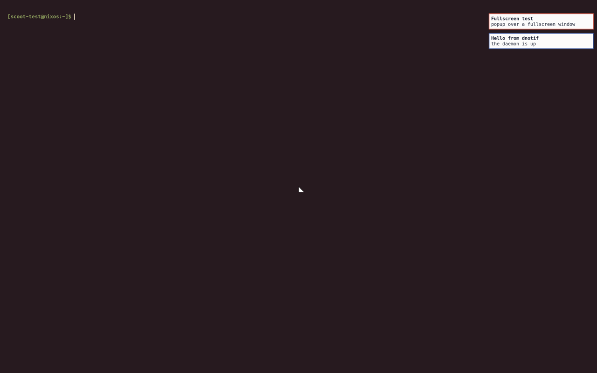
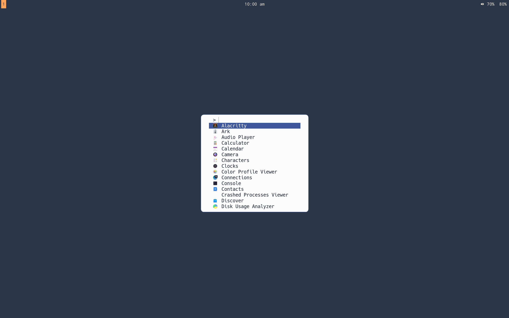
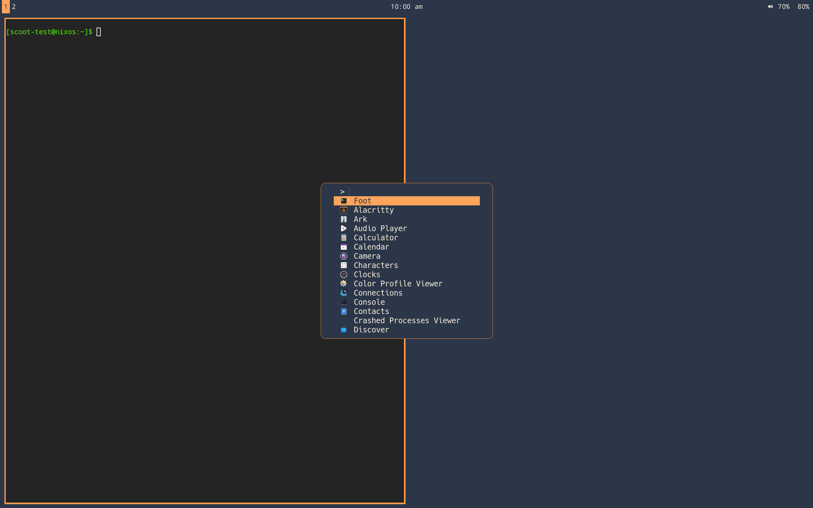
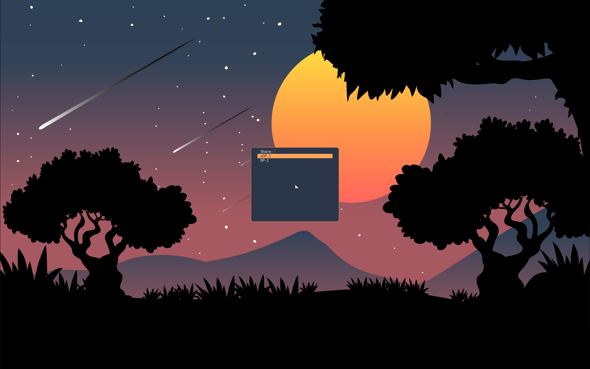

The primary path. Instead of hand-wiring the compositor, the bar, the
wallpaper daemon, the lock policy and the keymap from separate pages,
enable the desktop profile and pick a look:

```nix
# Home configuration:
programs.scoot.desktop = {
  enable = true;
  look = "music-desk";   # "vinyl-sunset" | "radial-burst" | "moonrise" | null (no theming)
};
```

```nix
# System configuration:
programs.scoot.desktop = {
  enable = true;
  # Greeter passthrough (opt-in login screen, default off):
  # greeter.enable = true;
};
```

`enable` turns on the session wiring and the bar plus wallpaper defaults:
on the NixOS side the login-screen session entry (`session.enable`) and
the system-wide scootbg (`wallpaper.enable`, so a `[wallpaper]` section
finds it on `PATH`); on the home-manager side the portal config
(`portals.enable`); on either side the bar (`programs.scootbar.enable`,
but only when that module is imported — the profile never requires it).
Either side alone degrades to what it can do: NixOS without
home-manager gets the entry and the packages but no themed config file
(the compositor config is per-user), and home-manager without NixOS gets
the themed files and the user units but no login-screen entry.

## Set up the flake

Copy-paste complete, starting from nothing. Add the input:

```nix
{
  inputs = {
    nixpkgs.url = "github:NixOS/nixpkgs/nixos-unstable";
    scoot.url = "github:scoot-sh/scoot";
  };
}
```

Prefer FlakeHub? The flake is published as `scoot-sh/scoot` (once per
merge to `main`, after both architectures' binaries reach Cachix):

```nix
{
  inputs = {
    nixpkgs.url = "github:NixOS/nixpkgs/nixos-unstable";
    scoot.url = "https://flakehub.com/f/scoot-sh/scoot/0.1.*.tar.gz";
  };
}
```

or `fh add scoot-sh/scoot`. `0.1.*` follows the rolling release (every
merge to `main`); pin a full version from the flake's page to hold
still. Either way, set up the [binary cache](../start/install.md#skip-the-compile-the-binary-cache)
or Nix compiles Smithay and the crates locally.

About `scoot.inputs.nixpkgs.follows = "nixpkgs"`: leave it **off**
unless you have a reason. The flake pins its own nixpkgs revision, and
Cachix holds binaries built from exactly that revision — with `follows`
pointing scoot's inputs at *your* nixpkgs instead, every store path
differs, the cache misses, and you compile locally the first time
(minutes). Turn `follows` on only to unify the tree with your system
at that cost. Which package name to take, the overlay, `nix run`, the
macOS split and the old-`flexwm` renames are under [Packaging
notes](../start/install.md#packaging-notes).

## NixOS

A complete minimal setup — flake plus system config:

```nix
# flake.nix
{
  inputs = {
    nixpkgs.url = "github:NixOS/nixpkgs/nixos-unstable";
    scoot.url = "github:scoot-sh/scoot";
  };

  outputs = { nixpkgs, scoot, ... }@inputs: {
    nixosConfigurations.myhost = nixpkgs.lib.nixosSystem {
      system = "x86_64-linux";
      specialArgs = { inherit inputs; };
      modules = [
        ./configuration.nix
        scoot.nixosModules.scoot
      ];
    };
  };
}
```

```nix
# configuration.nix
{ inputs, pkgs, ... }:
{
  programs.scoot = {
    enable = true;
    desktop.enable = true;
    desktop.look = "moonrise";
    # Real hardware with a GPU? Take the scanout build instead of the default:
    # (see "Which build do I need" on the install page)
    # package = inputs.scoot.packages.${pkgs.system}.scoot-gpu;
    # Log in through ReGreet (opt-in; default off):
    # greeter.enable = true;
  };
}
```

```sh
nixos-rebuild switch --flake .#myhost
```

The session entry comes on with the profile (without it, `session.enable`
stays an explicit opt-in — a login-screen change is a change to your way
back in, and that stays deliberate). The entry adds scoot *alongside*
your existing sessions, never replacing the default. The greeter replaces
the login screen, so it is opt-in twice over; it is refused at eval
beside GDM or SDDM. Logging in through it starts the same session [First
session](../start/first-session.md) describes.

Which options live on which side:

| Side | Owns |
|---|---|
| NixOS (`programs.scoot` in `configuration.nix`) | the package system-wide; the login-screen session entry; system-wide scootbg (so `[wallpaper]` finds it on `PATH`); the idle/lock tools system-wide, the docked-lid rule, and the locker's PAM service; the portal backends system-wide plus PipeWire running; the profiles daemon, the lid/power-key/low-battery policy and the charge service (all opt-in through `power.enable`); the greeter |
| Home Manager (`programs.scoot` in the home config) | the themed config file; the portal config; the per-desktop chooser config xdpw asks through; the screenshot tools; the user units (idle policy, notification daemon, clipboard watchers, bar feed) plus the `scoot-session.target` scope they start in; the profile switch, the charge button's fill unit, and the tools for the user |

## Home Manager

Standalone (a `home.nix` kept next to the machine that edits it — this
form also manages the config on macOS, for the Linux box it deploys
to):

```nix
# flake.nix
{
  inputs = {
    nixpkgs.url = "github:NixOS/nixpkgs/nixos-unstable";
    home-manager.url = "github:nix-community/home-manager";
    home-manager.inputs.nixpkgs.follows = "nixpkgs";
    scoot.url = "github:scoot-sh/scoot";
  };

  outputs = { nixpkgs, home-manager, scoot, ... }: {
    homeConfigurations."alice" = home-manager.lib.homeManagerConfiguration {
      pkgs = nixpkgs.legacyPackages."x86_64-linux";
      modules = [
        ./home.nix
        scoot.homeModules.scoot
      ];
    };
  };
}
```

```nix
# home.nix
{
  programs.scoot = {
    enable = true;
    desktop.enable = true;
    desktop.look = "moonrise";
  };
}
```

(The legacy spelling `scoot.homeManagerModules.scoot` resolves to the
same module.) As a NixOS module instead — home-manager inline in the
system flake above:

```nix
# inside outputs, beside ./configuration.nix:
# modules = [
#   ./configuration.nix
#   scoot.nixosModules.scoot
#   home-manager.nixosModules.home-manager
# ];
# home-manager.users.alice.imports = [ scoot.homeModules.scoot ];
# home-manager.users.alice.programs.scoot = {
#   enable = true;
#   desktop.enable = true;
#   desktop.look = "moonrise";
# };
```

A home-manager-only setup still needs two things from wherever PAM
and the seat are configured: the locker's PAM service (else no
password unlocks it), and backlight rights for dimming (else the dim
step logs EPERM and does nothing).

## Which sessions start the units

Every profile unit — the idle pair, mako and its bar feed, both
clipboard watchers, and the profile-managed bar — starts in
`scoot-session.target`, scoot's own session scope, and stops when it
ends. That scope is what the launcher starts past the display import,
so the display is already in the user manager when the units start.
No other desktop starts them: logging in to GNOME, KDE, niri or
Hyprland with the same home-manager config leaves scoot's mako,
locker policy and clipboard history stopped, instead of running
them inside someone else's session. (A standalone bar — the bar
module without the profile — stays a generic
`graphical-session.target` unit, the way other compositors run it.)

Without the launcher — a hand-written greetd entry or `startwm.sh`
that runs `scoot --tty` directly instead of `scoot-session` — start
the scope by hand once the display is known, and stop it on the way
out:

```sh
systemctl --user import-environment WAYLAND_DISPLAY XDG_CURRENT_DESKTOP XDG_SESSION_TYPE
systemctl --user start scoot-session.target
# ... on exit:
systemctl --user stop scoot-session.target
```

The home-manager side installs the scope's target file itself, so
this works with no NixOS login entry. Units ordered after the scope
inherit the imported display from the user manager. A
`sessionScript` entry (`scoot --tty -- session.sh`) never gets this
wiring — for startup programs that want it, use `[autostart]`
instead.

## Without flakes

`nix run github:scoot-sh/scoot -- --nested -- foot` tries it with
nothing installed, and `nix profile add` keeps it (see
[Install](../start/install.md)). Not on NixOS at all? That is the
[second front door](../start/install.md): the same page's build-from-source
route plus your own bar, launcher and session script — the profile is
optional by design, and everything it automates is documented piece by
piece across this site.

Which build sits underneath is still your call: the profile never sets
`programs.scoot.package`, so [pick the CPU or GPU build](../start/install.md#which-build-do-i-need)
there and the whole desktop follows it.

Two loud refusals instead of silent no-ops: `desktop.enable` without
`programs.scoot.enable`, and a `look` without `desktop.enable`, each fail
evaluation naming the missing switch; an unknown `look` fails naming the
four valid ones.

## Pick a look

`look` applies that example's palette to every piece the flake owns
today: the compositor `[appearance]` colors, the bar `colors`, and the
session wallpaper where one ships in the repository:

| Look | Compositor ring / background | Bar | Wallpaper |
|---|---|---|---|
| `music-desk` | blue ring `#3D579A`, paper `#FCFBFB` | paper, ink and blue | ships (copied to the store) |
| `radial-burst` | blue ring `#31a9e5`, plum `#241721` | plum, yellow and blue | ships (copied to the store) |
| `moonrise` | amber ring `#FF9A49`, slate navy `#2B3648` | navy, cream and amber | ships (copied to the store) |
| `vinyl-sunset` | orange ring `#E59560`, espresso `#271A1F` | espresso, cream and orange | **no image ships**: the illustration's license forbids passing it on standalone, so the session shows the flat espresso `background_color` unless you set `wallpaper` yourself |

`null` (the default) themes nothing. What the look does not theme yet
stays yours: layout details (gaps, corner radius, column widths — copy
them from the example's `scoot.toml` if you want the whole look), the
terminal palette (the flake installs no terminal), and the login screen's
stylesheet (each example ships a `regreet.css`; the greeter child themes
it later).

**Precedence**, highest first, per key: a value you set in `settings`,
then Stylix's (Stylix stays the override path where present), then the
look's. So `settings.appearance.background_color = "#123456"` beside
`look = "music-desk"` replaces that one color and keeps the rest of the
look. One combination is invalid the same way the Stylix one is: a
`wallpaper.color` you set yourself beside a look's shipped `image` (the
two together are refused by scoot, fail-safe — the session carries on
with `background_color`). Set your own `image` instead (it wins per key),
or drop to `look = null`.

For `vinyl-sunset`, the illustration is yours to download: point the
wallpaper at your copy and the flat color steps aside:

```nix
programs.scoot.settings.wallpaper = {
  image = "~/Pictures/wallpapers/vinyl-sunset.png";
  mode = "fill";
};
```

The look does not fetch it for you, deliberately: the illustration's
license forbids passing it on standalone and automated downloading is at
best unclear under its terms, so no URL is wired into the look. To drop
the illustration entirely, remove the `[wallpaper]` table: the flat
espresso `background_color` is the look without it. Every look is
previewed in [Theming](../scoot/theming.md) — including how to make your
own.

## Idle and lock

Idle and lock come on with the profile: a laptop that never dims, locks,
or sleeps its panels is not daily-drivable, so this is a default, not a
slot you wire yourself. After this many seconds without input:

| At | What | Why this step |
|---|---|---|
| 2 min | the panel dims to 10% (`brightnessctl -s set 10%`, restored on activity) | the backlight is most of idle draw (measured on the M2: 4.55 W screens on, 1.52 W both off) |
| 4 min | the session locks (`loginctl lock-session`, locker over `ext-session-lock-v1`) | after dim, **before** screens off, so the lock is already up when the panel goes dark and no unlocked frame is ever visible on wake |
| 5 min | every output powers off (`wlopm --off '*'`, back on at the first input, locked or not) | the measured 3 W saving |
| sleep | locks first, then sleeps (swayidle's `before-sleep`, waited on) | suspend must never land on an unlocked session |
| docked lid close | locks, does not suspend | a closed lid on a multi-output box means the user walked away, not that the session should die |

Audio holds the whole sequence off while anything plays (any sink or
source running), so music or a call never dims the panel. Any input
restarts every timer from zero, so there is nothing to reset after
unlock. One timeout set covers AC and battery alike; per-machine tuning
is an override away.

The locker follows the look: screen and indicator from its palette (a
value in `lock.settings` winning per key, `theme.targets.lock.enable =
false` dropping the themed block while the rest follows the look).
Locked, it looks like this — the music-desk palette, paper screen, the
indicator hidden until you type (captured from a real session through
scoot's own IPC screenshot path):


Every value is an option, applied on rebuild/switch (the units restart
into the new config; no re-login):

| Option | Type | Default | Meaning |
|---|---|---|---|
| `desktop.idle.enable` | bool | `true` with the profile | run the policy (dim, screens off, sleep lock, audio hold) |
| `desktop.idle.dimTimeout` | int (seconds) | `120` | inactivity before dimming; `0` disables the step |
| `desktop.idle.dimLevel` | int (percent, 1-100) | `10` | brightness the dim step sets |
| `desktop.idle.lockTimeout` | int (seconds) | `240` | inactivity before locking; `0` disables the step (sleep still locks) |
| `desktop.idle.offTimeout` | int (seconds) | `300` | inactivity before outputs power off; `0` disables the step |
| `desktop.idle.mediaInhibit.enable` | bool | `true` with the profile | hold idle while audio plays (needs PipeWire or PulseAudio running) |
| `desktop.idle.lock.enable` | bool | `true` with the profile | lock through the locker below |
| `desktop.idle.lock.command` | string | `loginctl lock-session` (system path on NixOS) | the stable lock action: what the timeout runs, and what the keymap's `Super+Escape` bind runs — lid-close and manual locks share this path through logind |
| `desktop.idle.lock.daemon` | enum (`"swaylock"`) | `"swaylock"` | the locker behind the action (a future scootlock widens this without renaming anything) |
| `desktop.idle.lock.settings` | attrset of string | `{ }` | extra swaylock lines over the themed ones (a value here wins per key) |
| `desktop.theme.targets.lock.enable` | bool | `true` | theme the locker from the look; `false` keeps swaylock's own style while the rest follows the look |

```nix
programs.scoot.desktop = {
  enable = true;
  # Later to bed: lock at 10 min, screens off at 15.
  idle.lockTimeout = 600;
  idle.offTimeout = 900;
  # No idle policy at all (the profile turns the set on; each switch below
  # turns its piece back off):
  # idle.enable = false;
  # idle.lock.enable = false;
  # idle.mediaInhibit.enable = false;
};
```

Troubleshooting, by symptom:

- *Screens never dim or power off.* Check the unit is running:
  `systemctl --user status scoot-idle` — and that it started with the
  display (a hand-started session must reach `scoot-session.target`
  with `WAYLAND_DISPLAY` imported, [above](#which-sessions-start-the-units)). The generated config is at
  `~/.config/swayidle/config`: read it, the timeouts are literal. Dim
  specifically needs the seat: logind grants the *active* login
  backlight access, so dim works in the seat session and logs EPERM
  anywhere else (over ssh, from a timer with no session).
- *The locker appears but no password works.* Unlock needs PAM: the
  NixOS side names it itself, but a home-manager-only setup needs it set
  wherever PAM is configured. Check Caps Lock second — the indicator
  shows its state while you type.
- *The timeout passes and the session never locks.* The locker is
  probably exiting immediately: run `swaylock -f -C
  ~/.config/swaylock/config` by hand — if it drops straight back to the
  prompt, its error names the cause.
- *`loginctl lock-session` does nothing visible.* Something must listen
  for logind's Lock: that is the policy's `lock` event, so `scoot-idle`
  is not running or `lock.enable` is off.
- *Music dims the panel.* The hold needs the inhibitor unit *and* an
  audio server: `systemctl --user status scoot-audio-inhibit` plus
  something actually playing. Without a server the unit backs off and
  stays stopped.
- *Closing the docked lid suspends.* Something beat the profile's
  docked-lid lock rule: your own logind setting wins over it.

Without the flake, the same policy is a hand-written swayidle setup —
see [Idle in the compositor reference](../scoot/configure.md#idle-locking-and-screen-power).

## Notifications

Notifications come on with the profile: a desktop with no notification
daemon drops password prompts, calendar pings and low-battery warnings
on the floor. The daemon is mako, owning
`org.freedesktop.Notifications` on the session bus as a user unit, with
its popups on the **`overlay`** layer:

```nix
programs.scoot.desktop = {
  enable = true;
  # A popup at the bottom-right, at most three visible:
  # notifications.settings = { anchor = "bottom-right"; max-visible = "3"; };
  # No daemon at all on this box:
  # notifications.enable = false;
};
```

The one setting that matters most is already set: `layer=overlay`.
mako's own default is `top`, which the compositor hides under a
fullscreen window — so a fullscreen game would swallow every popup.
`overlay` stays above it (the frame then composites instead of scanning
out directly; nothing changes on screen, at the cost of one compositing
pass). A critical popup over a fullscreen window looks like this (blue
ring for normal, urgent ring for critical — captured from a real session
through scoot's own IPC screenshot path):



Overriding `layer` back to `top` re-hides popups under fullscreen.

Over the session lock, nothing of a notification's content ever shows:
while locked the compositor draws nothing but the lock client's own
surfaces, so popups that arrive while locked wait in the daemon and
appear on unlock. The shot below is intentionally blank — it is
byte-identical to the frame just before the notification arrived, which
is the whole proof:


DND state and the unread count reach the bar through its `push` module —
the module is defined, not placed; show it with one line in your bar
config:

```toml
right = ["notifications", "clock"]
```

Each state has its own icon, so DND reads at a glance: a hollow circle
while idle, a solid dot beside the unread count, and a crescent moon
while do-not-disturb holds notifications (captured from a real session
through scoot's own IPC screenshot path, DejaVu Sans at 17 px):


The defaults are all in DejaVu Sans, the bar's default font, so they
render with no symbol font — and a default the font cannot draw fails
the flake's own checks instead of shipping a missing glyph. The old
envelope default is gone for exactly that reason: at bar size its fold
lines read as the X of a missing-glyph box. Each icon is overridable —
an empty `unread` or `dnd` sends no icon, so the static `idle` icon
shows beside the text (empty `idle` too for none) — and each is empty or
one glyph: two or more glyphs fail evaluation, since the bar refuses
them per update (two 2-byte glyphs such as `éé` slip past the check and
leave that state's last value shown, so do not use them). A Nerd Font glyph works wherever `bar.fallback-fonts`
provides one:

```nix
programs.scoot.desktop.notifications.bar.icons = {
  idle = "○"; # the push module's static icon; "" shows nothing while idle
  unread = "●"; # sent beside the count, overriding idle while set
  dnd = "☾"; # sent while do-not-disturb is on, overriding idle while set
};
```

A future scootnotify keeps these option names: only the daemon behind
them changes.

Every value is an option, applied on rebuild/switch (the units restart
into the new config; no re-login):

| Option | Type | Default | Meaning |
|---|---|---|---|
| `desktop.notifications.enable` | bool | `true` with the profile | run mako plus the bar feed |
| `desktop.notifications.daemon` | enum (`"mako"`) | `"mako"` | the daemon behind `enable` (a future scootnotify widens this without renaming anything) |
| `desktop.notifications.settings` | attrset of string | `{ }` | extra mako lines over the generated ones (a value here wins per key, rendered verbatim) |
| `desktop.notifications.bar.icons.idle` | string: empty or one glyph | `"○"` | the bar's static icon while idle; `""` shows nothing while idle |
| `desktop.notifications.bar.icons.unread` | string: empty or one glyph | `"●"` | the icon the feed sends beside the unread count |
| `desktop.notifications.bar.icons.dnd` | string: empty or one glyph | `"☾"` | the icon the feed sends while do-not-disturb is on |
| `desktop.theme.targets.notifications.enable` | bool | `true` | theme mako from the look; `false` keeps mako's own style while the rest follows the look |

Troubleshooting, by symptom:

- *No popups at all.* Check the unit: `systemctl --user status mako` —
  and that D-Bus knows it: `busctl --user list | grep -F
  Notifications` should name mako's owner.
- *Popups vanish under fullscreen.* Something set `layer` back to
  `top`: read `~/.config/mako/config` (the generated file), the first
  content line is the layer.
- *The bar shows nothing.* The module needs placing (the one line
  above), the bar needs the `push` feature, and the feed needs running:
  `systemctl --user status scoot-notify-sync`.
- *DND is stuck on.* `makoctl mode` lists the modes; toggle it back:
  `makoctl mode -r do-not-disturb`.
- *A popup stayed up for hours.* That is mako's default (no timeout):
  `makoctl dismiss -a` clears them all into history, or set one:
  `notifications.settings.default-timeout = "10000";` (milliseconds).
- *Two daemons fight over popups.* Another notifier owns the bus name
  instead: only one can. Turn this one off or uninstall the other.
- *A custom state icon shows as a box.* The glyph is in neither the
  bar's font nor its fallbacks: add the symbol font to
  `bar.fallback-fonts` (see the scootbar Fonts section).

## Clipboard

Copy in one window, close it, and the paste still works: every copy
lands in a history kept by cliphist, restorable with one keypress.
Without this slot, a copy dies with the app that offered it — from
your side of the screen that reads as data loss, and agents move text
through the clipboard constantly, so the profile turns it on.

```nix
programs.scoot.desktop = {
  enable = true;
  # A longer tail in a moved db:
  # clipboard.maxItems = 250;
  # clipboard.dbPath = "/home/you/.cache/cliphist-test/db";
  # No history at all on this box (each switch below is its own):
  # clipboard.enable = false;
};
```

What runs: two watcher units (regular clipboard and primary selection,
in `scoot-session.target`, so no other desktop starts them), each a `wl-paste --watch`
feeding one shared history, plus `wl-copy`/`wl-paste` on `PATH` for
scripts and terminals. The history keeps 100 entries by default
(oldest dropped first, each entry at most 5 MB), byte-for-byte:
trailing newlines survive, and so do images. Press `Super+v` and the
picker shows the newest first; Enter restores the picked entry to the
clipboard, then paste as usual:


Know exactly what "the paste still works" promises, because Wayland
selections are owner-held: the *history* survives the source app
closing (and a reboot — it lives in a db on disk), while the *live*
selection still dies with its owner. So `Ctrl+v` right after closing
the source finds nothing — open the picker, Enter, paste. One
keypress, always the same path.

Password-manager copies never land in history, by construction: such
an offer carries the `x-kde-passwordManagerHint` MIME type, for which
the watcher stores nothing. Managers that do not set the hint are
*not* excluded — treat the history as sensitive-adjacent anyway. Try
it: `wl-copy --sensitive` copies, and the history stays empty.

Over the session lock, two halves: the history is wiped as the session
locks (pre-lock copies never sit on disk behind the lock screen), and
nothing copied during the lock is recorded. Without the idle policy
there is no lock event to ride, so a standalone clipboard wipes
manually (`cliphist wipe`). The db lives at cliphist's default
(`~/.cache/cliphist/db`, honoring `XDG_CACHE_HOME`) unless `dbPath`
moves it — on disk, so history survives reboots. That is the privacy
trade-off, stated whole: convenience against exposure (any same-uid
process reads the db file). Secrets never land there by the mechanism
above, the lock wipes it every lock, and `wipe` empties it any time;
there is deliberately no encrypt-at-rest.

Every value is an option, applied on rebuild/switch (the units restart
into the new config; no re-login):

| Option | Type | Default | Meaning |
|---|---|---|---|
| `desktop.clipboard.enable` | bool | `true` with the profile | keep history (two watcher units), `wl-copy`/`wl-paste` on `PATH`, the picker bind |
| `desktop.clipboard.maxItems` | int (at least 1) | `100` | history entries kept, oldest dropped first |
| `desktop.clipboard.dbPath` | string or null | `null` (cliphist's default) | history db path: absolute, letters, digits and `._/+@-` only; anything else fails evaluation |
| `desktop.theme.targets.clipboard.enable` | bool | `true` | theme the picker from the look; `false` keeps fuzzel's own style |

Troubleshooting, by symptom:

- *Close the app and the paste is empty.* That is the live selection,
  not the history: open the picker (`Super+v`), Enter on the entry,
  paste. If the *picker* is empty too, the watcher never stored it:
  `systemctl --user status scoot-clipboard-store` (and
  `-primary-store`), then `cliphist list`.
- *`Super+v` opens nothing.* The slot renders that bind only with
  `clipboard.enable` beside the keymap (both on with the profile).
  Then check the menu: `fuzzel --dmenu` from a terminal — with an
  empty history it exits at once, which is the picker staying quiet,
  not an error.
- *Escape clears my clipboard.* It does not: a cancelled pick exits
  before `wl-copy` runs. If the selection changed anyway, another
  manager runs beside this one — only one watcher per selection
  should run.
- *A password is in the history.* The offering app did not set the
  hint: delete it (`cliphist list | fuzzel --dmenu | cliphist
  delete`, or `wipe` for all of it) and tell the app to set it.
- *Copies made while locked are in the history.* The store entry's
  probe failed open: check `scoot-clipboard-store` and the
  compositor's socket. The wipe still ran at lock, so pre-lock
  entries are gone regardless.
- *Two pickers / two histories.* Another manager runs beside this
  one: only one should. Turn this one off or uninstall the other.

## Launcher

Press `Super+d`, type a few letters, Enter — the app opens. Without
this slot a fresh desktop's launcher key does nothing; with it (on
with the profile) two binds open one menu:

```nix
programs.scoot.desktop = {
  enable = true;
  # The menu on Super+d lists XDG apps, most-launched first;
  # Ctrl+Alt+Space adds PATH executables beside them:
  # launcher.enable = false;  # no menu at all on this box
};
```

What runs: `Super+d` spawns `scoot-launcher` (drun: every XDG app —
the user's `~/.local/share/applications` plus the system's
`XDG_DATA_DIRS`, most-launched first), `Ctrl+Alt+Space` spawns the
same script with `--list-executables-in-path` (run: PATH executables
beside the apps). The menu draws on the **`overlay`** layer with
exclusive keyboard — above fullscreen windows (fuzzel's own default
is `top`, which the compositor hides under fullscreen, the mako
lesson), taking every key while open. There is no daemon, no unit, no
config file: the launcher holds nothing when closed (no process, no
memory — verified below). The ranking lives in fuzzel's own cache
(`$XDG_CACHE_HOME/fuzzel`: app launch counts, most-launched sorted at
the top); a second press while it is open does nothing (fuzzel holds
a per-display lock and refuses a second instance).

The menu follows the look: background and text, selection and border
from its palette (the exact flags are pinned in `nix/tests.nix` —
the same seven leaves the clipboard picker carries, one menu one
palette), a value you set in fuzzel's own config (`fuzzel.ini`: font,
lines, and everything these flags leave alone) winning per key as
usual, `theme.targets.launcher.enable = false` dropping the themed
flags while the rest follows the look. In music-desk paper and ink:



And in moonrise (same menu, same flags, that look's roles —
captured from a real session through scoot's own IPC screenshot path,
like every shot on this site):



Why fuzzel, measured at the pinned rev (`8ce4ef6`, `aarch64-linux`:
full closures by `nix path-info --closure-size`, marginals as new
store paths over the profile's own tools — swayidle, brightnessctl,
wlopm, swaylock, sway-audio-idle-inhibit, wireplumber, playerctl and
the lean mako — cold start as exec to first mapped frame under a
headless scoot on the M2, screenshot-diff poll at ~10 ms, three runs
each; RSS as VmRSS while the menu is mapped):

| Tool | Version | Full closure | New over profile | Cold first frame | RSS open | Why / why not |
|---|---|---|---|---|---|---|
| fuzzel | 1.14.1 | 152.4 MiB | 41.7 MiB (4 paths) alone, **0 with the clipboard** (the picker already ships this exact derivation — the launcher adds one wrapper script) | 57 / 50 / 52 ms | ~22 MB | the pick: layer-shell native, no toolkit, sub-60 ms cold, nothing held when closed |
| wofi | 1.5.3 | 342.3 MiB | 67.4 MiB (16 paths) | 135 / 80 / 73 ms | ~44 MB | heavier than fuzzel and GTK-based, slowest cold start of the set |
| tofi | 0.9.1 | 113.0 MiB | 0.2 MiB (1 path) | 62 / 41 / 46 ms | ~26 MB | lighter alone — passed over for the reuse: a second menu tool would theme, document and maintain twice for no saving once fuzzel ships for the picker |
| bemenu | 0.6.23 | 117.4 MiB | 0.6 MiB (2 paths: itself plus libxinerama) | 57 / 33 / 36 ms | ~18 MB | same call as tofi |

The dmenu contract is the slot's other half, and the reason the
clipboard picker already speaks it: lines on stdin, the selection on
stdout (`fuzzel --dmenu`, with `--no-run-if-empty` staying quiet on
an empty history and `--only-match` refusing custom entries — the
pickers' flags). Proven live, not just documented: `printf
'alpha\nbeta\ngamma\n' | fuzzel --dmenu`, the filter and Return driven
through scoot's own IPC, prints `beta` and exits 0 — and a future
`scootlaunch --dmenu` keeps that shape, so the bar's WiFi / power /
audio pickers swap daemons without changing a call site (see
[the launcher entry](https://github.com/scoot-sh/scoot/tree/main/docs/scootbar/backlog/launcher.md):
the `daemon` enum below widens to it without renaming anything).

Launched apps land in the session like any spawned client: fuzzel
forks the picked entry (a `Terminal=true` entry through your
terminal) and exits, and the window maps and takes focus through the
usual activation path. Over the session lock the binds never fire at
all (plain strings: never repeat, never `allow_when_locked`), so
there is nothing to refuse — and a manual run behind the lock only
lists app names, never clipboard or notification content.

Every value is an option, applied on rebuild/switch (the binds
re-render into `[binds]`; no re-login, `scoot msg reload` is enough):

| Option | Type | Default | Meaning |
|---|---|---|---|
| `desktop.launcher.enable` | bool | `true` with the profile | the package on PATH and both binds bound (drun on `Super+d`, run on `Ctrl+Alt+Space`) |
| `desktop.launcher.daemon` | enum (`"fuzzel"`) | `"fuzzel"` | the program behind `enable` (a future scootlaunch widens this without renaming anything) |
| `desktop.launcher.package` | package or null | fuzzel (Linux-only: null off Linux) | point at your own fuzzel build; null with the switch on fails evaluation naming it |
| `desktop.theme.targets.launcher.enable` | bool | `true` | theme the menu from the look (background and text, selection and border); `false` keeps fuzzel's own style |
| `desktop.keys.binds.launcher.enable` / `.launcherRun.enable` | bool | `true` | bind the drun / run menu (`false` leaves that combo unbound) |

Troubleshooting, by symptom:

- *`Super+d` (or `Ctrl+Alt+Space`) opens nothing.* The slot renders
  those binds only with `launcher.enable` beside the keymap (both on
  with the profile); either off leaves the combo unbound. Then check
  the binary: `scoot-launcher` from a terminal — outside the session
  it still lists apps (it is just fuzzel with flags), so a failure
  there names fuzzel's own cause (no compositor to map on, a broken
  `fuzzel.ini`).
- *The menu lists no apps.* fuzzel found no `.desktop` files: it
  searches the `applications` subdirectory of `XDG_DATA_HOME` and
  `XDG_DATA_DIRS`. Inside the session both are set (try `echo
  $XDG_DATA_DIRS` in a terminal); over ssh they may be empty, which
  is the menu telling the truth about that environment.
- *The wrong app keeps winning.* That is the ranking, not a bug: the
  most-launched sorts first. Reset it by clearing the cache
  (`rm ~/.cache/fuzzel` with the menu closed), or turn it off for one
  class of invocation with `--cache=/dev/null`.
- *My `fuzzel.ini` font is ignored.* It is not: only the seven color
  leaves travel as CLI flags (which beat the file, as CLI does) —
  font, lines, borders and everything else still come from your
  config. A color set in both places loses to the look (or to
  `theme.targets.launcher.enable = false`, which drops the flags and
  leaves the whole file standing).
- *Two menus stack.* They cannot from these binds: the second press
  finds fuzzel's per-display lock and exits. A second menu means a
  second launcher (another menu tool running beside this one): turn
  this one off (`launcher.enable = false`) or uninstall the other.

## Screenshots and screen sharing

Share your screen in a Meet call, or screenshot a region into
`~/Pictures` — on with the profile, through the standard portals, so
Chrome, Meet, OBS and Telegram all work with nothing extra to start.

```nix
programs.scoot.desktop = {
  enable = true;
  # Share without being asked which screen (kiosk: one fixed output):
  # capture.chooser = "none";
  # capture.outputName = "eDP-1";
  # No screenshots or sharing at all on this box:
  # capture.enable = false;
};
```

What runs: the portal backends system-wide
(`xdg-desktop-portal-wlr` 0.8.4 or later for ScreenCast and
Screenshot, `xdg-desktop-portal-gtk` for the file chooser and the
rest — a too-old backend fails evaluation naming the floor, never a
cast that binds nothing), the `scoot` backend selection beside them
(ScreenCast and Screenshot to `wlr`, everything else to `gtk`: the
same file the home-manager side installs per user, which wins where
both exist), PipeWire running for the cast, `grim` plus `slurp` for
the screenshot binds, and the output chooser xdpw asks through before
each cast. The portals start on demand over D-Bus and hold nothing
until a cast asks — no daemon, no memory, no wakeups when you are
not sharing.

Three binds, each plain (fire once, never behind the lock screen):

| Press | Does | Lands |
|---|---|---|
| `Print` | screenshot every output | dated files in `~/Pictures` (`scoot-20261005-143022.png`) |
| `Shift+Print` | screenshot a picked region | dated file in `~/Pictures` |
| `Ctrl+Print` | screenshot a picked region | straight into the clipboard (`wl-copy`) |

The region picker dims the screens and draws the pick with the
look's ring and accent (slurp's own style without a look, or with
`theme.targets.capture.enable = false`).

Before each cast, xdpw asks *which screen*: a dmenu list of every
output through the profile's fuzzel — the same `--dmenu` contract
the clipboard picker and the launcher speak, themed from the same
seven look roles, so the three menus read as one. The list, not a
click, is the default on purpose: in a Meet flow the call lives on
one screen while the thing to share is on the other, and a menu
names outputs from the keyboard where a click-picker needs the
pointer on the right screen first. The alternatives are one option
away: `chooser = "slurp"` picks by clicking a screen (xdpw's own
shape, themed the same way), and `chooser = "none"` casts
`outputName` — a connector name as `wayland-info` lists it, e.g.
`"eDP-1"` — with no picker at all (leave it null and any output
casts). Casts are capped at 30 frames per second (`maxFps`, `0`
lifts the cap): plenty for a call, and it bounds the compositor's
copy cost. The menu, in the moonrise look, over a call:



One honest limit, stated up front: scoot captures **outputs only**.
There is no per-window capture source, so a call's window picker
falls back to screens — share a screen, not a window. The window
list itself is still live (taskbars and Alt-Tab see every window),
only its pixels are not separately capturable.

If you drive scoot from an agent or a script, skip the portals:
`scoot msg screenshot` captures an output over the privileged IPC
socket with no portal, no picker and no clipboard involved — the
agent path, while everything above is the human path. See
[Screenshots](../msg/screenshots.md).

Every value is an option, applied on rebuild/switch (the chooser
file and the binds re-render; no re-login):

| Option | Type | Default | Meaning |
|---|---|---|---|
| `desktop.capture.enable` | bool | `true` with the profile | the backends on their bus names, PipeWire running, the tools on PATH, the chooser file written, the three binds bound |
| `desktop.capture.chooser` | enum (`"fuzzel"`, `"slurp"`, `"none"`) | `"fuzzel"` | the output picker before each cast (dmenu list, click a screen, or no picker) |
| `desktop.capture.outputName` | string or null | `null` (any output) | the output `chooser = "none"` casts (a connector name, e.g. `"eDP-1"`); read only with `chooser = "none"` |
| `desktop.capture.maxFps` | int (at least 0) | `30` | most frames per second on a cast; `0` means no limit |
| `desktop.capture.grimPackage` / `.slurpPackage` / `.menuPackage` / `.wlClipboardPackage` | package or null | grim / slurp / fuzzel / wl-clipboard (Linux-only: null off Linux) | point at your own builds; null with the switch on fails evaluation naming it (grim below 1.5.0 and the wlr backend below 0.8.4 fail the same way) |
| `desktop.capture.portalWlrPackage` / `.portalGtkPackage` | package or null | xdg-desktop-portal-wlr / -gtk (NixOS side; Linux-only: null off Linux) | the backends themselves; null with the switch on fails evaluation naming it |
| `desktop.theme.targets.capture.enable` | bool | `true` | theme the chooser and the region picker from the look; `false` keeps their own style |
| `desktop.keys.binds.captureOutput.enable` / `.captureRegion.enable` / `.captureClipboard.enable` | bool | `true` | bind that screenshot (`false` leaves its combo unbound) |

Troubleshooting, by symptom:

- *Meet's share dialog offers nothing, or the request fails at
  once.* Check the chain in order: the portals are up
  (`systemctl --user status xdg-desktop-portal
  xdg-desktop-portal-wlr` — both D-Bus activated, so a dead one
  here means activation itself failed and the logs name it), the
  session names scoot (`echo $XDG_CURRENT_DESKTOP` must print
  `scoot`, and the D-Bus activation environment must carry it too —
  the launcher imports it past the display import; a hand-started
  session needs `dbus-update-activation-environment --systemd
  WAYLAND_DISPLAY XDG_CURRENT_DESKTOP XDG_SESSION_TYPE`), and PipeWire runs
  (`wpctl status` lists sinks — no server, no cast).
- *Chrome shares a black screen, or offers windows it cannot
  capture.* Chrome is on its X11 capturer: it picks the portal
  capturer only with `XDG_SESSION_TYPE=wayland` in its own
  environment (`echo $XDG_SESSION_TYPE` in the terminal that
  started it; Chrome blanks its own `/proc/PID/environ`, so reading
  that file shows nothing either way). Every launcher login exports `wayland`, greeter
  or console; a hand-started session needs the three-var activation
  line in the entry above, and a Chrome started outside the session
  (over ssh, from another desktop's terminal) needs a restart from
  inside it.
- *The share starts but shows the wrong screen, or never asks.* The
  chooser is `none` (casts `outputName`, or any output when that is
  null): set `chooser = "fuzzel"` for the list. With two outputs,
  check the compositor sees both (`scoot msg outputs`).
- *`Print` (or `Shift+Print`, `Ctrl+Print`) does nothing.* The slot
  renders those binds only with `capture.enable` beside the keymap
  (both on with the profile); either off leaves the combo unbound.
  Then check the tool: `grim -o eDP-1 /tmp/t.png` from a terminal —
  outside the session it names grim's own cause.
- *The call's window list is empty.* Expected: outputs only (above).
  Share a screen.
- *A screenshot taken while locked shows the lock, not the
  desktop.* That is the guarantee, not a bug: while locked the
  compositor draws nothing but the lock client's own surfaces, so a
  capture holds no locked pixels. The portal Screenshot and `grim`
  see the same frame `scoot msg screenshot` does.
- *Two portal configs fight.* The per-user
  `~/.config/xdg-desktop-portal/scoot-portals.conf` (the profile's)
  beats the system's `/etc/xdg/xdg-desktop-portal/scoot-portals.conf`
  (also the profile's, for sessions without home-manager) — read the
  user one first. A hand-written file in either place wins over both
  only if it sorts earlier in the lookup; don't.

## Hardware keys and desktop actions

A laptop whose brightness and volume keys do nothing is not
daily-drivable, so the profile ships one keymap for them and for the
desktop actions — and it is on with the profile. The compositor's own
built-in defaults stay window management only: hardware binds spawn
tools scoot does not ship, so they belong to the profile that installs
those tools, not to every scoot session.

| Press | Does | Needs (beside the profile) |
|---|---|---|
| `XF86MonBrightnessUp` / `Down` | panel `+5%` / `-5%` | brightnessctl (installed) |
| `XF86AudioRaiseVolume` / `LowerVolume` | default sink `+5%` / `-5%` | PipeWire running |
| `XF86AudioMute` | default sink mute toggle | PipeWire running |
| `XF86AudioMicMute` | default source mute toggle | PipeWire running |
| `XF86AudioPlay` / `Pause` / `Stop` / `Next` / `Prev` | play-pause / pause / stop / next / previous | a player speaking MPRIS |
| `Super+Escape` | lock (through logind) | the locker |
| `Super+d` | launcher (XDG apps) | `launcher.enable` (fuzzel drun) |
| `Ctrl+Alt+Space` | run mode (PATH executables beside apps) | `launcher.enable` (fuzzel `--list-executables-in-path`) |
| `Super+v` | clipboard picker | `clipboard.enable` |
| `Super+n` | dismiss visible notifications | `notifications.enable` |
| `Super+Shift+n` | do-not-disturb toggle | `notifications.enable` |
| `Super+Ctrl+n` | show hidden notifications | `notifications.enable` |
| `Super+p` | cycle the power profile | `power.enable` (opt-in, never with the profile) |
| `Print` | screenshot every output into `~/Pictures` | `capture.enable` |
| `Shift+Print` | screenshot a picked region into `~/Pictures` | `capture.enable` |
| `Ctrl+Print` | screenshot a picked region into the clipboard | `capture.enable` |

On an Apple keyboard these are the Fn row: `F1`/`F2` brightness,
`F7`/`F8`/`F9` previous/play/next, `F10` mute, `F11`/`F12` volume
down/up. There is deliberately no on-screen display yet: volume and
brightness step silently until the audio-OSD child wires one. Every
hardware keysym and every `Super` combo above was checked against the
compositor defaults — no overlap, including `Super+Shift+e` (quit) and
`Super+Space` (float focus).

Why these two combos: `Super+d` is the launcher in niri and in
fuzzel's own documentation, and `Super+Space` — the other candidate —
already moves focus between floating windows and the strip, so taking
it would rename a shipped default out from under existing users.
`Ctrl+Alt+Space` keeps the run menu on the combo the old `wofi`
example used (hands that already know it keep a menu there; the drun
half moves to `Super+d`, where the rest of the desktop expects it).

Every value is an option, applied on rebuild/switch plus a session
reload (`scoot msg reload`) or re-login:

| Option | Type | Default | Meaning |
|---|---|---|---|
| `desktop.keys.enable` | bool | `true` with the profile | render the keymap into `[binds]` |
| `desktop.keys.binds.<name>.enable` | bool | `true` | bind that key (`brightnessUp`, `brightnessDown`, `volumeUp`, `volumeDown`, `volumeMute`, `micMute`, `mediaPlay`, `mediaPause`, `mediaStop`, `mediaNext`, `mediaPrev`, `lock`, `launcher`, `launcherRun`, `clipboard`, `notifDismiss`, `notifDnd`, `notifHistory`, `powerProfile`, `captureOutput`, `captureRegion`, `captureClipboard`); `false` leaves its combo unbound |

Each bind renders as a default a value you set in `settings.binds` wins
over — override or remove one bind like this:

```nix
programs.scoot.desktop.keys.binds.volumeUp.enable = false;
programs.scoot.settings.binds."XF86AudioRaiseVolume" = "spawn wpctl set-volume @DEFAULT_AUDIO_SINK@ 3%+";
```

Overriding with a plain string like that drops the bind's repeat and
lock-screen behavior (a string carries no flags). To keep both,
override with the table form:

```nix
programs.scoot.settings.binds."XF86AudioRaiseVolume" = {
  action = "spawn wpctl set-volume @DEFAULT_AUDIO_SINK@ 3%+";
  repeat = true;
  allow_when_locked = true;
};
```

A bind whose tool is missing fails quietly — scoot logs a warning and
carries on, input never wedges — so a partial setup degrades to dead
keys, never to a broken session.

Troubleshooting, by symptom:

- *A Fn key does nothing.* Check the tool first, not the bind:
  `brightnessctl get`, `wpctl get-volume @DEFAULT_AUDIO_SINK@`,
  `playerctl status`. Then check the bind reached the file (`[binds]`
  in `~/.config/scoot/config.toml`, after a reload). Then check scoot
  saw the key: `scoot msg key XF86AudioRaiseVolume` should do what the
  key does — if it does, the compositor never received the keystroke.
- *Volume or brightness keys die at the lock screen.* They should not:
  those binds fire while locked by default. If yours do not, the bind
  lost its flags — overriding one with a plain string drops
  `allow_when_locked`, and removing it through
  `binds.<name>.enable = false` leaves the combo unbound entirely.
  Check the rendered `[binds]` in `~/.config/scoot/config.toml`: a
  working volume bind is a table with `allow_when_locked = true`.
- *Holding volume up steps once.* It should keep stepping at 25 Hz
  after a 200 ms delay. A bind that fires once per press lost its
  `repeat` flag the same way: a plain-string override, which the
  rendered `[binds]` shows as a bare string instead of a table with
  `repeat = true`. (Overriding with a plain string drops both flags;
  to keep them, override with the table form — action plus flags.
  See [the bind grammar](../scoot/keybindings.md#the-bind-grammar).)
- *`Super+d` opens nothing.* The launcher slot is off: that bind
  renders only with `launcher.enable` beside the keymap (both on
  with the profile), and either off leaves the combo unbound. Same
  for `Ctrl+Alt+Space` (the run bind) and for the three capture
  binds ([above](#screenshots-and-screen-sharing)) — while `Super+v` runs the clipboard
  picker ([above](#clipboard)) whenever `clipboard.enable` is on
  beside the keymap, as does the `Super+n` family (mako's own
  commands) whenever `notifications.enable` is.

## Power

Batteries, lids and charge caps come on only when you ask: unlike
the idle policy above, nothing here runs with the profile. Lid-close
suspend and an 80% charge cap change what the machine does — with real
consequences on a box you drive remotely — so enabling the profile
must not smuggle them in:

```nix
programs.scoot.desktop.power.enable = true;
```

What each default does for your battery, so the choice is deliberate:

| Default | Battery effect |
|---|---|
| `balanced` profile (PPD's boot state) | none on Apple silicon — there is no PPD driver there (no `platform_profile`, no EPP; the cores already run `schedutil` with the deep idle state), so the daemon owns the bus name for widgets and changes nothing. On Intel/AMD with a driver, the middle ground between the other two. On Apple silicon the charge cap and the lid suspend below are what save battery, not profiles |
| lid close → `suspend` | stops all draw (s2idle on Apple silicon), at the cost of the session — including SSH — sleeping under you |
| docked lid close → `lock` | keeps drawing for the external screen, behind the lock |
| low battery (2%) → `suspend` | RAM stays powered on a dying battery — data safety, not savings |
| charge cap 80% | longevity, not runtime: sitting at 100% on the charger is what wears the cell most |

To stretch a flight on driver hardware: switch to `power-saver`
(`Super+p`, below), dim earlier (`idle.dimTimeout = 60`), and let
the lid suspend as it already does. On Apple silicon there is no
driver for profiles to steer (below), so the charge cap and the lid
suspend here are what save battery — everything else is runtime. To
hold a charge longer on the shelf, the 80% cap is the whole trick —
everything else is runtime.

### Profiles

`power-profiles-daemon` runs as a system service, owning
`org.freedesktop.UPower.PowerProfiles` on the system bus — which is
what applets and shells read, driver or not. Switch one keypress at
a time:

| Press | Does |
|---|---|
| `Super+p` | cycle power-saver → balanced → performance (`scoot-power-profile cycle`) |

```sh
scoot-power-profile status
scoot-power-profile set power-saver
powerprofilesctl list
```

On Apple silicon the daemon runs a placeholder driver offering
`power-saver` + `balanced` — both no-ops there, so `set` to either
succeeds while changing no CPU behavior, and only `performance` is
refused (loudly, with the daemon's own error: the hardware telling
the truth, not a broken setup). `Super+p` (`cycle`) steps only
between the profiles the daemon lists, so the bind never fails
silently from the keymap; `set` to an unlisted profile stays loud
for terminal use. Where no driver honors the daemon at all, drop
it and its bind entirely:

```nix
programs.scoot.desktop.power = {
  enable = true;
  profiles.enable = false;
};
```

TLP and `auto-cpufreq` stay out deliberately: both conflict
with the daemon (its module refuses them at eval), and neither has
an Apple-silicon backend either.

Holding a profile across plug events is opt-in — the daemon itself
holds whatever is set, treating a profile as your intent rather
than power state:

```nix
programs.scoot.desktop.power = {
  enable = true;
  profileOnAC = "performance";
  profileOnBattery = "power-saver";
};
```

Either half alone works (`null` keeps the current profile); the
switch applies on boot too (udev coldplug fires for the present
state), while a manual switch mid-session stays until the next plug
event.

### Lid, power key, low battery

The exact rule, with the profile's docked twin beside it:

| Event | Default | Meaning |
|---|---|---|
| lid close | `suspend` | the laptop sleeps (s2idle on Apple silicon) |
| lid close while docked or multi-output | `lock` | the session stays up behind the external screen — never suspends |
| lid close on external power, no dock | `suspend` | a charger is not a screen |
| power key | `suspend` | short press (long press is the firmware's) |
| battery at 2% | `suspend` | through UPower, which already sees the battery |

```nix
programs.scoot.desktop.power = {
  enable = true;
  # Stay awake on lid close (needs the idle policy's locker to mean
  # anything), and power off instead of suspending at 2%:
  # lidSwitch = "lock";
  # lowBattery.action = "PowerOff";
};
```

Lock-before-sleep ordering: the idle policy's `before-sleep` runs
the locker first — swayidle holds logind's delay inhibitor and
waits (`-w`), so `systemd-suspend.service` starts only once the lock
is up. Every sleep path here (lid, power key, low battery) goes
through logind suspend, which that inhibitor covers — the policy
adds no sleep that bypasses it. Suspend keeps the user manager (no
logout; `KillUserProcesses` stays false), so agents and multiplexers
survive it — while an SSH session sleeping under you does not
resume by itself. Working remotely through a lid close: hold it off
for the session, or make the rule permanent:

```sh
systemd-inhibit --what=handle-lid-switch sleep 1d
```

Hibernate is not wired: s2idle is the only sleep state the
reference hardware has, and its swap is zram (no persistent image
to hibernate into) — the UPower default (`HybridSleep`) would fail
there instead of sleeping, which is why the default suspends.
`Hibernate` and `HybridSleep` stay accepted values for hardware with
persistent swap and a deeper sleep state. No idle timer ever
suspends: the idle child owns idle timing and deliberately
suspends nothing (see [Idle and lock](#idle-and-lock)) — only the
battery percentage trips here.

### Charge limit

The battery normally stops at 80%: `charge_control_end_threshold`
on `macsmc-battery` (Apple silicon) or the first supply that owns
the node (`BAT0` on most laptops — one config travels). Sitting at
100% on the charger is what wears the cell; 80% is the day-to-day
default, and the rest covers the exceptions:

```sh
scoot-charge status
scoot-charge toggle
scoot-charge full-once
scoot-charge limit
```

A full charge once (`toggle`, until the next unplug), and an
automatic refill to 100% after thirty minutes on battery (a trip
needs the range), dropping back after a day straight on the
charger:

```nix
programs.scoot.desktop.power = {
  enable = true;
  # A lower cap on a named battery, an hourly trip, a half-day trip end:
  # chargeLimit.limit = 70;
  # chargeLimit.battery = "BAT0";
  # chargeLimit.fullAfter = 3600;
  # chargeLimit.tripEndsAfter = 43200;
  # No cap at all on this box:
  # chargeLimit.enable = false;
};
```

Root re-syncs on every AC change and every five minutes (a missed
event is caught within one interval). Where the hardware has no
charge-control node the service logs one line and exits cleanly —
inert, not refused, since one shared config deploys to machines
with and without the node. A limit outside 1–100, or a blank
battery name, fails evaluation instead.

The state reaches the bar through its `push` module — place the
cell and give it the toggle, and the fill unit (which runs when the
bar starts, so a fresh login does not wait for the next sync) does
the rest:

```nix
programs.scootbar.settings = {
  right = [ "charge" "battery" "clock" ];
  push.charge.on-click.exec = [ "scoot-charge" "toggle" ];
};
```

The button reads `80`, `full` or `trip` (text, which is what reads
in the bar's default font), with the explanation in its tooltip —
no polling, every change pushed. Without the look there is nothing
themed here: the button inherits the bar's own colors.

Every value is an option, applied on rebuild/switch (the services
restart; no re-login):

| Option | Type | Default | Meaning |
|---|---|---|---|
| `desktop.power.enable` | bool | `false` (never with the profile) | run the daemon, the lid/power-key/low-battery policy and the charge service |
| `desktop.power.profiles.enable` | bool | `true` | run the profiles daemon behind `Super+p` (`false` drops the daemon and its bind — for driverless hardware, where the charge limit and the lid policy are what save battery) |
| `desktop.power.profileOnAC` / `.profileOnBattery` | enum or null | `null` (hold) | profile to select on that power state (`"performance"`, `"balanced"`, `"power-saver"`); needs `profiles.enable` |
| `desktop.power.lidSwitch` | logind action | `"suspend"` | lid close (`"lock"` needs the idle policy's locker) |
| `desktop.power.lidSwitchDocked` | logind action | `"lock"` | lid close while docked or multi-output — never suspends |
| `desktop.power.lidSwitchExternalPower` | logind action | `"suspend"` | lid close on external power without a dock |
| `desktop.power.powerKey` | logind action | `"suspend"` | power key |
| `desktop.power.lowBattery.percentage` | int (0–5) | `2` | battery percent tripping the action (above 5 UPower silently uses its own triple) |
| `desktop.power.lowBattery.action` | enum | `"Suspend"` | the trip (`"PowerOff"`, `"Hibernate"`, `"HybridSleep"`, `"Ignore"`) |
| `desktop.power.chargeLimit.enable` | bool | `true` with the policy | cap the charge (inert without the sysfs node) |
| `desktop.power.chargeLimit.limit` | int (percent, 1–100) | `80` | the percent the battery normally stops at |
| `desktop.power.chargeLimit.battery` | string or null | `null` (first node found) | which battery (`"BAT0"`, `"macsmc-battery"`) |
| `desktop.power.chargeLimit.fullAfter` | int (seconds) | `1800` | on-battery time tripping the refill (`0` disables the trip) |
| `desktop.power.chargeLimit.tripEndsAfter` | int (seconds) | `86400` | on-charger time ending the trip (`0` keeps it until unplug) |
| `desktop.keys.binds.powerProfile.enable` | bool | `true` | bind the cycle (`false` leaves `Super+p` unbound) |

Troubleshooting, by symptom:

- *`Super+p` does nothing.* The slot renders that bind only with
  `power.enable` beside the keymap (opt-in, never with the
  profile), and not with `power.profiles.enable = false`; any of
  those leaves the combo unbound. Then check the
  daemon: `powerprofilesctl` from a terminal — outside the session
  it still lists profiles, so a failure there names the daemon's
  own cause.
- *`performance` is refused on Apple silicon.* Expected: the
  placeholder driver offers `power-saver` + `balanced` only, both
  no-ops there. The daemon still owns the bus name for widgets — it
  changes no CPU behavior. (`Super+p` steps between the two listed
  profiles; to drop the daemon and its bind entirely, set
  `profiles.enable = false`.)
- *Closing the lid suspends over SSH.* That is the default doing
  its job — hold it off per session (`systemd-inhibit`, above) or
  set `lidSwitch = "lock"` (needs the idle policy's locker) or
  `"ignore"`.
- *Closing the docked lid suspends.* Something beat both docked
  rules to logind: your own logind setting wins over the profile's
  (both children default to `lock`).
- *Low battery never suspends.* The trip needs UPower awake and
  the percentage reached: `systemctl status upower` plus
  `upower -d` (the battery must list with a percentage).
- *The charge never passes 80%.* That is the cap — `scoot-charge
  status` names the mode (`trip` refills on its own; `toggle`
  fills once). Past 80 with the mode already `limit`, the sysfs
  node stopped answering: read it
  (`/sys/class/power_supply/BAT0/charge_control_end_threshold`)
  and the service log (`systemctl status scoot-charge-sync`).
- *The bar button is empty.* The cell needs placing (the two
  lines above) and the fill unit needs running:
  `systemctl --user status scoot-charge-push`.

## Wallpaper from a link

The session wallpaper ([scootbg](../scootbg/index.md)) can be a link:
point `set` — or scoot's `[wallpaper] image` — at an `http(s)` URL and
the daemon downloads it once, caches it under `~/.cache/scootbg/`, and
shows it like any other image. Pin it with `sha256` so a changed byte
fails loudly instead of landing on screen:

```nix
programs.scoot.settings.wallpaper = {
  image = "https://example.com/hills.jpg";
  sha256 = "9f86d081884c7d659a2feaa0c55ad015a3bf4f1b2b0b822cd15d6c15b0f00a08";
  mode = "fill";
};
```

Until the download lands — and when it fails — the compositor's
background shows and the error says why; nothing blocks and nothing
retries in a loop. Full detail (cache layout, the retry rules, every
failure mode) is in [Wallpaper from a link](../scootbg/from-url.md).

## The greeter

**Passthrough, not profiled.**
`programs.scoot.desktop.greeter` is `programs.scoot.greeter` under the
profile's name (same options, same assertions, same forced session
entry). In particular `desktop.enable` never touches the login screen:
no default session, no autologin, nothing that could strand a login —
the greeter stays an explicit opt-in on top of the profile. Logging in
through it starts the same session [First session](../start/first-session.md)
describes.

**No buildup across logins.**
While the greeter is on, each greeter session's leftover processes
(the session bus, ReGreet's accessibility bus) are stopped with the
session through logind (`KillUserProcesses` scoped to the `greeter`
user only), so repeated logins leave no `closing` sessions behind.
An explicit `services.logind.settings.Login.KillUserProcesses` (or
`KillOnlyUsers`) of your own still wins, with two sharp edges. First,
`KillUserProcesses = false` alone does not opt out: while
`KillOnlyUsers` lists `greeter`, logind kills the greeter's processes
without ever reading the kill switch. To restore stock behavior,
override `KillOnlyUsers` too (e.g.
`services.logind.settings.Login.KillOnlyUsers = [ ];`), but know that
an empty list with the defaulted `KillUserProcesses = true` kills
every user's processes. Second, your `KillOnlyUsers` replaces the
greeter's list instead of merging with it, so keep `"greeter"` in
your list to keep the fix. With the greeter off, logind is left
exactly as nixpkgs ships it.

## XWayland, and what comes next

**XWayland** is a knob plus your existing package choice: the profile's
`desktop.xwayland.enable` defaults the compositor's `[xwayland] enabled`
on, and you point `programs.scoot.package` at the XWayland build as in
[the install page](../start/install.md#which-build-do-i-need). With the
default package the knob warns and the session runs Wayland-only.

**Every later piece has its slot already**, off and inert: one boolean
(plus a package override where a package is involved) per paved-path
child, so those children fill bodies without renaming options:

| Slot | Type | Default | Child |
|---|---|---|---|
| `desktop.launcher.enable` (+ `daemon`) | bool (+ enum, package) | `true` ([Launcher](#launcher): fuzzel on `Super+d` and `Ctrl+Alt+Space`, overlay layer, themed, nothing held when closed) | launcher (fuzzel now, scootlaunch later) |
| `desktop.capture.enable` | bool + packages | `true` ([Screenshots and screen sharing](#screenshots-and-screen-sharing): portal backends, PipeWire, grim + slurp, the output chooser) |
| `desktop.auth.enable` / `desktop.secrets.enable` | bool + package | `false` | polkit agent + keyring |
| `desktop.audio.enable` | bool + package | `false` | audio baseline and OSD |
| `desktop.clipboard.enable` (+ `maxItems`, `dbPath`, three packages) | bool (+ int, path, packages) | `true` ([Clipboard](#clipboard): history kept, picker bound, wiped at lock) | clipboard persistence + history (lean cliphist + wl-clipboard + fuzzel) |
| `desktop.nightlight.enable` | bool + package | `false` | night light |
| `desktop.power.enable` | bool + package | `false` (opt-in, never with the profile — [Power](#power): profiles on `Super+p`, lid/low-battery suspend, charge limit) | power profiles, suspend, charge limit |
| `desktop.theme.enable` | bool + package | `false` | GTK/Qt theme, dark mode |
| `desktop.apps.terminal.enable` / `desktop.apps.fileManager.enable` | bool + package | `false` | terminal + file manager |
| `desktop.displays.enable` | bool | `false` | output policy |
| `desktop.inputMethod.enable` | bool | `false` | input-method wiring |
| `desktop.automount.enable` | bool + package | `false` | removable-media automount |

Enabling one today is accepted and does nothing yet — except where the
keymap above says otherwise (a slot the keymap gates a bind on:
enabling it beside the keymap binds that key). Changes apply on
rebuild/switch.
