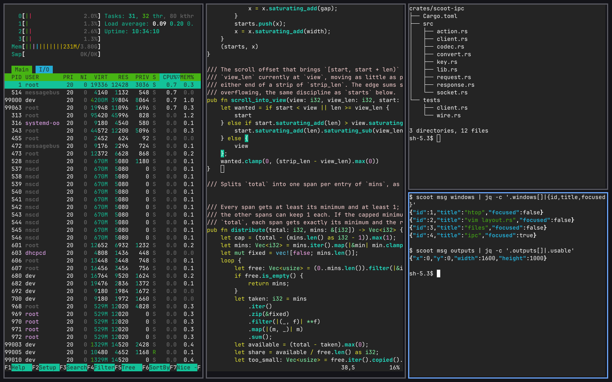

scoot is the compositor: the process that draws every window, takes
every input, and arranges windows in sideways-scrolling columns. The
bar, the wallpaper daemon and the desktop profile are separate pieces
that talk to it — this section is the compositor itself: launching it,
configuring it, driving it. Nothing here sits still for long.

## How scrolling columns work

Windows sit in **columns**; columns form a **strip** that scrolls
sideways. A new window never covers an old one — the strip grows and the
view follows:

```text
┌────────┐  ┌────────┐  ┌────────┐
│ term 1 │  │ term 2 │  │ term 3 │  ◀── you are here
└────────┘  └────────┘  └────────┘
◀────────── the strip scrolls ──────────▶
```

- Focus follows position: `Super+h` / `Super+l` walk columns,
  `Super+j` / `Super+k` walk windows stacked inside one column.
- `Super+1`…`Super+9` jump to workspaces; each workspace is its own
  strip, each output its own set of workspaces — nothing scrolls across
  a monitor boundary.
- `Super+r` cycles the focused column's width through
  `[layout] column_widths`.
- Dialogs, transient windows and fixed-size windows float above the
  strip instead of tiling ([Windows](./windows.md)); everything else
  tiles, always.

No titlebars by design: the focused window gets a colored ring drawn
around it in the layout's own gap ([Appearance](./appearance.md)).



## Launch it three ways

The backend flag chooses how scoot *presents* what it drew (the
*renderer* flag — pixman or GLES — chooses what draws it; see
[Backends and rendering](./backends.md)):

| Flag | What happens | Use it to |
|---|---|---|
| `--nested` | scoot runs as a window inside your current desktop | try everything safely; the host owns size and scale |
| `--tty` | scoot drives real DRM/KMS hardware on a console | daily-drive on hardware |
| `--headless` | no display at all; `scoot msg screenshot` reads the framebuffer | agents, tests, screenshots |

```sh
scoot --nested -- foot        # a window with a terminal in it
scoot --tty -- foot           # the whole console, from a VT
scoot --headless -- foot      # nowhere visible; screenshot it
```

Everything after `--` is one program and its arguments, run once the
session is up ([Starting a session](#starting-a-session)). `scoot
--print-default-config` emits a starting config file (commented, every
default shown); `--write` places it directly, refusing to overwrite.

| Flag | Type | Default | Meaning |
|---|---|---|---|
| `--width N`, `--height N` | int | `1600x1000` | the `--headless`/`--nested` output size, 1–65535 per axis. Out of range is a startup error naming the range. Under `--nested` it is only the size scoot *asks* for — the host's configure decides. An `[[outputs]]` entry's `mode` overrides it for the output it names. |
| `--outputs N` | int | `1` | how many outputs `--headless` creates, 1–8, laid left to right. `--nested` and `--tty` warn and ignore it. |
| `--renderer pixman\|gles` | enum | `pixman` | which renderer composites each frame (config: `[renderer] backend`). |
| `--gpu PATH` | path | automatic search | which DRM device `--tty` drives (config: `[tty] gpu`). Ignored with a warning outside `--tty`. |
| `--mode WxH` | mode | connector preferred | which connector mode `--tty` picks. Ignored with a warning outside `--tty`. An `[[outputs]]` entry's `mode` overrides it per connector. |
| `--xwayland` | switch | off | run an XWayland server so X11 apps get a `DISPLAY` (config: `[xwayland] enabled`; either turns it on). Needs an `xwayland` build; without one it warns and runs Wayland-only. |
| `--socket PATH` | path | `$SCOOT_SOCKET`, else `$XDG_RUNTIME_DIR/scoot.sock` | where the IPC control socket lives. |
| `--config PATH` | path | `$XDG_CONFIG_HOME/scoot/config.toml` | load this TOML file instead of searching. |
| `--version` | switch | — | print `scoot <version> (ipc protocol <N>)` and exit; needs no compositor. |
| `--help` | switch | — | usage, every request and every action. |

`scoot msg REQUEST` is the remote-control client — everything under
`REQUEST` is documented in [scoot msg](../msg/index.md), not duplicated here.

### Starting a session

scoot starts the programs inside the session two ways, which compose
rather than compete:

**The session script** is the `-- COMMAND...` flag: everything after
`--` is one program and its arguments, run once the session is up with
`WAYLAND_DISPLAY`, `SCOOT_SOCKET` and the session environment already
set. It is the 20% route — the one with ordering, conditionals, and
`wait`:

```sh
#!/bin/sh
# ~/bin/session.sh
scootbg daemon &      # a wallpaper, on the background layer
scootbar daemon &     # a bar, on the top layer
mako &                # a notification daemon
exec foot             # the terminal the session starts with
```

```sh
scoot --tty -- ~/bin/session.sh
```

scoot does not wait on the script and does not exit when it exits —
fire and forget — and it restarts nothing that dies. Supervision is
explicitly out of scope: restarting a crashed bar is a service
manager's job. Exited children are reaped, so nothing lingers as a
zombie.

**`[autostart]`** is the 80% route — the programs with no ordering or
conditionals, as action strings in the config file. Entries run first,
in file order, then the `--` command: the config declares the session
baseline, the script carries the behavior. Spawning the same bar in
both places yields two bars — pick one route per program.

**Logging in through a greeter** runs `scoot-session` (shipped beside the
binary, started by the login-screen session entry) instead of `scoot --tty`
directly. It refuses a second login while a session is live, heals a stale
one a crash left behind, imports the login environment into the user manager
and the D-Bus activation environment, waits for the compositor to answer
IPC, imports the session's own `WAYLAND_DISPLAY`, and only then reaches
`graphical-session.target` — so display-gated units start with the display
already set. While the session runs it blocks in the bus waiting for
`scoot.service` to leave the active state: an idle session costs no wakeups,
and logging out ends the session at once. A user-manager re-exec mid-session
(a NixOS switch) rides through without ending the session. When scoot
exits, the session targets stop and the display variables are restored.

> **Symptom:** a login is refused as already running, but no session is up.
> A crashed session's units can outlive it — log in again and the launcher
> heals them itself when nothing answers IPC. If it keeps refusing, check
> from a console which unit is stuck (`systemctl --user show -p ActiveState
> --value scoot.service` names the state, not the exit code) and clear it
> with `systemctl --user stop scoot.service scoot-session.target`.

Without a user manager at all the launcher execs a bare `scoot
--tty` instead — a session with no session integration, not a
failure. When that login is a `user-light` session (TTY autologin
never starts `user@UID.service`) the launcher names the cause and the
one-line fix (`users.users."you".linger = true`, or the greeter
instead) and mirrors the diagnosis into the system journal
(`journalctl -b -t scoot-session`), since the compositor takes over
the console on startup and buries stderr. See [Without a greeter
(TTY
autologin)](../desktop/index.md#without-a-greeter-tty-autologin)
for the whole setup.

Environment scoot reads: `$XDG_RUNTIME_DIR` (required — a missing one
is a one-line startup error), `$SCOOT_SOCKET`, `$XDG_CONFIG_HOME`,
`$XCURSOR_THEME`, and the session locale for typing. Environment scoot
exports to what it spawns: `$WAYLAND_DISPLAY`, `$SCOOT_SOCKET`,
`$XCURSOR_THEME`, `$XCURSOR_SIZE`, `$XDG_CURRENT_DESKTOP=scoot`
(always), `$XDG_SESSION_TYPE=wayland` and `$XDG_SESSION_DESKTOP=scoot`
(where unset — on a logind seat both are logind's to set, and the
compositor keeps logind's values), a fresh
`$XDG_ACTIVATION_TOKEN`, and `$DISPLAY` while the session's XWayland
server is believed live. A launcher session always carries
`XDG_SESSION_TYPE=wayland`: `scoot-session` exports it before
importing the login environment, so greeter and console logins alike
deliver it to the user manager, the D-Bus activation environment, and
every app — Chrome picks its portal screen capturer only with it, so
without it Meet shares through X11 and stays dark.

Portals need one manual step outside the compositor: D-Bus activation
carries its own environment, so the session must export the display
into it (under home-manager this copy-over is the module's job;
without the module, it stays manual):

```sh
# systemd session started by hand (a session script, not the launcher):
dbus-update-activation-environment --systemd WAYLAND_DISPLAY XDG_CURRENT_DESKTOP XDG_SESSION_TYPE
# s6 / seat without a user manager (the webtop target):
dbus-update-activation-environment WAYLAND_DISPLAY XDG_CURRENT_DESKTOP XDG_SESSION_TYPE
```

`resources/scoot-portals.conf` names which backend serves what once
the lookup can find it: everything falls through to `gtk`, while
`ScreenCast`/`Screenshot` go to `wlr`. Install it as
`scoot-portals.conf` in the first of `~/.config/xdg-desktop-portal/`,
`/etc/xdg-desktop-portal/`, `/usr/share/xdg-desktop-portal/` that your
setup provides (xdg-desktop-portal 1.17+ does the rest).

### More than one output

`--headless --outputs N` gives a session N virtual outputs with no
second monitor in the building — so per-output behavior is testable.
Each output is real: its own `wl_output` global, its own workspaces
and scrolling strip (a window is on exactly one output; nothing
scrolls across a boundary), its own exclusive zones (a bar on one
output shrinks only that output's tiling area), its own scale, its own
render target (so `scoot msg screenshot --output 2` answers with the
second output's own pixels). Under `--tty` every connected monitor is
an output like these, named after its connector, placed left to right,
added and removed as monitors plug and unplug.

What it is not yet: outputs line up left to right (no position
setting; scale and mode are set per output in the file, not from
`wlr-randr`); new windows open on the output under the pointer.
Stepping across outputs is bound by default (`Super+comma` /
`Super+period`, wrapping left and right — see [Outputs](./outputs.md)).
A returning monitor gets its windows back: when an output is removed
its workspaces are adopted by the remaining output, and when a monitor
with a matching identity returns, the still-open ones move back.

Next: [Configure](./configure.md) — the config file, reload, and what happens when the file is wrong.
