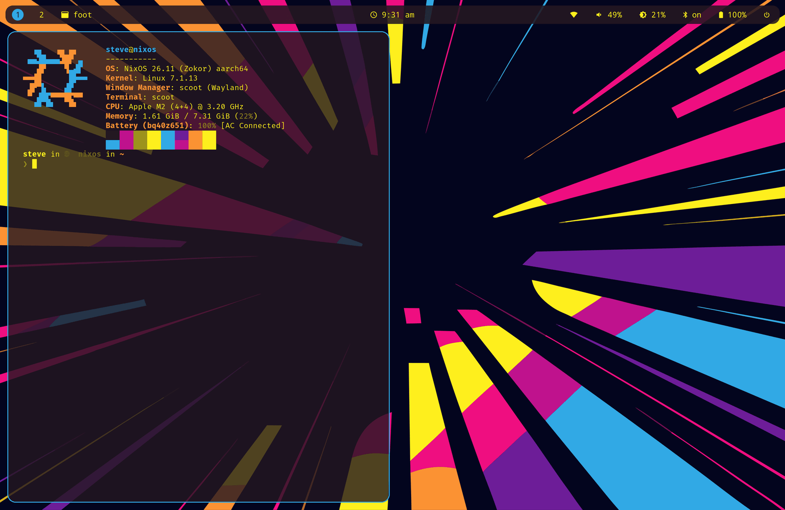
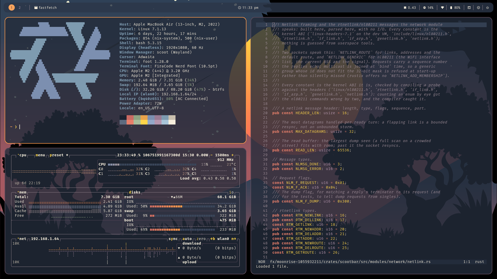

A look themes the desktop in one pass: compositor ring and background,
bar colors, session wallpaper, and (later pieces as they land)
greeter, locker, launcher, terminal, GTK and dark mode. Today the
profile applies the look to the compositor, the bar and the wallpaper —
pick one with `look` in [the desktop profile](../desktop/index.md#pick-a-look):

| Look | Ring / background | Wallpaper | |
|---|---|---|---|
| `music-desk` | blue `#3D579A` on paper `#FCFBFB` | ships |  |
| `radial-burst` | blue `#31a9e5` on plum `#241721` | ships |  |
| `moonrise` | amber `#FF9A49` on slate navy `#2B3648` | ships |  |
| `vinyl-sunset` | orange `#E59560` on espresso `#271A1F` | flat color (the illustration is yours to download) |  |

(Previews: real screenshots of each example, captured from live
sessions. The vinyl-sunset wallpaper illustration stays under its
Pixabay license — the example's `[wallpaper]` table points at a copy
you download, never a committed file.)

Each example is one directory with the same shape — `scoot.toml` (the
compositor: layout, appearance, binds), `bar.toml` (the bar),
`regreet.css` (the login screen), plus terminal and tool configs that
follow the palette:

- [vinyl-sunset](https://github.com/scoot-sh/scoot/tree/main/docs/examples/vinyl-sunset)
- [music-desk](https://github.com/scoot-sh/scoot/tree/main/docs/examples/music-desk)
- [radial-burst](https://github.com/scoot-sh/scoot/tree/main/docs/examples/radial-burst)
- [moonrise](https://github.com/scoot-sh/scoot/tree/main/docs/examples/moonrise)

With Stylix present the look yields per key (your explicit value >
Stylix > the look); `look = "auto"` matches your own wallpaper the
same way once the theme-look work lands.

## Stylix

When `config.lib.stylix` exists and `stylix.enable` is on,
`programs.scoot.settings` gets defaults from it — the compositor's
half of a themed desktop, next to the bar's. The module never imports
Stylix; nothing changes without it, and
`programs.scoot.stylix.enable = false` turns the defaults off with it
present. (Home-manager only: the NixOS module renders no config file.)

| Setting | From | Notes |
|---|---|---|
| `appearance.focus_ring_active_color` | base16 `base0D` | The focused ring. |
| `appearance.focus_ring_inactive_color` | base16 `base03` | Every other ring. |
| `appearance.background_color` | base16 `base00` | The frame clear color. |
| `appearance.cursor_theme` | `stylix.cursor.name` | Only when `stylix.cursor` is set. |
| `appearance.cursor_size` | `stylix.cursor.size` | Only when `stylix.cursor` is set. |
| `wallpaper.image` | `stylix.image` | Only when set; setting it is what turns `wallpaper.enable` on. |
| `wallpaper.mode` | `stylix.imageScalingMode` | Only when set (`fill`, `fit`, `stretch`, `center`, `tile`). |

Precedence per key: your `settings` value, then Stylix's, then the
compositor default. One combination is invalid: your own
`wallpaper.color` plus Stylix's `image` (scoot takes `image` or
`color`, never both) — for a solid color under Stylix, set
`programs.scoot.stylix.wallpaper.enable = false`, set your own
`image`, or turn `stylix.enable` off. `cursor_color` has no Stylix
convention and stays at the compositor default.

## Make a look

A look is data, so new ones are cheap: one directory with the same
shape as the four above — palette, `scoot.toml`, `bar.toml`,
`regreet.css`, and a wallpaper (an image, or a palette color for a
license-clean look like vinyl-sunset's flat espresso). Per-target
opt-out is Stylix-style, under one namespace, one flag per themed
piece (every target defaults on):

```nix
programs.scoot.desktop.theme.targets.lock.enable = false;  # keep swaylock's own style
```

`desktop.bar.enable` keeps its meaning ("manage the bar at all") and
is never a theme switch. Where looks are headed (the standing
direction, not all of it shipped): the look list reads from a
registry rather than a hand-written enum, so adding a look means
adding its directory and a check renders every look into every
target; `look = "auto"` matches your own wallpaper; and a user-passed
look (a path or attrset with the same shape) works the same way.
`look` only ever gains values — existing configs keep working.
