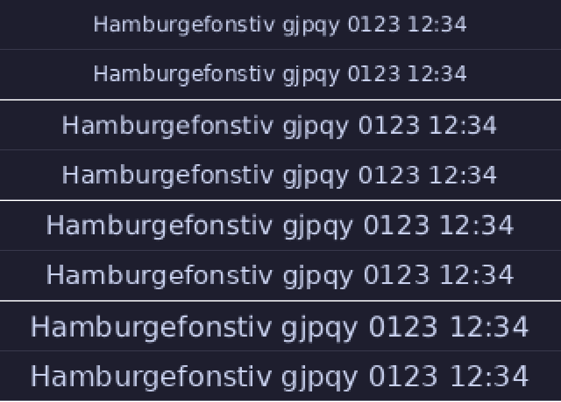

Shape the bar: where it sits, what it looks like, which outputs it covers, and the icons it draws.

## Layout

- **Left** modules are packed from the left edge, **right** ones from the
  right edge, in the order listed; **center** ones are packed together and
  centered on the bar.
- **Groups**: a `"|"` entry in a list marks where a separator goes.
  `left = ["cpu", "load", "|", "memory"]` draws one line, between `load`
  and `memory`; `load` sits next to `cpu` with no line inside the group.
  A list with no `"|"` draws a line in every gap, as before, so an old
  config looks exactly as it did. A `"|"` needs a module on both sides of
  it in its own section (leading, trailing and doubled marks are refused,
  naming the list), and it is never a module: it is not started, takes no
  space, and an unstarted module beside one never moves the line.
- Each module is as wide as its content plus `--padding` on both sides;
  `--spacing` separates neighbours, and a module's own `margin` adds room
  on each side of it ([Spacing](./modules.md##spacing)). A module with nothing to show
  takes no space at all, padding, margin and spacing included.
- **A rounded bar keeps its ends clear of the corners**: the first module
  on the left and the last on the right start `radius` less half a padding
  in from the bar's end, so their ink (a padding further in) and the
  workspaces pill (half a padding out) are never in a corner square.
- **When they do not fit**, the left part keeps its place, the right part
  gives way to it, and the center part is pushed off center to fit between
  them, then cut. Nothing overlaps and nothing is drawn past the bar's end;
  text is clipped to its module's space.
- Text is vertically centered on the bar. It is not shaped: one glyph per
  character, no ligatures, kerning or right-to-left runs (see
  [Fonts](./modules.md##fonts) for what is out of scope). A character no font in the chain has
  draws the primary font's missing-glyph box. Control characters are
  not drawn.


## Fonts

A font file, not a font name: there is no fontconfig. Without `--font`,
the first of these that exists and loads is used:

```text
/usr/share/fonts/truetype/dejavu/DejaVuSans.ttf         Debian, Ubuntu
/usr/share/fonts/dejavu-sans-fonts/DejaVuSans.ttf       Fedora
/usr/share/fonts/TTF/DejaVuSans.ttf                     Arch
/usr/share/fonts/truetype/DejaVuSans.ttf                openSUSE
/usr/share/fonts/dejavu/DejaVuSans.ttf                  Alpine
/run/current-system/sw/share/X11/fonts/DejaVuSans.ttf   NixOS, with fonts.fontDir.enable
/usr/share/fonts/truetype/noto/NotoSans-Regular.ttf     Debian, Ubuntu (Noto)
/usr/share/fonts/noto/NotoSans-Regular.ttf              Arch (Noto)
```

With none of them, and no `--font`, the daemon **refuses to start** (exit
status 1), saying so and how to give one; it does the same for a `--font`
it cannot use (missing, not a regular file, empty, over 64 MiB, or not a
TrueType or OpenType font), naming the file and why. A bar with no modules
placed draws no text and needs no font. On NixOS those directories are
usually empty: give `--font` a store path (`nix build nixpkgs#dejavu_fonts`
has `share/fonts/truetype/DejaVuSans.ttf`), or run the flake's
`scootbar-demo`, which gives it DejaVu Sans by default
([docs/nix.md](./index.md)).

**Replacing the font file while the bar runs cannot crash it**, unless a
*root* process rewrites a mapped store file in place through a read-write view
(root ignores the write bit; `nix-daemon` never does, it adds, unlinks and
renames whole paths). The font is mapped
(costing only the pages drawn from, shared with every other program using
the font) only when it is owned by root, has no write bit for anyone, and
lies on a read-only mount: NixOS's `/nix/store`. Every other font (your
`~/.local/share/fonts`, `/usr/share/fonts`, and a writable file seen
through a read-only view such as systemd's `ProtectHome=read-only` or
flatpak's `/run/host/fonts`) is read into the bar's memory once, costing
its size (about 740 KB for DejaVu Sans): copying a new file over it with
`cp`, which truncates it in place, would kill a bar that had mapped it,
and cannot touch one that read it. The file is read at start and on every
reload: changing `bar.font` (or any option) and running
`scootbar msg reload` swaps it live.


### Fallback fonts and icons

`bar.fallback-fonts` (file only, no flag) names at most **two** more font
files, tried in order for a character the primary lacks. A character is drawn
from the first font in the chain that has a glyph for it; a fallback is asked
only about characters the fonts before it lack. A character in none of them
draws the **primary's** missing-glyph box: never a blank, never a panic. Each
fallback must load like the primary: one that cannot is a refusal naming it
(a start-up error, or a refused reload with the running bar untouched), and
more than two is a config error naming `bar.fallback-fonts`. Line height and
vertical centering come from the primary alone. There is no fontconfig, so
give the paths (Stylix supplies them on NixOS).

That is also how **icons** work: an icon is a glyph from a symbol font (Nerd
Font, Material Symbols, Font Awesome) given as text in the config, with the
symbol font as a fallback (or the primary). The clock takes one, drawn before
the time with a space between:

```toml
[bar]
fallback-fonts = ["/path/to/SymbolsNerdFont-Regular.ttf"]
[clock]
icon = "\U000f0e65"   # or the character itself; exactly one, else a config error
```

The icon is one code point, not one grapheme: an emoji plus a variation
selector or a ZWJ sequence is refused, but a lone format or combining
character passes and draws as a `.notdef` box or a blank, so give a real
symbol.

Glyphs are cached per font, size and scale, at most 512 glyphs and 4 MiB;
past either the cache is dropped and refilled from what is drawn next, so
arbitrary text (a window title) costs bounded memory. It is keyed by size, so
outputs at different scales each keep their glyphs until the bound, rather than
one dropping the other's on every frame.

**Out of scope, and will look wrong**: shaping (ligatures, complex scripts such
as Arabic or Devanagari, combining marks), right-to-left and bidirectional
layout (text runs left to right in logical order), and color emoji (outlines in
one color only; an emoji is drawn only if a font in the chain has an outline for
it). A title in such a script draws per codepoint.

**Real fonts, checked**: DejaVu Sans with `SymbolsNerdFont-Regular.ttf` and
`NotoSansCJK-VF.otf.ttc` (nixpkgs' `nerd-fonts.symbols-only` and
`noto-fonts-cjk-sans`) draw Latin, a symbol icon and Japanese, Korean and
Chinese together. A `.ttc` collection loads (its first face), and so does a
variable CFF2 font (its default instance). A CJK font is 30 MB or more, so
put it where it is mapped (a read-only `/nix/store`) or expect its size in the
bar's memory, as for any font not on a read-only mount; see
[icons.md](./configure.md#fonts-what-the-real-ones-do).


## Colors

Modules name a state, never a color, and the state picks one of the
theme's color tokens: `normal` is drawn in `fg`, `warn` in `accent`,
`urgent` in `urgent` and `muted` in `dim`. The clock is always `normal`.
Every token has a `[colors]` key; `bg` and `fg` are `--background` and
`--foreground` flags too. Their defaults are Catppuccin Mocha's:

| Token | Default |
| --- | --- |
| `bg` | `#1e1e2e` |
| `fg` | `#cdd6f4` |
| `accent` | `#f9e2af` |
| `hover` | the `accent` value (unset, it follows a custom `accent`: the tint was the accent before it had a token of its own) |
| `dim` | `#6c7086` |
| `urgent` | `#f38ba8` |


## What it does on the compositor

- **One bar per selected output** ([Outputs](./modules.md##outputs)), a layer surface (`top` by default) with the namespace
  `scootbar` (for compositor rules that match on it), anchored to its edge
  and both sides. An output plugged in later gets a bar; an output
  unplugged takes its bar with it, and the others are untouched. With no
  outputs at all the daemon waits, idle, for the first.
- **It reserves its space** (an exclusive zone), so windows are arranged
  beside it, never under it. The zone is set before the bar's first frame
  is drawn: on scoot, windows move out of the way once, when the bar
  connects, and do not jump again when it draws.
- **It takes no keyboard focus** (but for the keys of an open
  [popup](./modules.md##popups) — Escape, arrows, Enter — for as long as it is open). Pointer clicks on the workspaces
  module's numbers switch to them ([above](./modules.md##workspaces)); anywhere else
  clicks do nothing.
- **It draws at each output's real device pixels**, fractional scales
  included (`wp_fractional_scale_v1` with `wp_viewporter`). A compositor
  without those two gets the bar drawn at its integer scale (the fraction
  rounded up) and scaled down: sharp, not device-exact. The daemon says so
  on stderr at start-up.
- **It draws only when something changes** (a new size or scale, or a
  module's content), and otherwise makes no system calls. Idle with the
  clock it wakes **twice a minute**: the clock's tick, and about a
  millisecond later the compositor's `wl_buffer.release` for the buffer
  that tick's frame replaced (every `wl_shm` client gets one per frame;
  measured on scoot and sway). With no module placed it wakes zero times.
  There are no frame callbacks. A change redraws, and tells the compositor
  about, only the module that changed: a tick repaints and damages the
  clock's own span, not the bar.
- If the compositor closes a bar (some do when an output goes away), it is
  made again once; closed a second time, that output is given up on until
  it is unplugged and plugged back in, and stderr says so.


## Layers and the zone

`--layer` (or `[bar] layer`) picks the layer-shell layer the bar sits in.
On scoot, `bottom` sits behind windows (they cover the bar where they
overlap it) and `top` and `overlay` in front, and **a fullscreen window hides
the `top` layer** (and the bar's zone is covered with it): the bar
disappears while something is fullscreen, which is the right default for a
bar. `overlay` stays over fullscreen windows; ask for it on purpose.
Fullscreen and maximize are different on purpose: a window that should fill
the screen *with* the bar visible wants scoot's
[maximize](https://github.com/scoot-sh/scoot/tree/main/docs/scootbar/backlog/resolved/maximize-done.md) (`Super+m`,
`toggle-maximize`). There is
no `background` layer: that is the wallpaper's.

`--exclusive false` (or `exclusive = false`) sends an exclusive zone of -1:
the bar reserves nothing and windows go under it, and it also ignores any
other bar's zone. It is the choice for a floating overlay-style bar. With
the default `true` the zone is the bar's height, and the compositor adds the
margin on the anchored edge (see [Margins](./modules.md##margins)). Whichever layer:
the bar never takes the keyboard, so clicking it never moves window focus.

Each of the three layers on each of the two edges, with and without the
zone, is checked on headless scoot (`crates/scootbar/tests/visibility.rs`),
along with the layer and the zone in the protocol requests themselves.
Changing either on a running bar is a `reload`, which makes the surfaces
again.

To toggle the bar from a key, bind it in scoot's own config (the bar takes
no keyboard, so it has no hotkey of its own):

```toml
[binds]
"super+shift+b" = "spawn scootbar msg toggle"
```


## Outputs

By default every output gets a bar, all alike. The top-level `outputs` key
(or `--outputs`) picks which, and `[output."NAME"]` tables change one
output's bar. `NAME` is the compositor's own name for the output
(`wl_output.name`: the connector, `DP-1`, `eDP-1`, `HDMI-A-1`; `scoot msg outputs` on scoot, `swaymsg -t get_outputs` on sway).

```toml
outputs = ["eDP-1", "DP-1"]     # before any [table]: TOML puts later keys in it
left = ["workspaces"]
right = ["clock"]

[output."DP-1"]                 # the external monitor: taller, at the bottom, no workspaces
height = 36
edge = "bottom"
left = []
right = ["clock"]
```

A 4K panel next to a 1080p one wants a different em, not only the same em
at its own device pixels: give the denser output its own size.

```toml
[output."DP-1"]                 # the 4K panel: larger text, same bar
font-size = 20                  # 1 to 256, as [bar] font-size; absent is the shared value
```

- **`outputs`** is `"all"` (the default) or a list of names: only those
  outputs get a bar. An output plugged in later that is listed gets one; one
  that leaves loses its bar (and nothing else). An output the compositor
  never named (a `wl_output` older than version 4) matches only `all`.
  Names are compared byte for byte. The flag is `--outputs all` or
  `--outputs DP-1,eDP-1`; given, it replaces the file's list.
- **`[output."NAME"]`** takes `edge`, `layer`, `exclusive`, `height`, `margin`,
  `font-size` (the same values as `[bar]`, 1 to 256 for the size) and `left`/`center`/`right`. A key not given
  keeps the shared value. Giving any of the three lists sets that output's
  whole layout, as at the top level: a list not given is empty, and
  `left = []` alone is a bar with nothing on it. Colors, the font file, `padding`,
  `spacing`, `radius`, `opacity` and each module's own options are shared by
  every bar. An output table wins over a flag for its output (`--height 40`
  is the height of every output that does not set its own, and
  `--font-size 14` the em of every output without its own `font-size`). A
  bad `font-size` (0, past 256, not a whole number) is refused naming
  `output."NAME".font-size`, and the running bar stands on a bad reload.
- **Refused, naming the key:** `outputs = []` (hide the bar with `msg hide`
  instead), a name listed twice, an empty or over-long (128 bytes) name or one
  with a control character, more than 32 names or tables, an
  `[output."X"]` table for an output `outputs` leaves out (it could never
  apply; with `outputs = "all"` a table for an output that is not plugged in
  is fine), an unknown key, a bad value, and a module placed twice **within
  one output** (the same module on two outputs is the point). `--outputs`
  is checked against the file's tables the same way, so the pair is a
  usage error, not a silent dead table.
- **One set of modules, started once.** The daemon starts each module in
  the shared layout or any output's override a single time, even if a
  `[output]` table then leaves it off every bar, and every output's bar
  reads it, so a second
  monitor adds a surface and its two buffers, not a second clock timer or a
  second set of file descriptors (checked in `tests/outputs.rs`: the daemon
  holds 8 fds with one output and 8 with two). A module's change redraws
  only the outputs that show it. The workspaces module is shared too, and
  each bar shows its own output's workspaces (see [Workspaces](./modules.md##workspaces)
  for the switching limit). There is no "primary" output: to put a module
  on one output only, name that output in its table.
- **Scale.** Each bar is drawn at its own output's real device pixels
  (fractional scales included), so text and pill scale with their output.
  An output with its own `font-size` measures, paints and hit-tests at
  that em: its modules take the room the larger (or smaller) text needs,
  clicks land on what that output shows, and its popups and tooltips
  measure in it too. The glyph cache is keyed by size, so a second size
  costs its glyphs only. A reload that changes an output's size remakes
  that output's measures and paints it again; its surface stays (the
  geometry did not change), and `padding` and `spacing` stay shared.
  Check it live: `scootbar msg layout` prints each module's rectangle per
  output — the same module is wider on the output with the larger em.

> **Symptom:** the text is the right size on one monitor and too small (or
> too large) on the other. Give that output its own `font-size` (above)
> and `scootbar msg reload`. If the wrong output changed, the compositor's
> name for it is not the one in the table: compare with
> `scoot msg outputs` on scoot (`swaymsg -t get_outputs` on sway).
- **`radius`** is shared and at most half the shared height: on an output
  whose own `height` is smaller the corners are cut back to what that bar
  holds (`radius` is 0 to half the height at the file level).
- **A reload** re-places every output: one the list now leaves out loses
  its bar (and its zone), one it now includes gets one, and a bar whose
  geometry changed is made again. Modules are restarted as at any reload,
  except an `exec` whose table is unchanged, which keeps its child (above).
- **`hide`/`show`** keep to the list: a shown bar is made only on a selected
  output. The two reasons a bar can be absent (hidden, not selected) are
  independent, so a `show` after a reload that changed the list makes the
  new list's bars.


## Hiding the bar

`scootbar msg hide` **destroys the bar's layer surface and its buffers** on
every output: a hidden bar holds no `wl_shm` buffer (checked in
`tests/visibility.rs` by counting the daemon's memory mappings, which go to
zero and come back), and its exclusive zone is released, so windows
reclaim the space. `show` makes them again, committed with no buffer before
the first draw as at start-up, so windows move once (back out of the bar's
way) and do not jump again when it draws; the round trip leaves a window
where it started (also checked, sampling the window's rectangle every few
milliseconds across the show). `toggle` flips whichever it is. The reply says
what is now the case: `{"type":"bar","visible":false}`.

- All three are idempotent, and applied **once per loop turn** with the net
  result: a burst of requests (forty `toggle`s at once, say) is one change
  of the final state, never a hide-show-hide flicker, since the surfaces are
  made or destroyed only after every request that arrived together has been
  served.
- Hidden is runtime state. A `reload` keeps it (a geometry change while
  hidden just waits for the `show`), and a restarted daemon starts shown.
- An output plugged in while hidden gets no bar until `show` (and only if the
  [list](./modules.md##outputs) selects it); one that was
  unplugged and plugged in again is the same. `show` with no output is fine:
  each output's bar is made when it arrives.
- A hide during a redraw needs no care: a draw is one synchronous step of
  the loop, and the hide is another. Events for a destroyed surface (a
  `configure`, a buffer release) are dropped, as after any removal.
- The modules keep running while hidden (the clock's timer still fires
  every minute, or every second with a seconds format; a workspace change
  still wakes the daemon), and nothing is
  drawn: a hidden bar costs the process, not the surfaces. A bar with no
  module placed wakes zero times, hidden or not.
- A `top` bar under a fullscreen window needs nothing from scootbar: the
  compositor stops drawing the layer and the bar has nothing to do.
- **`hide` after the compositor closed a bar** (an output going away) forgets
  that: `show` gives it a fresh one, with one retry as at start-up.


### Not built: auto-hide

An auto-hide bar that appears on pointer contact needs a thin
always-present sensing surface at the edge, which is exactly what `hide`
removes (a surface, a buffer, an input region and pointer events that wake
the daemon). It was **decided against for now, not measured**: the cost
that matters (a sensing strip's pages and its pointer wakeups) would only
be worth paying if the strip could beat a key bind that toggles the bar
(above), which costs nothing when unused. Pointer input on the bar exists
now ([Pointer input](./modules.md##pointer-input)), so the strip's cost could be
measured; it has not been, and the decision stands until it is.


## Margins

The margin is sent to the compositor as the layer surface's own margin, so
the bar surface is exactly the bar: no transparent border, and nothing on
the margin catches clicks. The compositor keeps windows clear of the bar
**and** the margin on its edge: with `--height 20 --margin 8,4`, a top bar
sits 8 pixels below the top edge, 4 in from each side, and windows start
28 pixels down. That is what the layer-shell protocol specifies ("the
exclusive zone includes the margin"), and what scoot and sway both do.

The margin on the edge opposite the bar's (the bottom margin of a top bar)
does nothing; the protocol says so.

To line a floating bar up with scoot's tiling, match `--margin` to scoot's
`[layout] gap` ([configuration.md](../scoot/configure.md)): windows then sit
one gap below the bar, as they sit one gap from each other. The default is
still a flush, square, opaque bar (flush to the edge with no margin);
making it float is a choice, and these are the two settings to change
together, with the values that match scoot's defaults (`gap` 12):

```toml
# ~/.config/scoot/bar.toml: a floating bar that lines up with the windows
[bar]
margin = 12            # = scoot's [layout] gap
radius = 8             # = scoot's [appearance] corner_radius, if you round windows
opacity = 1.0
```

```toml
# ~/.config/scoot/config.toml: what they must match
[layout]
gap = 12               # the bar's margin

[appearance]
corner_radius = 8      # the bar's radius (0, square, is scoot's default)
```

Change `gap` and `margin` together and the bar keeps lining up; change
only one and the bar's edge drifts from the windows'. The bar does not read
scoot's config (it works on other compositors), so nothing keeps them in
step but you.


## Spacing

Three lengths, all logical pixels and all bounded 0 to 1024 (a value past
that, negative or not a whole number is a loud refusal naming its key):

| Key | Flag | What it spaces |
| --- | --- | --- |
| `[bar] padding` | `--padding` | inside each module: room either side of its content |
| `[bar] spacing` | `--spacing` | between neighbouring modules in a section |
| `[clock] margin`, `[workspaces] margin` | none | outside one module: that much more room on each side of it, on top of `spacing`. Its own span never covers it, so a repaint of the module leaves it alone. A module with nothing to show takes none. |

`[bar] separator` draws a line in the gap between neighbouring modules of a
section: that many logical pixels wide, in the theme's `dim` color, from a
quarter to three quarters of the bar's height, centered in the gap. It sits
in the gap, so it needs one: **`separator` may not exceed `spacing`** (a
larger value is refused, naming both), and the drawn line is cut back to the
actual gap. The check is against the file's `spacing`: a `--spacing` flag
given later replaces it and can leave a separator wider than the gap, which
is then cut to it (drawn narrower, never over a module). There is none between two sections, beside a module with
nothing to show, or at the bar's ends. `0`, the default, draws none. In a
section whose list has a `"|"` mark, only the marked gaps draw (see Layout
above); a list with none draws every gap, as before.

```toml
left = ["workspaces", "clock"]

[bar]
spacing = 12
separator = 1          # a hairline centered in each 12-pixel gap

[workspaces]
margin = 4             # 4 more either side: the gaps beside it are 20
```

Group related modules with no line inside the group and lines between
groups:

```toml
left = ["cpu", "load", "|", "memory", "|", "disk"]

[bar]
spacing = 12
separator = 1          # one hairline between load and memory, and one between memory and disk
```

Nothing here costs a frame: the lines are painted with the whole bar, never
for a module's own repaint, and the layout is worked out only when a width
or the size changes. A reload keeps the flags over the file, as at
start-up: giving any of `--left`/`--center`/`--right` replaces just that
section's list (marks included).


## Shape and opacity

`[bar] radius` rounds the bar's four corners, in logical pixels: 0 (the
default) is square, and the most is half the height (a pill), which the file
enforces (`bar.radius` names the limit when it is refused). `[bar] opacity`
is the background's alpha, 1 (the default) opaque down to 0 transparent;
text stays fully opaque over it. There is no blur, gradient or shadow.

```toml
[bar]
height = 28
margin = "8,8"     # match scoot's [layout] gap: see Margins
radius = 10
opacity = 0.9
```

- **The corners are analytic**: each edge pixel's alpha is how far its
  center sits inside the circle, no supersampling. The coverage of one
  corner is computed once per radius and scale, and the other three mirror
  it, so a repaint costs a table lookup for the few pixels in a corner.
- **A rounded or translucent bar is an `ARGB8888` buffer** (premultiplied);
  a square, opaque bar stays `XRGB8888`, exactly as before either option.
  Only the surface is the bar, never a bigger transparent one: the margin
  is still the protocol's, and the corner pixels are the only transparent
  ones.
- **Opaque region**: an opaque bar tells the compositor which pixels are
  opaque, so it can skip blending under them (all of a square bar; all but
  the four corner squares of a rounded one). A translucent bar declares
  none: the compositor blends all of it, which is the cost of the option.
- **The radius is cut back to fit**: `--height` below twice the file's
  `radius` (the flag replaces the file's height), or a compositor giving
  the bar less height than asked, draws the corners as large as the bar
  holds.
- **Text is kept out of the corners, not clipped to them**: the layout
  clears the bar's ends by the radius (see [Layout](./modules.md##layout)), so no ink
  is near a corner whatever `padding` is. This costs the radius less half a
  padding of room at each end, and needs no per-pixel clipping in the
  paint; a bar whose radius is 0 loses nothing.
- **Corners are not clickable**: the surface's input region is the rounded
  shape (one rectangle per corner row, at most `2 x radius + 1`, set when
  the size or radius changes), so a click in a cut corner reaches what is
  behind the bar (the wallpaper, a window under a bar that does not reserve
  space) instead of an invisible bar. scoot honors `wl_surface.set_input_region`
  on layer surfaces, checked end to end on a headless scoot: a click in the
  window's corner under a rounded bar focuses that window, and the same click
  under a square bar does not. The region is in logical pixels, so it is the
  same at every scale (at a fractional scale it can differ from the drawn
  edge by a device pixel). A compositor that ignores input regions leaves
   the corners clickable, which is the protocol's fallback.
- **Popups round separately**: `[bar] radius` never rounds a popup; that is
  `[bar] popup-radius` ([Popups](./modules.md##popups)), which follows this radius when
  unset.
- Measured costs (release build, 1600x28 bar, radius 14): filling the whole
  bar takes 4.9 us square and 6.1 us rounded and translucent; 3200x56 (scale
  2), 16.2 us and 29.2 us. A repaint of one module's span, the common case,
  costs the same as before except in the rows of a corner.


## Icons and fonts: mechanism and measurements

The reference for the config keys is [the Icons section](./configure.md#icons); this is the
mechanism and the measurements behind it, for the button, push, exec,
volume,
microphone, network, battery, brightness, bluetooth, media and
window-title modules that reuse it, and for whoever asks "why not X".

An icon is one of three things, chosen by which config key a module's section
sets (at most one):

| Key | What | Cost | Built |
| --- | --- | --- | --- |
| `icon = "\U000f0e65"` | One glyph from the font chain (a symbol font as a fallback) | one more font file | always |
| `icon-path = "M12 2 ..."` | SVG path data, filled by the bar's own rasterizer, tinted from the theme | +36.9 KB of binary | always |
| `icon-image = "/abs/icon.png"` | A PNG, decoded once, scaled at the output's real scale | +115 KB of binary | `--features icon-image` |

The clock was the first module with an icon. A module names an icon, never
pixels: it holds an `Icon` (`src/icon/mod.rs`) from its settings and shows it
with `View::show_icon`; `config/icon.rs` turns the three keys into one, and the
render path measures, lays out and draws it. **The per-module `icon` keys arrive
with the modules that need them** (button, push, exec, volume, microphone, network,
battery, brightness, bluetooth, media, window-title, in their own tickets):
each takes the same three keys through `config::icon`, and none
is invented ahead of its module.

## Path icons

`src/icon/path.rs` parses the `d` attribute of an SVG `<path>` by hand:
`M m L l H h V v C c S s Q q T t A a Z z`, implicit repeats (`M 1 2 3 4` is a
move and a line), shorthand numbers (`.5.5`, `1e2`, `-1-2`), arc flags without
separators (`a1 1 0 00.5.5`). Relative commands become absolute, quadratics
become cubics and each arc becomes at most four cubics (the endpoint-to-center
conversion of the SVG implementation notes, F.6), so the rasterizer sees only
lines and cubics. Nothing is guessed: a stray character, a missing argument, a
bad flag, a number that is not finite or past 1,000,000, a path that does not
start with `M`, or one that draws nothing is an error naming the byte it
stopped at, and the config error names the key (`clock.icon-path: not usable
SVG path data: at byte 7: expected a number`). The bounds are 16 KiB of text,
1024 commands (an implicit repeat counts each time) and 4096 segments; a
fuzzed-string test (20,000 random and 20,000 mutated strings, plus every
truncation of a corpus of real icon paths) runs on every `cargo test`, and
another feeds hostile numbers (1e6 coordinates, radii of 1e-6, a 0.001-unit
viewbox) through the rasterizer.

The path has no size of its own, so `icon-viewbox = "min-x min-y width height"`
says which part of its plane is the icon. The default is `0 0 24 24`
(Material's); Font Awesome's are `0 0 512 512` and so on. The viewbox is fitted
into the icon's square with SVG's `xMidYMid meet`: scaled uniformly, centered.

`src/icon/raster.rs` fills it **analytically, with no supersampling**: the
signed-area accumulation `font-rs` and `ab_glyph` use for glyphs. Each edge adds
the area it uncovers into a buffer of one float a pixel; a running sum along
each row is the coverage. Curves are flattened first into at most 48 lines
within 0.025 px of the curve (a circle of radius 10 then covers 0.3% less area
than the true one; at a tenth of a pixel it was 1.1%, visibly small). The
fill rule is the accumulated winding clamped to 0 to 1: SVG's default `nonzero`
for icons as drawn (a hole wound the other way cancels, overlapping
same-direction shapes saturate). Edges outside the square are clamped to it, so
a path past its viewbox costs nothing and cannot write outside the buffer.

The size is the **em in device pixels**, rounded, so the icon is as tall as the
text's em at whatever scale the output is at: the bitmap is made at that size,
never a smaller one stretched. It is drawn tinted with the theme token of the
view's class (`normal` `fg`, `warn` `accent`, `urgent` `urgent`, `muted` `dim`),
so it follows Stylix like the text beside it. A gap of one space of the primary
font follows it when text does.

The cache clears **wholesale** past 16 (icon, size) pairs or 4 MiB, and an
image's scaling allocates a temporary buffer on each miss (up to 8 MiB for a
1024-pixel source), so it starts to matter when several modules and outputs at
different scales all use icons: each refill is a burst of work and allocation at
the next draw, though never per frame in steady state.

The bitmap is cached per (icon, size) in one arena of at most 4 MiB and 16
entries; past either the cache is dropped and refilled from what is drawn next
(the glyph cache's rule), and a size past 512 pixels draws nothing and takes no room. A new
output scale is a new size, so it is one miss. A warm repaint allocates nothing
(`render/tests/icons.rs`, counted through `scootbg_mem`'s allocator).

### Measured

Release build (`lto = "fat"`, `codegen-units = 1`, `strip`), one core of a
4-vCPU container, `cargo test --release` ignored benchmarks (thrown away, not
committed) at the commit before this record:

| | |
| --- | --- |
| parse a 149-byte cloud path | 1.0 us |
| rasterize the cloud at 14 / 16 / 21 / 24 / 32 / 64 px | 2.3 / 2.4 / 3.0 / 3.5 / 6.2 / 13.8 us |
| the same at 128 / 512 px | 32 / 374 us |
| a ring (two arcs, four 90-degree cubics each) at 24 / 512 px | 5.7 / 498 us |
| a warm repaint of the whole bar, 1920x28, three text modules, before / after this change | 5.78 and 6.64 us / 5.07 and 6.66 us (two runs each: noise) |
| an unchanged repaint (nothing to do) before / after | 0.043 and 0.039 us / 0.031 and 0.040 us |

So a path icon costs microseconds once per (icon, size) and nothing per frame:
the draw path for a view with no icon gained one `Option` check. Binary size
(release, the bar built alone, sizes in bytes):

| Build | main | this change |
| --- | --- | --- |
| `--no-default-features` (no module) | 1,164,032 | 1,168,128 (+4,096) |
| default (`clock`, `workspaces`) | 1,442,576 | 1,479,448 (+36,872, +2.6%) |
| default + `icon-image` | | 1,594,136 (+114,688 for the decoder) |

Sizes re-measured on the final code (`cargo build --release -p scootbar` twice, identical: main's default is 1,442,576 and its
`--no-default-features` 1,164,032, rebuilt from `origin/main`; a size taken at an
earlier commit of this branch differs by a few KB, as the config plumbing grew).

Idle RSS of the default release bar on headless scoot with a clock and a path
icon is 4,792 kB against 4,744 kB without the icon (`VmRSS` after 2.5 s; the
cache holds one 15 x 15 bitmap).

## Image icons

`icon-image = "/abs/path.png"` (an absolute path; a relative one is refused) in
a build with the **`icon-image`** feature. `src/icon/image.rs` decodes it once,
when the config is read (so a bad file is a refused reload naming
`clock.icon-image`, with the running bar untouched), holds it as a
premultiplied `b, g, r, a` bitmap, and drops it with the module at the next
reload. It uses the `png` crate the workspace already carries (scootbg, scoot),
`0.18`, MIT OR Apache-2.0, default features, no new package in the tree.

**The feature is off by default**, measured: the decoder is +114,688 bytes on a
1,479,448-byte bar (+7.8%), and the [resource ratchet](https://github.com/scoot-sh/scoot/tree/main/docs/scootbar/backlog/lightest.md) does
not let a row regress for a feature most bars will not use, where a path icon
does the same job for 37 KB and follows the theme. `--no-default-features` is
the smallest build either way. Build it in with `--features icon-image`, or on
Nix through the module's `features` list
(`programs.scootbar.features = [ "clock" "workspaces" "icon-image" ]`, see
[Overview](./index.md)). Without it the key is unknown, and
the config error says so, as for a module that is not built. The CI matrix
treats it as one more feature: clippy and unit tests alone and combined, and
the headless-scoot test with it on.

**Where it runs**: on the daemon's main thread, when the config is read (start-up
and every `scootbar msg reload`), so a large file stalls the bar for as long as
it takes to decode: measured worst cases, release, 10.7 ms for a 1024 x 1024
RGBA image, 24 ms for a 4.5 MB file of 300,000 `tEXt` chunks (the flood test
is in the tree); the scaling to a size happens at the first draw of that size
(6 ms for 1024 to 512 px). Nothing runs per frame.

Bounded like the font loader: opened `O_NONBLOCK` and required to be a regular
file (a FIFO or device is refused without a read; a symlink loop is the kernel's
`ELOOP`), at most 8 MiB, read whole (a file that grew past that since `fstat`
is cut and refused); the decoder has a 16 MiB allocation budget and the header's
size is checked before any pixel buffer exists (at most 1024 x 1024, so a
100000 x 100000 header is refused once the header chunk is read). Tests refuse a truncated file
at every length, a bad checksum in the header and in the data, a zero size,
oversize headers, and compressed data 4096x larger than its header declares.
**Ignored on purpose**: gamma (`gAMA`), `sRGB`, ICC profiles and text chunks:
the pixels are taken as stored, and `tEXt`/`zTXt`/`iTXt`/`iCCP` are discarded
as they are read (the decoder's 16 MiB budget covers pixel and row buffers, not
ancillary chunks, so keeping them let an 8 MiB file of ~600k tiny `tEXt` chunks
reach 71 MB of RSS in review). Adam7-interlaced files and APNG (the default
image, whether or not an `fcTL` precedes its `IDAT`) are tested pixel-exact.
Palettes, 1 to 16 bits, gray, gray and alpha, RGB and RGBA are all read (the
decoder expands them to 8-bit RGBA); an animated PNG shows its default image.

**The filter**: a separable triangle (bilinear) filter over *premultiplied*
color, its support widened to the scale ratio when shrinking (so it is an area
average: a 256-pixel icon at 20 pixels is smooth, and no source pixel is
skipped), plain bilinear when enlarging. Premultiplied, so a transparent
pixel's color never bleeds into its neighbor as a fringe. The image is fitted
into the em-sized square keeping its aspect ratio, centered, with transparent
margins, and drawn source-over with its own colors (not tinted). A full-color
SVG is converted to PNG ahead of time (the Nix module can do it in a
derivation): **no SVG files and no `resvg` in the bar**.

Measured, release: decode 256 x 256 RGBA 0.56 ms, 1024 x 1024 10.7 ms; scale
256 to 24 px 0.12 ms, 1024 to 24 px 1.8 ms, 1024 to 512 px 6.0 ms. All once, at
load or at the first draw of a size, never per frame. The cache holds one
`side x side x 4` bitmap per size (a 21-pixel icon is 1.7 KB).

## Fonts: what the real ones do

The fallback chain is documented in (./cli.md#fallback-fonts-and-icons)
and was tested against the test font in code. To check it against real ones,
the run on headless scoot (scale 1, a 32-pixel bar, 15 px) was:

- primary `DejaVuSans.ttf` (nixpkgs `dejavu_fonts.minimal`,
  `/nix/store/zqhby0xidpi0xsafsbl4l7dc72imqqq6-dejavu-fonts-minimal-2.37`),
- fallbacks `SymbolsNerdFont-Regular.ttf` (`nerd-fonts.symbols-only` 3.5.0,
  `/nix/store/hqsjk54dhxf2s380j6rrnn4jx6a5xwrm-nerd-fonts-symbols-only-3.5.0`)
  and `NotoSansCJK-VF.otf.ttc` (`noto-fonts-cjk-sans` 2.004,
  `/nix/store/dllg6pqphyxipzwihzb6phmjlq4r0w4b-noto-fonts-cjk-sans-2.004`),
- `[clock] format = "%H:%M  日本語 한국어 中文"`, `icon = "\U000f0e65"`.


The symbol icon, the Latin digits and the three CJK scripts all draw, from three
files, with no `.notdef` box. What the run showed beyond the picture:

- **A `.ttc` collection loads** (index 0), and **so does a variable CFF2 font**
  (`NotoSansCJK-VF`): `ab_glyph` reads its default instance.
- **A 32 MB CJK font costs its size in memory unless it is mapped**: it was
  read into the heap here (`RssAnon` 35,432 kB, `VmRSS` 39,140 kB with all
  three fonts), because this container's `/nix/store` is a writable mount and
  the bar maps a font only from a read-only one
  ([Fonts](./configure.md#fonts)); on NixOS it is mapped, and only the pages of the
  glyphs drawn are resident. A bar that needs CJK on another distribution pays
  the file's size (this one is 32.7 MB).
- **Shaping is not done**: the run is per codepoint, in order (see the out of
  scope list in cli.md).

## Hinting: `swash` against `ab_glyph`, decided

The ticket asked whether 1x text needs hinting. A throwaway copy of the bar
(not in the tree) replaced only `ab_glyph`'s rasterization with `swash` 0.2.10
hinted (`Render` with `hint(true)`, TrueType instructions), everything else the
same, and rendered the same text at 12, 14, 15 and 16 px at scale 1 in
DejaVu Sans on headless scoot. In the image each pair is `ab_glyph` (top) then
`swash` hinted (bottom), 3x nearest-neighbor, sizes 12, 14, 15, 16 from the top:



| | `ab_glyph` (shipped) | `swash` hinted | Cost |
| --- | --- | --- | --- |
| Release binary, default features (both at `804c0d1`) | 1,467,160 B | 2,310,928 B | **+843,768 B (+57%)** |
| Idle `VmRSS`, three runs at 15 px | 4,780 / 4,760 / 4,796 kB | 5,580 / 5,532 / 5,592 kB | **+0.79 MB (+16.7%)**, PSS +0.79 MB |

(`RssAnon` +50 kB and `RssFile` +0.75 MB: the cost is the code's pages, not the
glyph cache.) Ink pixels in the crop, by how much of them are partial coverage
(20 to 80%) and how many are fully inked (90% or more):

| px | partial, `ab_glyph` / `swash` | full, `ab_glyph` / `swash` |
| --- | --- | --- |
| 12 | 55.4% / 51.2% | 13.1% / 20.5% |
| 14 | 57.1% / 54.3% | 18.0% / 22.3% |
| 15 | 46.3% / 48.5% | 23.4% / 28.3% |
| 16 | 49.0% / 45.9% | 25.0% / 29.5% |

**Decision: do not ship `swash`.** Hinting does snap horizontal stems (more
fully inked pixels, four to seven points, and 3 to 13% fewer ink pixels), and a
side-by-side shows a slightly crisper x-height and crossbars at 12 and 14 px.
But the difference is small (the share of blurry pixels moves by three or four
points and at 15 px goes *up*), where the cost is 57% more binary and a sixth
more memory for the smallest consumer of either, which is the resource ratchet's
whole point; and the bar is meant for HiDPI outputs at fractional scales, where
device-pixel sizes are large and hinting matters least. Revisit if a real user
on a 1x display reports blurry text, and try the cheaper levers first (a
contrast curve on the coverage, a gamma-corrected blend). Nothing in the bar
depends on the choice: the rasterizer is one function, `Text::fill`.

## What was not built

- **Icon-theme lookup** (`.desktop` files and named icons, option 4): only the
  [tray](https://github.com/scoot-sh/scoot/tree/main/docs/scootbar/backlog/tray.md) or window icons force it, and it is the heavy path
  (loading and decoding files). It is not started.
- **A libFuzzer target** for the path parser. The stable property tests (above)
  run on every `cargo test`; the clock's two parsers have `cargo fuzz` targets
  because CI budgets them, and the path parser would be a third with the same
  shape (`icon/path.rs` uses only `std`, so it compiles by `#[path]` as they do)
  if a finding ever calls for it.
- **Built-in bitmaps or paths compiled in for the built-in modules** (mute, wifi
  bars, battery levels): those modules do not exist. The mechanism is what
  they will use.
